# この一週間，志賀高原はかなり冷え冷え！雪は降らなさそうだけど（涙）．昨日，今日の志賀高原も冷えて真冬に逆戻りだったみたい…

📅 投稿日時: 2020-04-07 03:03:50

🏷️ カテゴリ: [日記](cc4b5682fb7b8b144980957a978653fb0.md)

えー．

昨日，このBlogの更新が無く．

スキーができなくてSkier_Sは死んだのか？？

…と思った人が，5000万人ほどいたんじゃないかと

思う今日この頃，みなさまいかがお過ごし

でしょうか．←だから，このBlogの読者は何人いるの？？

いや．

昨日は，Blog更新をする前に．

娘と一緒にぐっすりと寝ちゃってました…

で．

本日，4月6日から．

志賀高原は完全に春モードの営業になってます…

・平日営業するのは…

　　中央エリア：一の瀬ファミリークワッドのみ

　　焼額山：第1ゴンドラのみ

　　奥志賀高原：第2，第3高速＆ゴンドラ

　　熊の湯：第2ペアのみ

　　横手＆渋：第1，第2，第3，渋

　の10本だけという，寂しい状況…

　平日は，奥志賀第4が動かないので，

　奥志賀⇒焼額へは滑って行けません（涙）

・休日は，上記に加えて

　　中央エリア：高天クワッド，寺子屋，タンネ，ダイヤ

　　焼額山：第2ゴンドラ

　　奥志賀高原：第4，第6

　　熊の湯：第3クワッド

　が動きます．

　…が．山の神が動かないので，

　中央エリア⇔焼額＆奥志賀

　の行き来ができません（涙）

焼額は，例年なら第2高速＆第1ゴンドラで

春営業のところ．

今シーズンは，山の神の営業が4/5で

終わっちゃうので，第2高速でなく

第2ゴンドラで春営業にすることにしたようです…

まぁ，第2高速の唐松コース，真南で日当たりが

良すぎて，春はすぐに雪が緩んじゃうから，

判断としてはアリかも…

しかし，この4月にゴンドラ2本動かすとは，

なんとゼイタクなことか…！！

で．

この2日間の志賀高原の状況ですが．

5日(日)，6日(月)と2日間，志賀高原は

かなり冷え冷えだったようですね…！！

5日の日曜は，朝の気温は私の予想通り，←ここむちゃくちゃ強調しておくところ

真冬並みの-8℃まで冷え込み．

そして，雪降りで始まったようですが…

あさイチの積雪は1cmも無いほど

だったようです（涙）

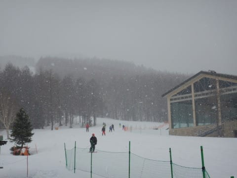

とはいえ，真冬並みの気温で冷え冷えの

しっかり締まったバーンで，

さらに昼ごろになると，これも予想通り青空が！！，←当たったところはしつこく強調するのね…

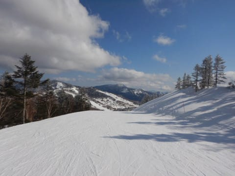

午前中に冷え冷え雪がうっすらと積もって，

ゲレンデコンディションは思いのほか

良かったようです…

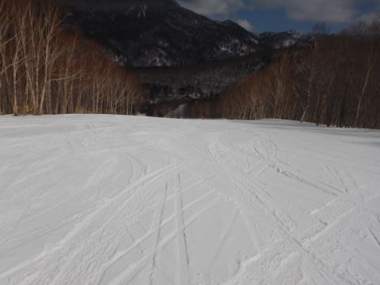

一の瀬ファミリーのバーンは，

朝からラストまでカリカリの

硬めのバーンだったらしく．

ごく一部の硬いバーンが好きな方が，←20000mクラブな方は，これが誰だかすぐ分かる

狂喜乱舞して滑っていたようです…

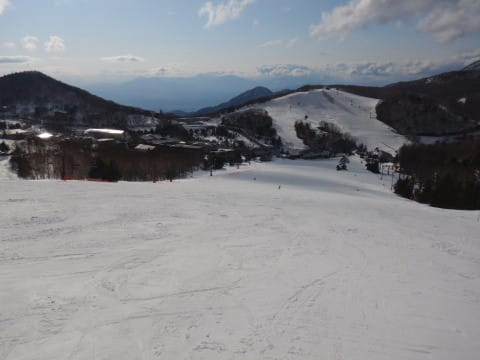

そして，6日の月曜も，朝イチの気温は-8℃と

この時期としては超冷え冷えで．

真冬の雪降りの朝だったようで…

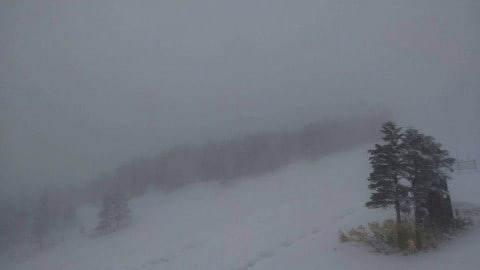

ただ，朝10時ごろには晴れ始めて．

晴天ながらも昼間も気温はマイナスをキープし，

3cmほどの冷え冷え積雪もあり，

4月上旬としてはいい状況で終日滑れたようです！！

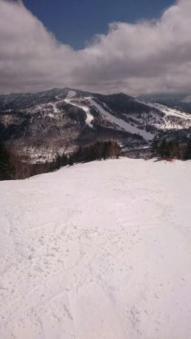

いやー．

この2日間．

4月としては，恵まれた冷え冷えの

2日間でしたね…！

…しかし．

毎日気温やら積雪状態などを細かく報告してくれる

特派員の皆様，ありがとうございます…

これなら，私が志賀高原に行かなくても，

毎日志賀高原レポートが書けるのでは…？？

これから先も，来シーズンになっても，

私が志賀高原に行ってレポートを書かず，毎日特派員レポートを載せていれば良いのでは…？？

という思いが脳裏をよぎりますが…

そのような思いは気づかなかったふりをして．

今週一週間の志賀高原の予想に行きます…！

これから週末にかけてですが…

冷えそうです．

今週一週間，かなり冷えそうです！！

…この図を見ての通り．

5日以降，13日まで，平年より気温が

低い日がひたすら続きそうで…

さらに，水色矢印で示した9，10，11日は，

平年比-6℃程度に冷える日が続きますよ！！！

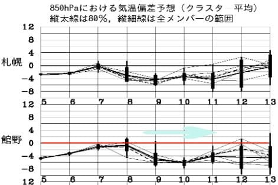

7日(火)の850hpa図を見ると，赤い0℃線は

志賀高原より北まで上がっており，

この日は晴れそうなので，

ちょいと雪が緩みそうな気配がありますが…

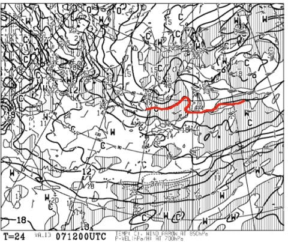

8日(水)の850hpa図では，赤い0℃線は

志賀高原より南まで下がり，

そこそこ冷えそうです！

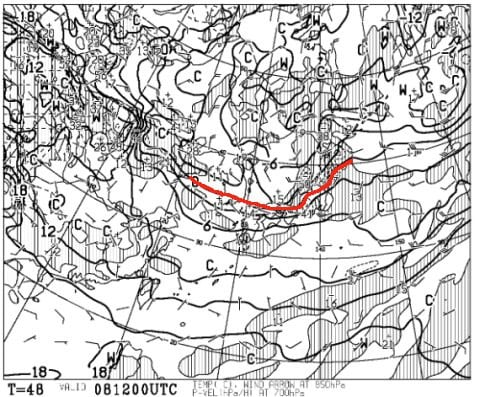

ただ，この日も晴れそうなので，

昼間は日が当たるバーンは雪が緩むかな…

ただ，西斜面の一の瀬はそれほど緩まなさそう！

で，9日(木)の850hpa図を見ると，

この日も0℃線は志賀より南に下がっており．

あさイチは-5℃以下まで冷えそうな，

冷え冷えデーの予感！

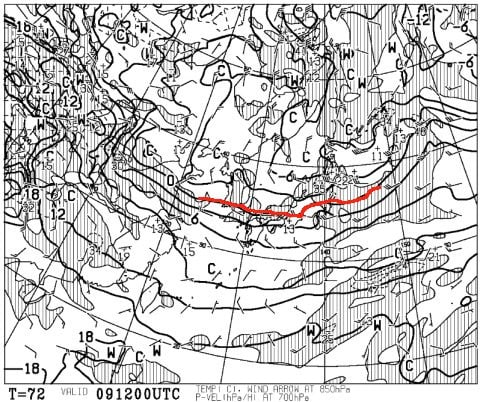

そして，9日は地上天気図でも

ギリギリ水色の降水域がかかるか

かからないかのところにいるので．

わずかにうっすら雪が積もるかも…

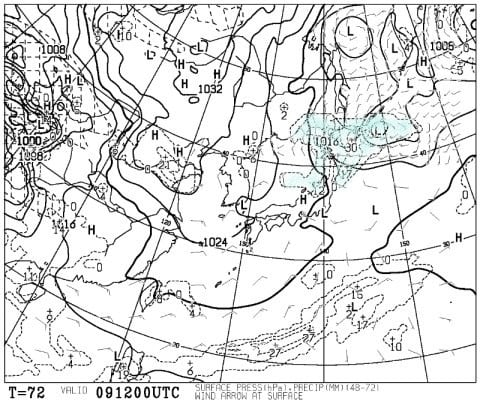

9日の金曜は，冷えてうっすら雪が積もり，

この時期として考えればいいコンディション！

で，

10日(金）の850hpa気温図でも，

赤い0℃線は志賀高原より南にいるし．

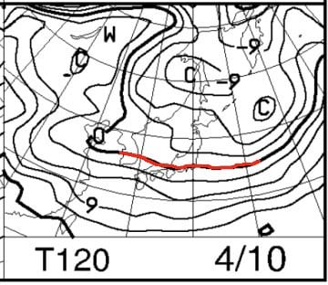

11日(土)も，赤い0℃線は志賀より

わずかに北に上がる程度…

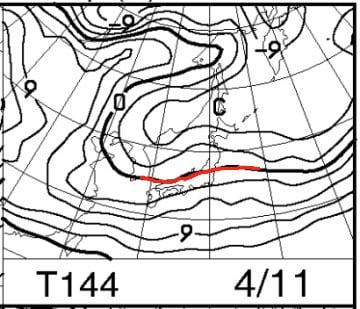

10日，11日とも，地上天気図は

網掛けの降水域がかかっていないので，

晴れそうな予感…！

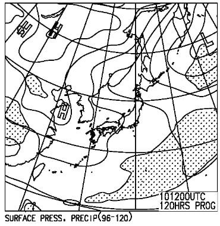

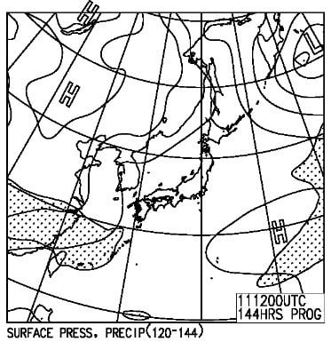

ただ．11日は昼間はプラス気温に

なるので，ちょっと昼間は雪が

緩みそうかな…

ってなことで．

これから週末までの天気をまとめると．

7日(火)：朝は気温は-3℃程度で，天気は晴れ．

　あさイチは晴天のカリカリバーン．かなり固め．

　ただ，晴れて日差しがあり，昼間は山頂でも

　+3℃くらいまで上がりそうなので，南斜面は

　すぐに雪が緩む．西斜面は昼近くまでもつか…

　まぁ，終日天気が良いので，春スキーと割り切れば

　良いコンディション

8日(水）：朝は-2~3℃．天気は晴れ．

　この日も朝はガッチリ固めのガリガリバーン．

　昼間はプラスまで気温が上がるものの，

　午後から雲が多くなっていきそうで，

　風も出てくるか…？奥ゴン大丈夫かな？？

　午後曇れば，気温自体はわずかにプラスに

　振れる程度なので，それほど雪は悪くならない．

9日(木）：朝は-3℃程度かな？朝は雲が多い晴れか…

　この日は曇ったり晴れたり．時折雪が舞うかも？

　昼間も気温はそれほど上がらず，0℃前後．

　この時期としては，昼間も気温が上がらず

　日が当たらないバーンは締まった

　コンディションをキープしそう．

　

10日(金）：朝はそこそこ冷える．

　朝までに数cm，朝は雪がぱらつき，

　うっすら雪が積もってるかも？？

　気温はマイナスをキープしそうで，

　午後に向かって晴れていくものの，

　夕方には結構冷え込む．

11日(土）：朝は放射冷却が入れば-3℃以下に

　冷えるものの，すぐ気温が上がり，

　昼間は+3℃くらいまで上がりそう．

　天気は終日晴れで，雪もしっとりと緩んでいくが，

　穏やかな春スキー日和．

ってな感じでしょうか…

とりあえず．

3月までの異常な雪不足を考えれば

想像がつかなかった，4月としては

冷え気味の日々が続いてくれて．

このままなら，GWまで雪がもってくれる

可能性が高くなってきました…！！！

コロナ騒動で，このGWがどうなるか

まだわかりませんが．

出来れば，GWまでにみんなが安心して

スキーができる状況になって．

これからのスキー場に，素晴らしい救いの光が

降り注ぐことを願う，Skier_Sだったのでした…

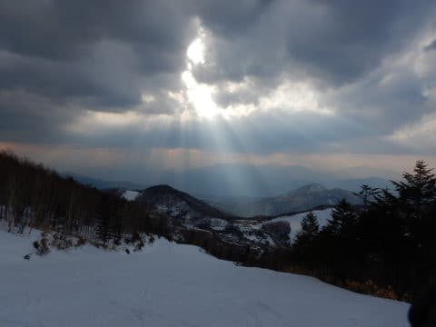

## 💬 コメント一覧

### 💬 コメント by (しんちゃん)
**タイトル**: 救いの光
**投稿日**: 2020-04-07 22:00:05

最後の写真、いいですね。

あんな感じの救いの光で世の中全体を照らしてほしいものですね。

事態が早く収束しますようにm(_　_)m

### 💬 コメント by (Skier_S)
**タイトル**: ＞しんちゃんさま
**投稿日**: 2020-04-07 23:38:57

ホントに，救いの光が射してほしいところです…（願）

一刻も早い事態収束を祈り．

我々も，事態収束のための行動をとりましょう…

