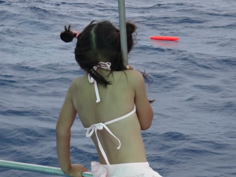
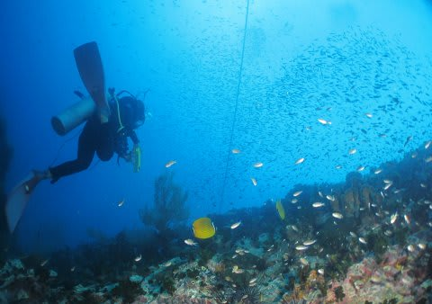

# 2013年9月　子連れタイ・タオ島ダイビング旅行記　その17　ようやくの外洋ダイビングや，いかに？

📅 投稿日時: 2013-10-31 01:33:01

🏷️ カテゴリ: [ダイビング日記](ce3a7a8d424d112fce83ee85c81a0e344.md)

で．

妻が潜りに行ってしまってから，

船の上でボーっとまつこと，40分．

ダイビングフロートが海面に浮かんできて…

ダイバーが浮上してきました…

…3日目にして初めての外洋ダイブ．

狙っていた，あいつは．

出たのか？？

今日，この海に，あいつはいるのか？？

私「お帰り～っ！出た？出た～？？」

妻「………一面のイソギンチャク…」

私「…なんじゃそりゃ」

　

とりあえず．

残念ながら，ジンベエ様は，出なかったようで…．

しかし，一面のイソギンチャクって…？

今日の午前中は，1本目も2本目も同じ「サウスウエストピナクル」で潜るので．

水面休憩を1時間ほどとったあと．

今度は私が潜りに行きます．

1本目は出なかったけど．

今度はジンベエ様，出てきてくれますようにっ！

と，祈りつつエントリーすると…

うむ．さすが，外洋．

内湾と違って，まーまー透明度は良いぞ．

さすが外洋ポイント，魚は結構多いよ！

…せっかくタオまで来たら，やっぱり外洋ポイントに潜りたいものよ…

でも．このポイントの根が．

…サンゴではなく，なぜか，イソギンチャクだらけ．

…見てのとおり．

見渡す限りの岩がすべてイソギンチャクに覆われているという…

なんじゃ，こりゃ．

…確かに，「一面のイソギンチャク」だわ…

でも．魚は多くて満足．

やっぱり外洋ポイントじゃないと！

魚に囲まれて安全停止の後…

エグジット．

船の上では，娘がお出迎えしてくれました．

って感じで．

…外洋，良かったけど．

…

…

やっぱり，ジンベエ様．出なかったなぁ…(涙)
