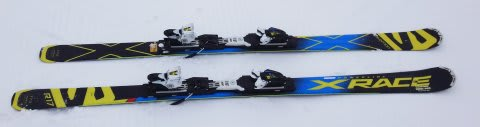
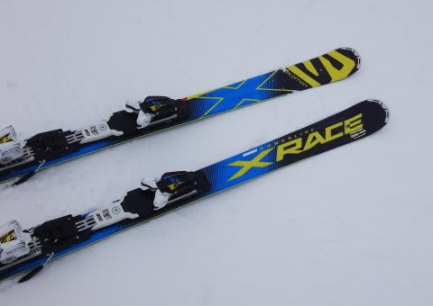
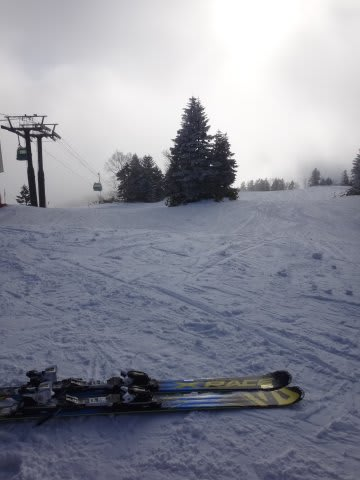
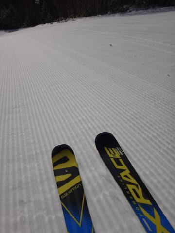

# '16モデルSALOMON X-RACE　175cmデビューさせたけど…強烈！かなり優秀なハイスピードマシン！

📅 投稿日時: 2017-01-13 03:01:36

🏷️ カテゴリ: [スキー雑談](c1f9d2cb7478308da16419928ea3945e9.md)

ということで．

すでにほとんどの読者は気づいていると思いますが．

[物欲選手権にすっかり完敗した結果である](e7e02015f03823884a3522a56c651a398.md)，昨シーズンモデルの

サロモン X-RACE 175cm．

こいつを，すでに12月にデビューさせてます…

もう，ハイスピード大回りマシンとして，

朝イチ焼額でガンガン使ってますが．

ここしばらく，天気予想と年末年始スキーレポートが

続いており．

レポートを書く暇がなかったんですね～．

だもんで．

…今更ながらではありますが．

この板のインプレッションでも

書いてみましょうか…←かなりいまさら感がある気がするが？？

昨シーズンまで，'15モデルのX-RACE 165cmを履いていて．

すごく気に入っていたというのもあり．

今回，10cm長いこの板を思わず追加購入したわけですが．

…いや．

やっぱりこの板．

強烈だわ…

まず．

何にしろ，

異常に高速耐性が強い．

焼額のオリンピックコースとかを，直滑降に近い

スピードで降りても，板が全くばたつかない！！

板がばたつかず，とんでもないスピードでも

安心して板に乗っていけるので．

普段履きのATOMICのSXに比べると，トップスピード50％アップ！！

165cmより10cm長くなった分，トップスピード耐性が

さらに上がりましたね～！

でも．

175cm．

思ったより良く曲がります．

R=17mというのもあり．

ガラガラの朝イチ焼額だと，

ちょっと曲がりすぎるかな～．

朝イチ焼額専用マシンと割り切れば．

180cmか185cmでも良かったかも…

そして．

どこまでもスピードを上げて行けて．

どこまでも横Gをかけても耐える，

強烈なエッジグリップ！！

どこまで板に仕掛けて行っても，

エッジはみじんもずれることなく．

ガッツリとエッジグリップしたままきれいにたわんで．

ものすごい横Gを発生しながら．

ゲレンデに細く，深い2本の掘りこみ跡を残し

落下していけます…

いや…

快感…っ！！！！

これは．

朝イチ焼額の快感を3割増しにしてくれる板でしたね～！

…でも．

あまりにも強烈なエッジグリップで発生するGに

耐え続けるために．

かなりの体力必要とする板であることは間違いないです…

この板で飛ばすと，かなり体力を消耗するので．

本気で2時間滑ると，もうヘロヘロになってしまうのが，

欠点と言えば欠点か…

＃もう少し自分の体を鍛えないといかんな…

しかし．

この板を履いてからというもの．

気持ちいいスピード域がかなり高いので．

朝イチ焼額の私の滑走スピードがアップした気が！？？

もう，何人たりともついて来れないスピードにっ！！

…って．

あれ？

確か．

Gokuraku Skierさんは何の苦も無くついてきてたなぁ…

そして．

20000mクラブな方々には．

あっさりおいて行かれた気がする…

…うむ．

私はこれだけ強力な武器を用いても．

これらの方々には全く及ばないわけですね…（涙）．

しかし．

このX-RACEを履いたあと．

ATOMICのSXに履き替えると．

かなり強めの板であるはずの，VARビンディング付きSXが，

軽自動車みたいに感じる…！

とりあえず．

そのくらい，どっしりした重さと安定感に

あふれる板です．

＃決してSXがへたったわけでは無い…

＃…はず

いやー．

しかし．

この板．

朝イチ焼額の気持ちよさをさらに高めてくれる板として．

チョー―気に入りました～！

## 💬 コメント一覧

### 💬 コメント by (びわ湖)
**タイトル**: Unknown
**投稿日**: 2017-01-13 08:46:40

S様お疲れ様です。我がホームも年末にようやく

オープンしましたが、中々フルオープンになりません。週末の寒波に期待する所です。私もSX乗り

ですが昨年ブーツをX3-RCからX-MAX120を京都の黄色いお店で購入しましたがポジションの違いでコントロール出来ず悩んでいます。自分では結構乗れていたと思いっていたのですが、落ち込んでいます。難しいですね。今週も練習です。

### 💬 コメント by (Goku)
**タイトル**: Unknown
**投稿日**: 2017-01-13 14:24:53

いやいや、何をおっしゃいますか。

あのスピードに付いていくには必死ですよぉ～！

で、いつも思いますけど、Sさんの滑った後の彫れ具合は本当に惚れ惚れします。

なので、たとえ一緒の時でなくても『あ～、これはSさんのだわ！』と、ピンときちゃいます。

ところで、長野市は現在晴れ。

でも、山は本降りのようですよ～♪

おっと、仕事しなくちゃ(笑)

### 💬 コメント by (かず)
**タイトル**: 今日はワックスが当たりました
**投稿日**: 2017-01-13 19:08:54

やはり雪重めです　ワックス色々試しましたが新雪なのでフッ素系では抵抗になるようで無理でした　今日走った新雪ワックス現地対応可能なので　走らなくなったら言って下さい　ソールに悪い液体系では無いです

### 💬 コメント by (Skier_S)
**タイトル**: かなり雪が積もり始めた気配
**投稿日**: 2017-01-13 23:48:30

＞びわ湖さま

今週はかなり冷えますから，ゲレンデ状況は

一気に改善すると思いますよ！

ブーツ買い替えると，最初はかなり戸惑うかと…

特に，X3→X-MAXとなると．

ポジションがかなり変わりますから…

X3はまだトップを抑える設計のブーツでしたが，

X-MAXは明らかにかかとを使うブーツですので，

ヒールピースより後ろを抑えるくらいの

「これってすごい後傾？」

ってポジションで滑ってちょうどいいくらいかもしれません…

＞Gokuさま

いやいや，私が気を抜くと置いて行かれている

気がするのですが…（笑）

でも．

私が滑っているかどうか，シュプールを見ると

分かるって言われたことは何回かあります…

特に，ダイヤモンドナイターで私が滑ってるか

どうか，一発で分かるようです（笑）

＞かずさま

あ，やっぱり今日も重かったですか…

明日も湿数0の空気が入りますが，上空の

寒気が―40度レベルなので，重くならないんじゃ

無いかと期待してます…

明日，明後日とヤケビでパフパフ予定ですので，

よろしくお願いします～！

### 💬 コメント by (Unknown)
**タイトル**: Unknown
**投稿日**: 2017-01-17 16:22:31

次は 180〜185cm R=23〜25m とかどうでしょうか？

横Gはそこそこでスピードだけ出せます。

マスターとかの名称で人気が出てしまい安くなりません。

カービングが得意であれば 183cm R=30m もお勧めです。

神田の黄色いお店に 2 万円ぐらいからあります。

一の瀬ダイヤモンドのシマシマを 2〜3 ターンで降りるとか夢見ませんか？

### 💬 コメント by (Skier_S)
**タイトル**: Unknownさま
**投稿日**: 2017-01-18 01:30:03

X-RACE LAB Mastersも購入候補だったんですが…

あまりにも高すぎて，手が出ません（笑）

昨シーズンX-RACEの180cm，R19が良かったかも…

でも．

私はR=23 の板が精いっぱいです．

試乗会で，R=27の板を履いたりもしましたが．

…私にはR=27の板は履きこなせません…

R=30の板なんて，もってのほかです（笑）

180～185cmで，R=23くらいがちょうどいいのかなぁ，

と思っていますが．

私の車のルーフボックス，185は乗らないんですよね…（涙）．

あ，ちなみに．

朝イチヤケビは大回りが楽しいですが．

一の瀬ダイヤモンドを2-3ターンで降りちゃったら，

勿体なすぎる気が（笑）

