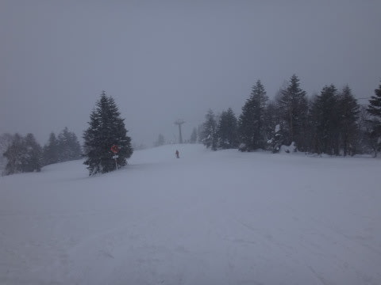
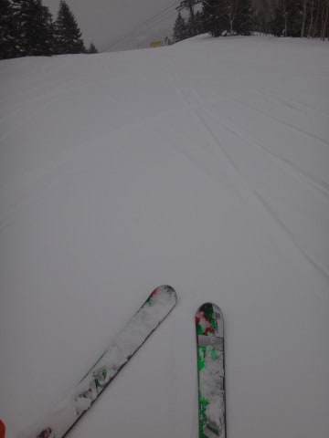
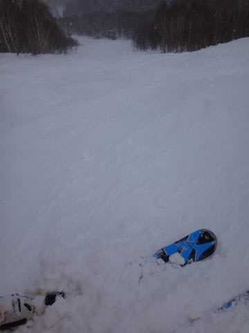
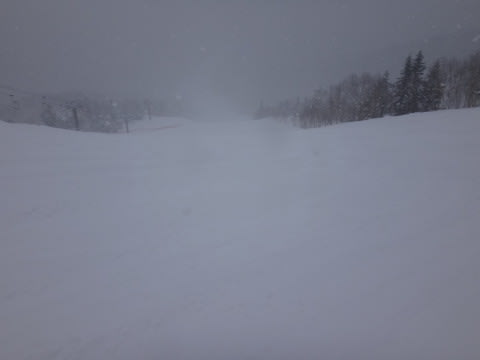
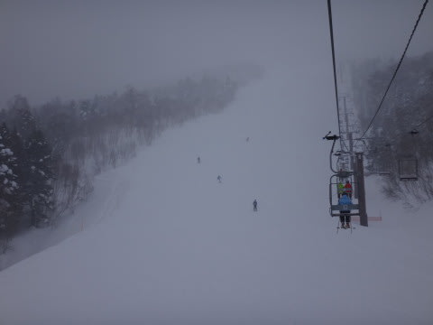
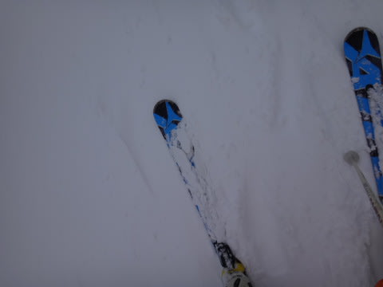
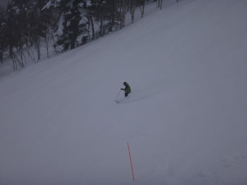
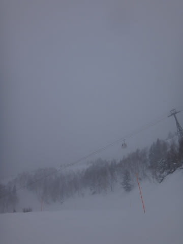
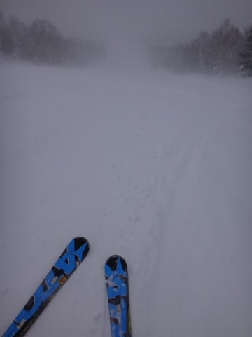
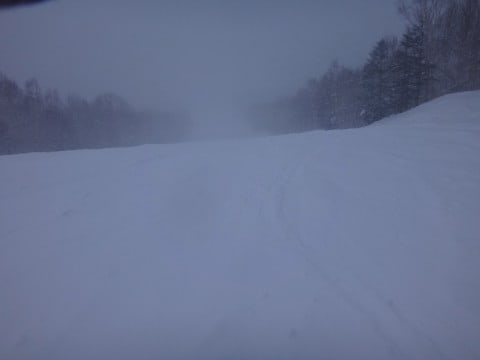

# 1月26日の志賀高原は…終日雪，午後吹雪(涙)

📅 投稿日時: 2014-01-28 00:11:02

🏷️ カテゴリ: [2014スキー滑走日記](c992167609b6415052179ee69ea1ea7d8.md)

「寒さに弱い」という，スキーヤーとしては致命的な欠点をもっている

らしいことに気付きつつある，Skier_Sです．

…さて．

昨日速報した，日曜の志賀高原の詳細状況をば…

えー．

この日の朝の気温は，マイナス10度ほどと．

昨日ほど異常にな高温ではなく．

小雪がちらつく朝でした．

んでも．

雪の降り始めは，朝6時とか7時くらいだったようで．

昨晩からの積雪は，ほとんどありませんな…

2-3cmかな？

ってことで．

朝のうちのゲレンデは，普通の圧雪のような感じで滑れちゃったので，

朝イチ焼額の最大の楽しみ，快楽大回りを楽しむことが

できましたね～．

午前中は風も穏やかで，雪もちらつく程度で．

さらに，天気が良くなかったので昨日より人も少なくて…

うほほほな大回りを楽しめたんですが．

…何か，昼に近付くにつれて雪が強くなり，

雪が圧雪の上にけっこう積もり始め…

ゲレンデはもさもさ状態になって来ちゃったんですけど…

さらに，視界が悪化してるんですが…(涙)

そして．

どうやら．

この日は志賀高原に日頃の行いが悪い人がいたみたいで．←自分のことじゃないのか？

昼ごろには，完全吹雪になっちゃったんですけど…(悲)

あれですね．

リフトは完全，冷凍人間製造装置と化してますね．

風も強かったので，乗車時間が長いリフトでは，

降りるころにはコールドスリープに入れるんじゃないか？

ってほど冷えます．

さーーーーーぶいです．

で．

朝にほとんど積雪がなかったゲレンデは．

軽い雪が積もって…

人が少ないのもあって，午後というのに新雪バーン化してきてます．

…なぜ．

なぜ，夜に降らずに昼間に降るかな～…(涙)

やっぱり，この日の志賀高原には，だれか日頃の

行いが悪い人が…←だから，自分が悪いのでは？

とりあえず．

吹雪いて天気が悪かったし．

さらに午後3時過ぎには焼額第2ゴンドラも強風で

止まってしまうほどの風で．

そして視界も悪く．

そのうえに，ゲレンデはもさもさ雪で，見えないところに

予期せぬ凸凹があったりして．

野生のカン(サルスキーヤーに標準装備）

をフル活用して滑らねばならぬ，なかなか厳しい午後ではあったけど．

おかげで，今日の午後も．

やっぱりゲレンデはがらがらで．←当たり前だ

白い粉中毒の私としては．

いつも通り，リフトストップまでたっぷりと堪能したのでした…

PS.昼間だけでこれだけ積もって，夕方はすごい勢いで

　降っていたので…月曜はパフパフパウダーだったんだろうなぁ…
