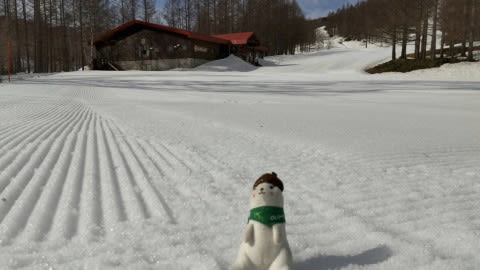
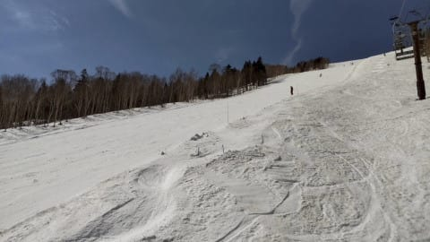

# うぎゃーーー！！我が愛機，ATOMIC Bluester DEMO SXの四朗君のエッジが剝離！！(涙)

📅 投稿日時: 2021-04-07 03:23:36

🏷️ カテゴリ: [スキー雑談](c1f9d2cb7478308da16419928ea3945e9.md)

えー．

本日も志賀高原の特派員から写真が送られてきました～！

今日も朝から晴天だったようで…

当然，昨晩からの積雪があるわけもなく．

おこみんは，あさイチから緩み気味の

シマシマの上に鎮座なさっております．

そして．

あさイチから気温は+4℃ですか…！！

高すぎる…（泣）

高温のせいで，奥志賀は朝イチから

かなり緩み気味だったものの．

朝のうちは柔らかめとはいえ，

結構滑りやすい雪だったようですが…

当然，日差しが強く，気温が高かったので．

すぐに緩んでザブザブになっていき．

そして，昼間の最高気温は+10℃を

超えたらしく，昼ごろには

かなり緩んだ雪に…

でも，滑っている人が少なかったからか，

昼ごろまでは意外と荒れずに済んだようです！

ちなみに，サンバレーは昨日と比べても，

またかなり雪解けが進み…

先週日曜はまだ真っ白だった焼額

オリンピックコースも，一気に土が

出始めて．

先週の日曜でも雪が少ないと思ったのに．

今日の高温で，さらに雪解けが加速度的に

進んでいるようです…(泣）

明日7日は今日よりは気温が下がり．

さらに8～10日までは，かなり気温が

低い日々になりそうだけど．

でも，この間に積雪は全く無さそう(泣）

あぁ…また，奇跡の4月が来てくれないかな…

ってな特派員レポートを終えたところで，

本題へ．

このBlogの読者の方は．

私が長きにわたりメインマシンとしている

ATOMIC Bluester DEMO SXを，いかに

愛しているかを良く知っていると思いますが…

とりあえず，あまりにも気に入ってしまい

すぎ，4セットも同じ板を購入してしまう

ほどに愛しているわけですが．

2016シーズンに一郎君がデビューした後．

[2017シーズンに一郎君がマイルド化し二郎君](e27e2a7149d362e76794896614d0f18f3.md)に，

[2019シーズンに二郎君が死亡して三郎君](e693423fc0fd3ad69044e21fa21921153.md)に，

[2020シーズンに三郎君が過労のため
四朗君に](e6c31e0b2668b576d145d37cb92d0c912.md)…

と乗り継いできて．

昨シーズンの2月から最後の1台である

四朗君を使っていたわけですが．

先日．

その四朗君のエッジを研いでいた時のこと…

なにか，エッジを研ぐファイルの手ごたえに

違和感が！？

何だろう…？

と，よく見てみると…

うぎゃーーーーー！！！！！

エッジが…

エッジが剝離してるっ！！

それも，ドライバーが突っ込めるほどの

隙間が空いてるんですが…っ！？？

…いや．

ATOMICの板，ドライバーが差し込める

隙間が空いているのが標準ってわけ

ではありませんから．

普通は，エッジとサイドウォールの隙間は

こんな感じで全くありませんから…！

な，なんということだ．

これで，4台も買い揃えたSX．

ついに最後の1台も終了なのか…！！！

ついに，我が愛するSXともお別れか…！

…しかし．

昨シーズン2月にデビューした四朗君．

4月からはコロナでスキーができず．

昨シーズン履いたのは2，3月の2か月のみ．

そして，今シーズンも11月下旬までは

ヘタッた三郎君で滑っていて．

さらに正月明け以降はコロナで滑って

おらず．

今シーズン履いたのは12月と，スキーに

行く夢を見るようになってからの3月の

一か月間，合わせて2か月間．

ということで．

この四朗君．

まだトータル4か月しか履いてない

にもかかわらず，早くも剝離したとは…！！

何と根性がない板なんだっ！！

思い返せば．

[一郎君もわずか4か月，滑走40日でヘタりまくって死亡](ed5767135dfb18a758390c3e37aae05b5.md)．

[二郎君も滑走40日でエッジ剝離](ed5767135dfb18a758390c3e37aae05b5.md)．

[三郎君も一シーズンもたず，4か月でマイルド化](ef0c360ac12bd72263d69f111b44fb947.md)．

と，どの板も寿命は短かったことを

思い出すのですが…

…今回，この記録に，

四朗君も4か月でエッジ剝離

という，新たな項目が追加されたのでした…

しかし．

週末しか履かないスキー板が4か月

しか持たないってどういうこと？？

一郎君から四朗君までの，どの板も大体40日程度で

死んでます…(激涙)

スキー板，寿命短すぎ…

しかし．

どうやら私がスキー板を週末4か月間

履いただけでヘタらせるという，

スキー板劣化加速能力を

もっていることは明らかになったようです．

…誰か，新品で買ったスキー板が硬すぎて

困っているという方がいれば．

私がマイルドにして進ぜましょう

ってふうに，有効にこの能力が活かせれば

いいんだけど．

そんなうまくいくわけがないし．

こんな能力，ホントにいらんわ…

私にとってスキー板とは，グローブより

寿命が短い，完全なる消耗品です…(涙）

…そして．

最後の四朗君が息絶えた今．

2016シーズンから6シーズンの長きに

渡って愛用し続けてきて，慣れまくって

ほぼ体の一部＆私の代名詞と化していた

ATOMICのSXとも．

…ついにお別れする時が

来たようです…(泣）

## 💬 コメント一覧

### 💬 コメント by (yumi)
**タイトル**: Unknown
**投稿日**: 2021-04-07 06:26:21

Ｓさぁ～ん😅😢😭

お気に入りの板と お別れ👋するのは 悲しい💦ですよね😿

お気に入りの板🎿が 表面剥離😢した時に 偶然 ゲレンデで 会った時の Ｓさんとの会話。。。。。

Ｓさん「yumiさんは どんな基準で(何を重要視して)板を選びますか❓️🙄」

yumi「色とか模様(ピンクやオレンジとか花柄やハート💕柄)デザインで 選びます🎵」

Ｓさん「・・・・・😶」

Ｓさんを 絶句させたのを 今でも覚えてます✌️😅

### 💬 コメント by (レインボー73)
**タイトル**: Unknown
**投稿日**: 2021-04-07 06:57:34

エス様、板を長持ちさせる妙案を思いつきました。是非ともお試しあれ。

レインボーに入隊すればいいんです。

### 💬 コメント by (アリス)
**タイトル**: 剥離修理可能です
**投稿日**: 2021-04-07 07:26:41

Skier_S様

おはようございます。

エッジの部分剥離で板を諦めてしまうんですか？

たぶん、まだ充分たわみがある板だと推測しますが・・・

ショップで修理可能ですよ。個人でも可能ですが。

①剥離した部分のクリーニングと乾燥

②接着剤流し込み

③24時間圧着（クランプやバイス使用）

こんな感じです。

### 💬 コメント by (毎日読者K)
**タイトル**: 無題
**投稿日**: 2021-04-07 12:46:00

毎日読んでおります読者です。

私のライト使用でこれだけ板を劣化させることは無いので教えてください。

剥離状態のまま使ったら問題あるのでしょうか。

滑り感としては剥離しててもしていなくても同じ感覚なんでしょうか。何か違和感があるのかな。エッヂメンテの時に剥離に気が付いたということは滑っているときは気が付かなかったということですよね。

剥離のまま使っても問題無いならそのまま使ってもいいような。。。

無知ですみません。

安全性の問題とか？

### 💬 コメント by (レインボー73)
**タイトル**: Unknown
**投稿日**: 2021-04-07 12:58:52

水曜日の志賀高原情報

朝の上林４℃　蓮池３℃、ヤケビブルーのスキー日和。山頂０℃。雪は硬め、いいぞ！今日は12本はやるぞ。

六本滑ってもまだ緩まない。人口は20人もいるだろうか。がらがらです。

奥志賀はゴンドラ、第２、第３が動いているので、多分人気してるのでは？

横手は、陽坂のパークが宿泊者と早朝のみみたい。

2ゴンのみでもこれだけ空いてれば、ヤケビに忠誠を誓ってもいいかと。

今日は14分半で一回りできてる。8本滑ったら（約2時間経過したら）、緩い所がかなり柔かくなってきた。

10本目まで快適。11本目にパノラマの写真を撮るため何度も止まったけど、誰も滑ってこない。貸し切りだ！そうこうするうちにゆるみが一気に加速したので、業務完了。

明日は冷え込むので残業かなあ。

### 💬 コメント by (とある若者)
**タイトル**: Unknown
**投稿日**: 2021-04-07 18:40:09

雪がズクズクになるので、昨日はブーツのインナーを出しておきました。

今朝、2ゴンで履こうとしたら、硬いし違和感が半端ない。それでも右足はなんとか履けましたが、左がどうにも履けない。

もしやもしやと確認したら、流石はまだボケとはほど遠い若い私！インナーを左右反対に入れていたことを素早く発見（あほやろ！）。

こんなこと、経験されたかた、おられます？

### 💬 コメント by (いか)
**タイトル**: Unknown
**投稿日**: 2021-04-07 21:12:59

ついに長きにわたったSX生活も終わりでしょうか、、、

まだ170なら売ってますが、キレは少し欠けますが。

ただ、ブーツも良くなって、SXを卒業してキレキレの新世界を追求するのも良さそうですね。

ちなみに私は…まだSX四郎が新品で残っています！

(途中にSalomonに浮気しているから、というだけですが笑)

### 💬 コメント by (NorthFox)
**タイトル**: Unknown
**投稿日**: 2021-04-07 21:47:07

何でしょう．．．四郎君終了の悲しみと共に言葉の端々に浮き浮き感を感じるのは気のせいでしょうか？？？

これでまた新たな物欲伝説が始まる予感がしてなりませんｗ。

### 💬 コメント by (炎の北海道民)
**タイトル**: Unknown
**投稿日**: 2021-04-07 22:58:30

これは朗報ですよ！

次はVector Glideなどいかがでしょう。

### 💬 コメント by (しんちゃん)
**タイトル**: ニューノーマルの幕開け
**投稿日**: 2021-04-07 23:49:13

四郎君、残念ですね。しかし、これは新しい時代の幕開けかもしれませんね。ＳＸじゃないのが普通になるニューノーマルの幕開けかと。

ブーツもよくなったことだし、リングがすり減りすぎてしまった長年愛用してきたストックも更新時期に来ているのではないでしょうか（悪魔のささやき）

今後の物欲選手権に期待です(笑)

### 💬 コメント by (Skier_S)
**タイトル**: 次の板はもう購入済みです(笑)
**投稿日**: 2021-04-08 02:34:30

＞yumiさま

いや．板のデザインが気に入っているってのは，愛着が増していいんですが…

あそこまで毎日滑る人の板の最大かつほぼ唯一の選択基準が

デザインだってのは，ちょっと衝撃でした(笑)

＞レインボー73さま

私がレインボーに入会するのはまだまだ先になりそうです…

まだその心境にまで至ってません(笑)．

明日は冷えてガチガチバーンですよ～！！

＞アリスさま

一郎君が剝離した時，ATOMICに出したところ「修理不能」で返ってきました(涙）

スキーショップで修理に出すといいお値段しますし，

私が履いて剝離した板は，まずトゥピースの下，続いてヒールピースの下…と，

次々剝離が進むので．修理しても修理しても，またすぐ違う場所が剝離すると思います(泣）

もうかなり使い過ぎで滑走面も波打ってますし(プレートを止めるビスのあたりが変形してくる)

剝離したらもう修理は諦めてます…

＞毎日読者Kさま

コメントありがとうございます～！

剝離した板で滑っても，剝離していることは分かりません…

ただ，剝離したところから水が入ってコアの木材がダメになっていくので，

剝離した板は，じきにフレックスが抜けてしまってグリップしない

ダメダメ板になっていきます…

まぁ，私の場合は目に見える剝離がなくてもグリップしないダメダメ板に

なっていくのですが(笑)．

＞とある若者さま

ホントに若者なのかどうか気になるところですが…

私も左右インナー間違えて入れたことが2回ほどあります(笑)．

＞いかさま

とりあえず，今シーズンいっぱいはまだ履き続けますが．

これでSX生活も終わりです…(涙）

まだ四朗君が残ってるんですね！ちょっとうらやましい…

でも，今シーズン途中の四朗君の死亡を見越した次の主力戦闘機，

FISCHRE RC4 WC SC Proが購入済みなので，それを投入するかも…

＞Northfoxさま

いや…

すでに次期主力戦闘機は購入済みで，出番を待ってる状態なので…

物欲選手権は開催されない予定です！！

＞炎の北海道民さま

Vector Glide，ちょっと気になりますが，太板はLINEがあるので…

今シーズン，太板は1回しか履かなかったです(涙)

昨シーズンも2回だったかな…

＞しんちゃんさま

大丈夫です！次期主力戦闘機として控えていた，FISCHER SC Proが

実戦投入されるだけで，物欲選手権は開催されません！！

されません…

されないはず…

### 💬 コメント by (ikkun)
**タイトル**: Unknown
**投稿日**: 2021-04-08 12:34:28

お疲れ様です  (^-^ゞSX 様に向けて(笑)そこまで乗って頂けたならスキーも本望ですよね❗ 改めてすごいですね  次の愛車は？

ちなみにフォルクルチューンナップ出しました で来シーズン迄預けて置けるんです

### 💬 コメント by (Skier_S)
**タイトル**: ＞ikkunさま
**投稿日**: 2021-04-09 01:33:19

わずか40日ですが，天寿を全うするまで使い込みました．

板としても本望かと…

次のメインマシンは，すでにFischer RC4 WC SC Pro購入済みです~！！

