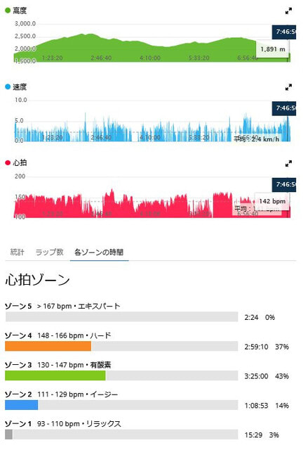
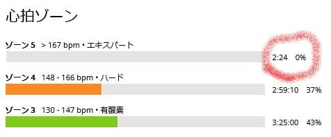

# 知らぬ間にGarmin Fenix7Xの最高心拍数が書き変わって，山に登ってもゾーン5に入らなくなったよ…！

📅 投稿日時: 2022-11-09 02:57:58

えー．

どうやら．

ホントに明日，横手山がオープンする

みたいですね…

まさか，志賀草津道が冬季通行止めに

なる前に横手山がオープンするとは…

9日以降の高温を乗り切って，

12，13日の週末も営業できればすごい．

13日は雨になりそうなので，そこで

雪はかなりのダメージを食らいそう

だけど．

14日以降冷えるから，それからのゲレンデ

再生に期待かな…？

ってなことで．

本題へ．

何度も書いているように，この夏は[Garminの
Fenix7X](e516b23a4874189de2e9208be87fa5184.md)を山歩きのお供にして．

心拍数150をキープした，スキーのトレーニングを

兼ねた山登りをやっているわけですが…

[以前の記事](e5ac1bba75a5c8a92fd0db6e27e641796.md)にも書いたように．

自分の山歩きの記録を見ると．

行動時間の半分以上が最大心拍数90％以上の

・全速力の速さで，長時間持続できないペース

・呼吸が相当きつい

とされるゾーン5に入っているという，

激しい山歩き（？）の記録になっていたわけですが．

10月頭に，と[ある山に登ってきた](e91cda3f43c16339f6913c78164bf7052.md)ときも．

記録を振り返って見ると…

片道3時間ちょいの平均心拍数は161と，

かなり追い込んだ記録になっていて．

心拍ゾーンの記録を見ても…

全体の57％の時間，1時間48分の間

ゾーン5に入れ続けていることが

分かります…

ってなことで．

うん．

全速力で呼吸が苦しくなって，長時間

持続できないはずのゾーン5に，

これだけの時間入れ続けてるって

おかしいよね…？？

と思っていたら．

その後，[TECNICAのトレランシューズを
試しに山に行った](ecb25856da7e6ee729ee2fefd2c4a167f.md)ときの記録を見てみると…

この時は，ピストン登山じゃなく，ぐるっと

回るルートだったので，上り下りの両方が

一緒になった7時間50分の長い記録に

なって，山頂での休憩時間とかも

入っちゃってるので．

平均心拍141とちょいと低めになっちゃっ

てるけど…

でも，心拍160を超えている時間も長いし．

またゾーン5にかなりの時間入っているよね…？

と確認すると…

え！？？

ええ？？

ゾーン5は0％？？

ってか，わずか2分24秒しかゾーン5に入ってない！？？

これは一体，どうしたことだ？？？

これまでは毎回，かなりの長時間ゾーン5に

入っていたのに…？

追い込みが足りなかったか？？？

…と思って，じっくり見てみると．

前回の時は…

ゾーン5の基準は，心拍160以上だったのが．

今回の記録では．

ゾーン5の基準が，心拍167以上に上がってる？？

え？何があったの？？

なんでゾーンの基準が変わったのかな？？

と，いろいろ見てみると．

平均心拍161を記録した，とある山からの

下りの記録の詳細部分．

ここに，最大心拍数186という

記録が！！

いや…この下り坂，まぁまぁ攻めたからなぁ…

最大心拍数，ここまで上がってたんだ…

心拍ゾーン5は，最大心拍数の90％以上

という定義があるので．

最大心拍数186を記録してしまったら，

自動的に心拍ゾーンの基準が変わって，

ゾーン５は186の90％，167以上…

と，変わってしまったようです．

うーん．

でも，自分にとってはこっちの方が納得いく．

いくらなんでも，一日4時間も5時間もゾーン5に

入っている方がおかしいからなぁ…

これで，ちゃんと正しい心拍ゾーンになった感じ．

ってか．

186を記録した時も，

もうダメ，限界…

ってところまで心拍を上げ切った感じがないので．

もしかすると，自分のリアルの最大心拍はもう少し

高いかもしれず．まだ基準は厳しい方向に

行くのかも？？

ってなことで．

Garminのスマートウォッチを使っていて．

心拍ゾーンがおかしいなぁ…

と思っている方は．

一度，全力疾走をやってみて

「もうこれ以上心拍上げるの無理…！！」

ってまで追い込んで．

スマートウォッチに，正しい最大心拍数を

教えてやることをおススメします…

## 💬 コメント一覧

### 💬 コメント by (一昨年から読んでいる者)
**タイトル**: Unknown
**投稿日**: 2022-11-09 20:46:15

私もガーミンを使用していますが、同様に突然心拍数のレンジが変わりました。今回のようにいい方向に変わればいいのですが、ForeAthleteからForerunner 955に変更した際に最大心拍数が勝手にかわってまたやり直しとなりました。デバイス変更の際はお気を付けください。ちなみにマラソンでVAAMを使用してみましたがあまりのつらさに効果を実感することができませんでした。また試してみようと思います。

### 💬 コメント by (Skier_S)
**タイトル**: ＞一昨年から読んでいる者さま
**投稿日**: 2022-11-10 01:04:52

え！？

デバイスを変えると，最高心拍のデータがリセットされちゃうんですか…

それはなんだか微妙な感じですね．

デバイスを変えたら最高心拍チャレンジをしないとダメですね(笑)．

マラソンはフルマラソンですか？

おそらくマラソン中に効果が感じられなかったとしても，運動後の回復が

早まってたりしませんでしょうか…

私は今シーズンはVAAM効果かプロテイン効果か分からないのですが，

登山中のVAAM＋登山直後のプロテインで，一度も筋肉痛にならずに過ごせました…

### 💬 コメント by (Unknown)
**タイトル**: Unknown
**投稿日**: 2022-11-10 08:35:58

おっしゃる通りフルマラソンです。徳島の先生もＣＰＫを出しておられましたが、数値的には軽減されても実感としてはわかりませんでした。ただ、レース中に足がつることがなかったので効いているのかもしれません。ただ、他にも工夫をしているのでどれがきいているかはわかりませんが。次からも使ってみようと思います。

### 💬 コメント by (Skier_S)
**タイトル**: ＞Unknouwnさま(一昨年から読んでいる者さま)
**投稿日**: 2022-11-11 02:39:06

おおお！フルマラソンですか．すごいですね…

確かに，いろいろ試すと何が効いてるか分からないんですよね…

