# 2月20，21日の志賀高原スキー場の天気は…

📅 投稿日時: 2021-02-19 07:04:04

🏷️ カテゴリ: [日記](cc4b5682fb7b8b144980957a978653fb0.md)

かなりいろいろヤバい状況で．

Blog更新している場合じゃない日が続く

今日この頃．

皆様いかがお過ごしでしょうか…

とりあえず，いろいろクリティカルな状況で．

今日も明け方に更新…

って，更新してる場合なのか？＞自分

ということで．

今日も，木曜の志賀高原特派員レポートから…

まず，朝は－15℃と冷え冷え！

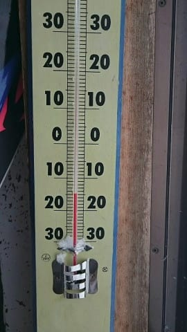

そして，天気は朝から意外と空が明るめで．

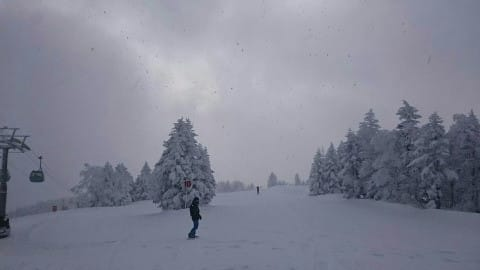

ドサドサ積もってるかな？と思ったけど．

圧雪コースの上にはそれほど雪が積もって

おらず…

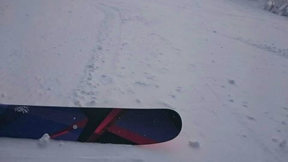

でも，冷え冷えの最高コンディションだった

みたいです！

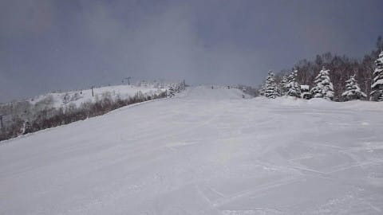

非圧雪部分はところにより20cm，

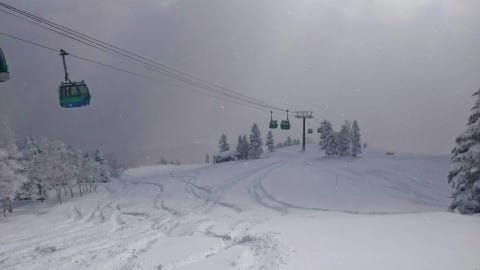

深いところは50cm近くあるところも

あったみたいですが…

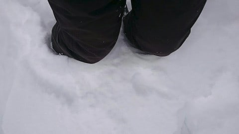

予想ほどの激パウダーにはならなかった

ようです…

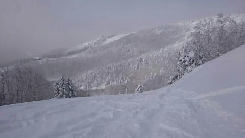

でも，気温は冷え冷え，硬い下地の上に

冷えた雪が乗ったいいコンディションで．

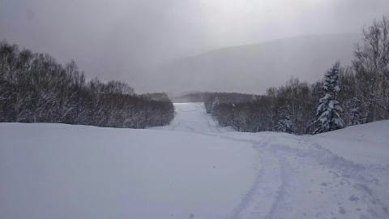

天気も午前中は時折日が射し，

パラパラと雪が舞う程度だったみたいです

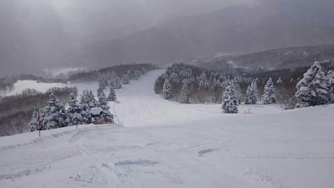

午後になるとかなりひえて，

雪が舞い始めて

根性の無いスキーヤーふるい落とし機能が

働き始めたみたいですが．

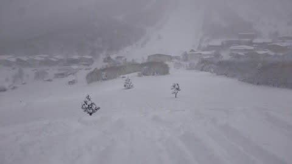

下地も硬めだったものの，アイスバーンって

ほどではないみたいで．

その上に水曜からの冷え冷え雪が乗って，

コンディションはよくなったみたいです…！！！

で．

今週末のスキー場の天気ですが…

時間が無いので細かな解説は抜いて．

いつものまとめだけ書いておくと．

19日(金)：朝は曇り．時折雪がぱらつく．

　朝の気温は－9℃程度．圧雪の上に

　うっすら軽い雪が乗った，トップシーズンの

　コンディション！

　昼前から日差しも出て，午後はすっきり

　晴れそうで．

　なのに気温もマイナスをキープして，

　終日雪質がいい冷え冷えGoodな

　いい一日になりそう．

　

20日(土)：朝から晴れ！

　朝の気温は－3℃程度？

　昼間はプラス気温まで上がりそう…

　気温はちょい高めで日差しもあるので，

　日当たりのよい東－南のバーンは

　午後はちょっとだけ雪がしっとり

　するかも．

　でも，奥志賀や一の瀬方面はそれほど

　緩まずに，晴れて締まったいい

　コンディションのバーンを滑れそう！

　ただ，天気図に現れないプチ低気圧が

　発生すると，雲が多くなり，晴れない

　時間が多くなるかも…

　で，風がちょっと強そうなので．

　ゴンドラ減速運転とかにならなきゃいいなぁ

21日(日)：終日晴れ．

　朝は－2~3℃だけど，すぐに気温が上がり

　プラスに突入．

　昼間は晴れ~うす曇り．

　昼間の最高気温は＋5℃を超えそうなので，

　うす曇りの時間が長ければ雪は

　緩まないけど，すっきり晴れちゃうと

　3月~4月上旬の雪になりそう…

　どちらにしろ気温が高いので，

　雪は緩み気味で，重めの雪に．

という感じでしょうか…

ちなみに，21日のあとは，22日も

気温が上がり気味で晴れそうです．

ただ，その後．23日は…

おっと！

－9℃線が志賀にかかるので，

－10℃以下の冷え冷えデーになりそう！

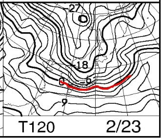

そして．地上天気図は冬型なので．

23日は積もるかも！！

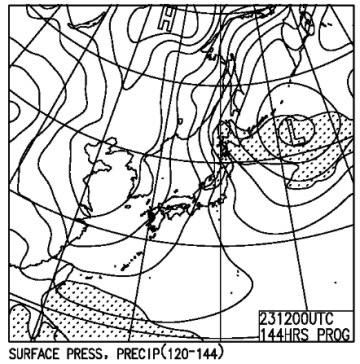

とりあえず，

赤矢印で示した，20日~22日の高温期間のあと，

水色で示したように，23日以降は冷え冷え

期間がやってきそうです…！

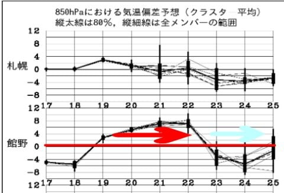

しかし，22日と24日の気温差が，12℃以上

ありそうで…

極端なんですけど…

まぁ，今回は気温が上がるものの．

雨になったりしないので，日曜午後に

雪が緩む以外はまぁ楽しめる週末かな！

そして，23日の祭日は，また冷えますよ～！！

PS.昨日のおこみんは，アルツ磐梯へ出張だったようです

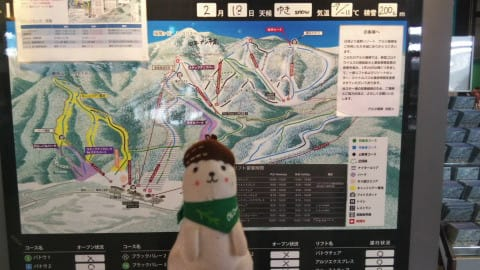

## 💬 コメント一覧

### 💬 コメント by (レインボー73)
**タイトル**: Unknown
**投稿日**: 2021-02-19 12:24:16

金曜日の志賀高原情報

朝からさらさら雪が！上林ー４℃　蓮池ー９℃ 

ニゴンからスーパーを見ると手付かず真っ平ら。これは行かずばなるまい。

あーあ、速い１ゴンから二人の刺客が！　だけど左端のコースを選べは、深いし長い距離を楽しめます。ファーストをゲットしたボーダーさんによると、結構底づきしたそうな。

ＧＳサイドの非圧雪は、新雪は20cmくらいだけど、ふわふわ軽々で快適そのものでした。

だけど狙いはダイヤモンド。

### 💬 コメント by (レインボー73)
**タイトル**: Unknown
**投稿日**: 2021-02-19 14:04:07

金曜日の志賀高原情報２

やっぱり◆は裏切らない。♥ではいっぱい泣かされてきたけど。（もてない男の悲哀。わかってください）

某クラブのリーダー様と合流できて、３人でイナゴの大群のように◆を◇にするまで食い尽くして（◆は中がつまってる。◇は中がすっからかん。ごめんなさい。思いつきばかりで）、ヤケビへ。

あと少しで仕事に戻る隊員に付き合って、ヤケビは一本で帰るつもりが、あまりの雪の良さに『おかわり！』

帰りに上林の蕎麦屋『羅臼庵』で十割天ぷらそば大盛り、ここはびっくりするほど太切りの麺。腰のあるのが好きな人にはお勧めです。

明日は初の妙高か悩んでます。あちこち行ってみたいけど、行った人の話を総合すると、『やっぱり志賀がいい』ってことだから！

### 💬 コメント by (ikkun)
**タイトル**: Unknown
**投稿日**: 2021-02-19 17:51:35

お疲れ様です  団体のスキー授業も終わりを迎えてしまいました❗しかも明けたらこの青空？上手くいかないモノですね？しかしやはりカワイイ笑顔にも癒された昨日でした❗その今日は青空の中で午前中はお客様無しで講師仲間と近所のパパさんなどと滑りました 柔らか目な雪私しは好きだなあ❗  残念ながら富士山は見えず？ついでに準指導員試験も……雪の中みたいになった悲しい結果でした❗あ但し 各種目の点数を頂いたのは初らしく有難いことでした

### 💬 コメント by (かず)
**タイトル**: Unknown
**投稿日**: 2021-02-19 20:28:37

本日ヤケビスタート 

SGファーストも底ツキ氷コブ 速攻1GSTファースト こちらはサイコーでした 昨日より軽い！ やっぱり志賀のオーバーヘッドは違います！午後は日が当たりパウダーが重くなりましたが閉店まで

お告げは23日昼間雪ですか22日夜は微妙ですよね…

### 💬 コメント by (かず)
**タイトル**: Unknown
**投稿日**: 2021-02-19 20:40:27

若さん 妙高ってどこですか？本日アライ検討してました 結局降りすぎで

ヤメとのお告げが！妙高のゲレンデもコースを滑れば大丈夫だと思いますが行くなら桁違いのパウダーです  視界不良＆雪重で心が折れるかもしれません笑  ちなみに明日明後日は標高の高い志賀だと思いますよ！

### 💬 コメント by (レインボー73)
**タイトル**: Unknown
**投稿日**: 2021-02-19 20:51:11

お借りします。明日の妙高は、長岡連中が、back カントリーなので、登る力のない私らには無理。志賀でいろんな友達に会えることを楽しみに、やんわり志賀で滑ることにします。明後日が年長組の子とデートなので、明日はＧＳ板で楽しみます。明日で48連荘。

### 💬 コメント by (かず)
**タイトル**: Unknown
**投稿日**: 2021-02-19 22:04:05

今日のア○○の動画ヤバイデスヨ…

### 💬 コメント by (Skier_S)
**タイトル**: 冷えるのは明日の午前中まで
**投稿日**: 2021-02-20 00:20:23

＞レインボー73さま

毎度レポートありがとうございます～！

今週末だったら気温が上がりそうなので，やっぱり標高の高い志賀がいいですよ～！

＞ikkunさま

スキー授業お疲れ様です．

準指導員は残念な結果だったんですか…

志賀高原も雪は柔らかめですが，今日はいい雪質でキープしたようです．

緩み始めは土曜昼，日曜はかなり雪が緩むと覚悟せねば…

＞かずさま

今日ゲレンデに行っていたのですね…

当たりの日だったと思いますよ！

このあと，しばらくパウダーはなさそうな予感…

