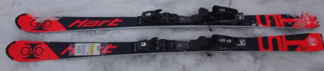
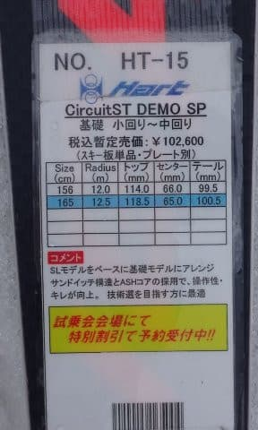
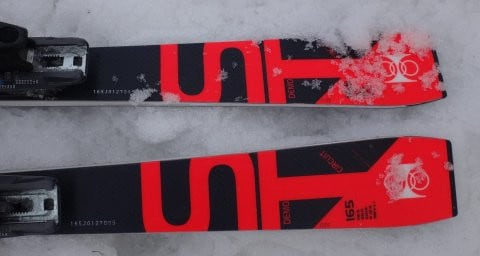
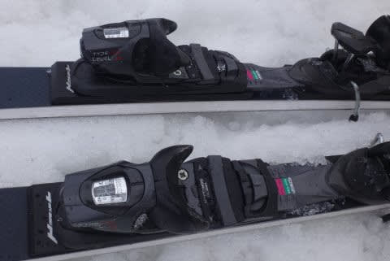

# 2018シーズンモデルのスキー板の傾向をまとめてみる

📅 投稿日時: 2017-07-11 02:23:06

ってな感じで．

昨日のレポートで，2018シーズンモデルの

スキー試乗レポートを一通り終えたわけですが…

…実は，

もう一機種，

HART Circuit ST DEMO SP 165cm

というモデルを試乗していたんですね～．

この板，普通のDEMO STとはちょっと違う，

プレートが入った板らしいのですが．

残念ながら，いつも試乗直後に録音する

試乗インプレッションのボイスメモが見つからず．

…どんな板だったかすっかり忘れてしまったので．

レポートが書けずじまいでした…

すいません．

うっすらと残っている記憶では．

結構どっしりした，かなりSL競技用に近い板で．

ガッツリグリップと山回りまでしっかり回り込む

旋回性をもった，かなり体力のある乗り手を想定

した，ハイレベルな小回り板だった印象が

あるのですが…

なにぶん，忘却の彼方に去りつつある

記憶なので，参考程度に…

ってことで．

今シーズンも，かなりの種類の板を試乗したわけですが．

いろんな板を試乗した中で，私個人が感じた

2018シーズンモデルの傾向をまとめてみます…

…あくまで個人的感想ですので，そのあたり

ご理解の上読んでください（笑）．

えー．

とりあえず．

技術選やプライズを狙うレベルのオンピステモデル

からは，ロッカー板が減った感じを受けます．

基礎系の板で，ロッカー構造が残っているのは，

SALOMONのX-RACEシリーズと，

ROSSIGNOLのDEMOシリーズ，

あとはVOLKLのPlatinumシリーズに，

かすかにその痕跡を残すくらいでしょうか．

これらのロッカー板も，数年前の

「いかにもロッカー！」という，

谷回りで何もしなくても，角づけだけで

トップが回り始める感じから，

トップを抑えて回っていく方向に

味付けが変わってきている気がします…

とりあえず，基礎系の板全体的に，

ここ数年のロッカー板ブームの時のような

・谷回りでトップを抑えなくても，角づけだけで

　トップが浮き上がるような感じで勝手に回り始める

・山回りの最後までガッツリエッジがグリップし，

　どこまでも切れ上がっていく

という，板の旋回性が強い性格から，

・トップを抑えて谷回りに入っていく．

　谷回りで板を動かしやすく，ターン弧が操作しやすい

・山回りでもある程度のルーズさがあり，

　早くからエッジを外していける

という，コントロール性重視の性格に

変わりつつある気がします…

＃特にATOMICは，あまりにも一気にこの方向性に変わった気が…

だもんで，スキーブーツも．

これまではかかと重視で，かかとがつま先に対して

低くなっていく傾向にありましたが．

おそらく，これからはトップを抑えて行くために，

つま先下がりのブーツに回帰していくのかなぁ…

と，個人的には勝手に思ってます．

うーむ．

無精者の私は．

板が勝手に回ってくれて，

どこまでも勝手に切れ上がっていくような，

板任せにすれば乗り手は何もしなくてもOKという，

そーゆー楽な板が好きだったので．

このロッカーブーム，私にはぴったりと

思っていたのですが．

あっさりと，ブームは終わってしまった

ようです…（ちょいと涙）．

うーむ．

私の次期主力戦闘機．

どうしようかなぁ…（悩）．
