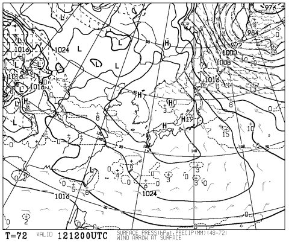
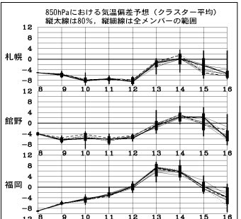

# 恒例！この週末のスキー場の天気は？

📅 投稿日時: 2012-02-10 01:16:20

🏷️ カテゴリ: [スキー天気予想](c6554f5c3c106093b511a8daae23757e8.md)

はい．

というわけで，恒例の週末スキー場の天気予想です～．

えー．

この週末．

土日とも．

冷えます．

降ります．

新潟は当然．

今回は，信州まで降りそうですね～

土曜日の朝は，信州もそこそこの新雪，それも軽い新雪が楽しめそうですね～！！

新潟はパウダー祭りですか…．

まぁ，土曜は終日降るでしょう．

スキーの神に対する信心深い皆さんは，この雪で，6-7日の雨のせいで固まった

アイスバーンが隠れてくれることを祈りましょう．

あー．

日曜の朝も，土曜ほどではないけどぼちぼち積もりそうです．

で，日曜もずっと雪が降り続けそうです．

12日午後9時の地上予想図を見ると…

高気圧に覆われて晴れそうに見えますが．

一見晴れると思いそうですが．

12日午後9時の500hpa気温＆700hpa湿数図を見ると…

湿数の大きなエリア（網掛けのないエリア）が，矢印で示すように日本を

横切ってます．

これは，この流れに沿って雪雲が流れるパターン．

信州も雪になるんですね～．この場合．

FZCX50を見ると…

12日の日曜までは，例年より低い気温が続きそうですね．

という感じで．

よく冷えて，よい雪質の雪が降り積もる2日間になりそうです．

が…

…逆に言えば．

この土日．

お日様は拝めなさそうですな…

うーん．

子供を連れて行くには寒すぎだなぁ…
