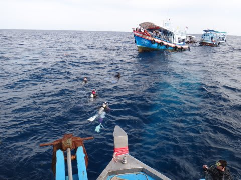

# 2013年9月　子連れタイ・タオ島ダイビング旅行記　その27…ダイビングラストDay，5日目スタート

📅 投稿日時: 2013-11-20 00:49:24

いやー．

冷えてますね～．

…でも．昨日の天気予想通り．

信州は雪にならず，晴れてますね…．

でも．気温が冷えているので．

スキー場は全力で人工降雪を打ってますよ～．

今週末からは，かぐらはクワッドが動くようで，

気持ちいい中斜面が，高速リフトで滑れるようになりますね～．

＃混むだろうなぁ…

ってことで．

いつものダイビング日記へ，Go！

---

さてさて．

ついに，ジンベエを見るラストチャンスの5日目がやってきたわけですが…

果たして．

本日．

無事，ジンベエさまと遭遇できるのか？

あるいは，妻の突発性ジンベエ見たい病が治癒せぬまま帰国となるのか？？

朝，おきて見てみると…

ををっ！

最後の願いが通じたのか．

タイにきて初めて，朝から晴れてるじゃないですかっ！！

…これは，

今日こそ外洋に出れるのでは…？

と，期待して水上タクシーに乗り本船へ．

乗船すると…

いやー．朝からデッキに日が射してるのは，初めてだよ…

ガイド「今日は外洋に出れます～！チュンポンピナクルへ行きますっ！」

…やっと．

やっとだよ．

やっと，ジンベエが狙えるポイントへ遠征できる…(喜)

…今日こそジンベエと遭遇だっ！

ってことで．

タオ島周りのジンベエ狙いの有力ポイント，チュンポンピナクルへ向かいます．

初日に一緒に潜った人が，「昨日，チュンポンでジンベエを見たよ」と

言ってさんざん我々をうらやましがらせたという，

期待いっぱいのポイント．

船がチュンポンに近づくと…

をー．

すでに他の船がいっぱい泊まってますね～．

さて．

午前中はチュンポンで2本潜る予定なので．

1本目は，まず，妻がジンベエチャレンジ！

さーて．

今日．チュンポンにジンベエさんはいてくれるのかな？

ジンベエさん，出てね～！と，

祈りながら，潜っていく妻を見送ります…

そして．

ジンベエさん，出たかな～

妻は無事，ジンベエさん見てるかな～

と，やきもきしつつ，ダイビング組が戻ってくるのを娘と

待つこと，約40分…

妻が，浮上してきました．

さて，妻は無事，ジンベエ様を拝むことができたのか？

妻の，「突発性ジンベエを見たい病」は治癒するのか？？

(続く)
