# 2月11日の志賀高原詳細…晴天！激烈シアワセの一日！

📅 投稿日時: 2014-02-13 02:24:49

🏷️ カテゴリ: [2014スキー滑走日記](c992167609b6415052179ee69ea1ea7d8.md)

ってことで．

飛び石4連休最終日の詳細情報です…

昨日速報しましたが．

むはははは．

スキーの神様は，スキーを愛する私のために，

最高のコンディションを提供してくれたのでしたっ！

とりあえず．

朝から，ピカピカの晴天だぁっ！！！！

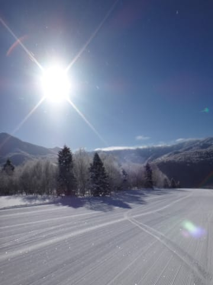

そして，気温もキンキンに冷えてますっ！

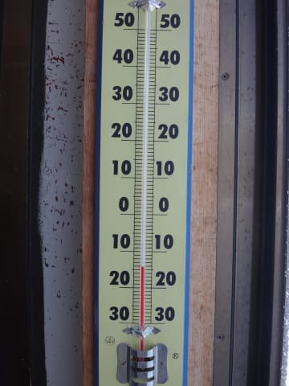

朝イチの山頂気温はマイナス15度．

晴れてても，いい感じで冷えひえなもので…

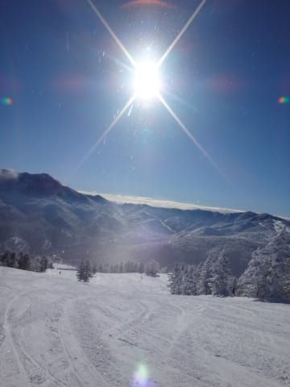

ダイヤモンドダストがキラキラしてます！

そして．

ゲレンデは．

超冷え冷えの，よだれじゅるじゅるモノの，

激烈にいい感じの，締まったシマシマ圧雪！

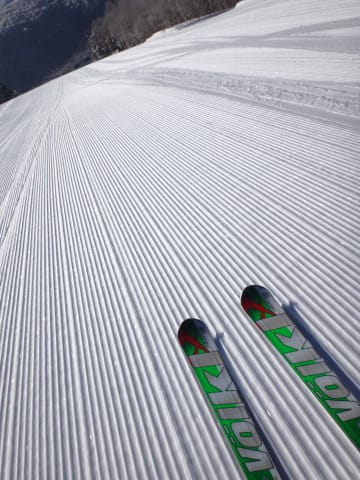

この，冷えひえシマシマを切り裂いていく快感っ！

人生，これ以上の快感があるのかっ！？？

もう．

夢に出てきそうな最高コンディション．

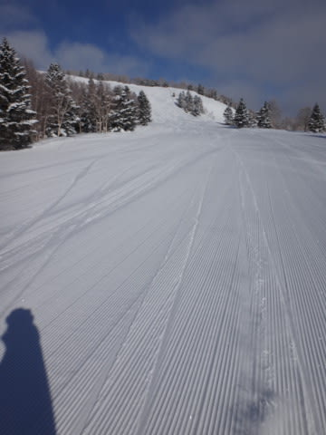

こんなに晴れて，最高の冷えひえ雪質のぴかぴかの圧雪を

滑れる日が，シーズンに何日あるか…

人生最高の快楽バーンだぁっ！

…でも．

最高の快楽も1時間ほどで終了…(涙)．

娘が出動したので，ここからはのんびり家族スキーモードです…

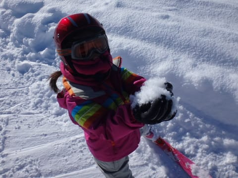

でも．最高の雪質に，娘も喜んでます(笑）．

いや，

しかし．

この日．

天気が良くて，雪質がいいだけじゃないよ．

平日の合間の祭日ってこともあって．

…ゲレンデ，人がいないんですが…

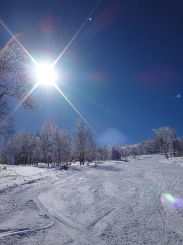

もう，ぜんぜん写真に人が写ってないんですが…

いつもながら，経営大丈夫かっ！？

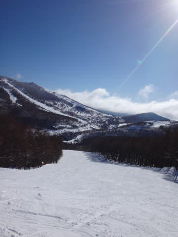

そして．

人が少なかったので．

この日は，午後になっても完全フラットなままで，

好きなラインで大回りしたい放題っ！！！

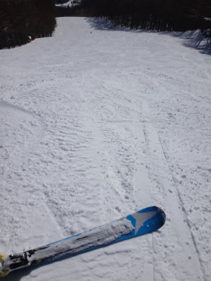

昼間も気温は低いままで，雪質は一日中ベストコンディションをキープっ！

日が暮れるころになっても…

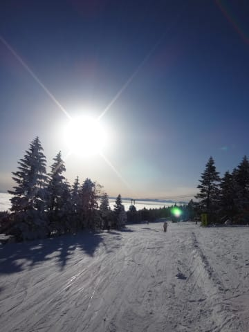

相変わらずゲレンデはフラットで．

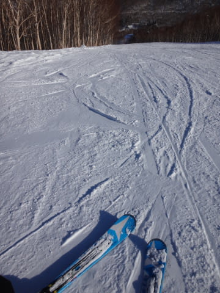

そして，リフトストップ直前には，すばらしい雲海が

眼下に広がるというオマケまで…

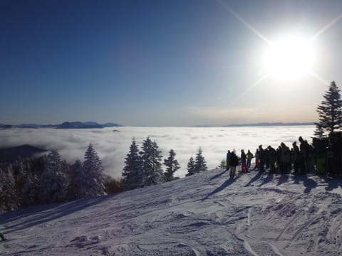

もう，雪質・天気・混雑と全ての条件がそろった上に．

朝イチのダイヤモンドダストから，夕方の雲海まで…

私の日ごろの行いのよさを

自然が祝福してくれてるとしか思えない一日でした．

そうです．

この日，志賀高原で滑った人は．

私の日ごろの行いのよさに感謝して…

あ，痛い！石を，石をぶつけないでっ！(読者からタコ殴りに殴られるSkier_S)

## 💬 コメント一覧

### 💬 コメント by (Goku)
**タイトル**: Unknown
**投稿日**: 2014-02-13 20:28:24

ハイ！私もＳさんの日頃の行いの良さの恩恵を受けたひとりです(笑)

いや～本当に最高の１日でしたね。

朝イチのＧＳコースは幸せすぎて涙が出そうでした。

### 💬 コメント by (Skier_S)
**タイトル**: Gokuさま
**投稿日**: 2014-02-13 23:33:36

いやー．

もう，最高すぎる一日でしたねっ！

朝イチのGSコース，私も滑ってたんですけどね～．

お会いしませんでしたね～．

毎週，こんなコンディションだとシアワセだなぁ…

