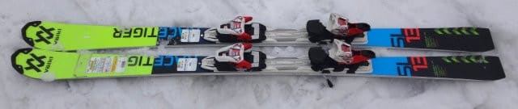
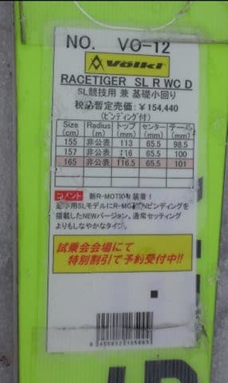
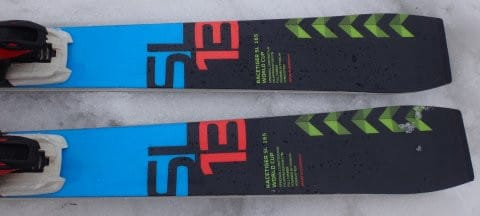
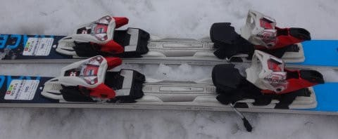

# 2018シーズンモデル，スキー試乗レポート第20回…Volkl編その3

📅 投稿日時: 2017-06-17 01:05:04

ということで．

明日は娘の参観日の，Skier_Sです．

…あぁ…

天気がよさそうなのに…

月山はまだ雪がたっぷりあって楽しめそうなのに…

今週末，スキーに行かないと．

実に3週連続でスキーに行かない週末．

…そろそろ，禁断症状がヤバいかも…

ってことで．

かなり心が月山に飛んでしまってますが．

本日はスキー試乗レポート，フォルクル編です．

では，どうぞ～！

---

◎VOLKL RACETIGER SL R WC D 165cm

>

SL競技用，基礎小回り用

SL競技用トップモデルのRACETIGER SL WCのプレートを抜いて，

Platinumシリーズと同じR-Motionビンディングを乗っけて，

トップモデルよりは優しくしたこのモデル．

基礎小回り用としての利用も想定されているようで…

ちょっとPlatinum SDとキャラがかぶるかな？

…と思いつつ試乗した，このモデル．

乗ってみると…

Platinum SDと同じく．

SL競技用ベースと思えないほど軽快，軽いです！

そして，動かしやすい．

荷重ポイントはセンター．

センターに乗ればきれいにたわんで，キュインと

エッジに乗って，ちっちゃく回ることができます．

ATOMICのSXのようにピュンとたわんでグッと回る板じゃなく，

割とカラカラとした感じの，ドライで張りのある強いコアを

たわませて，くーっと回る．

そんな感じの板です．

SDとの違いは，返りの速さ＆強さ．

SDのように，ビュンと返ってくる強い反動に乗って

反復横飛びをしていくような感じの板ではなく．

張りのある板をたわませていくと，板がぐぐっと

まわって，それが体の下を通過して切り替わっていく…

という感じ．

SLモデルベースの板なので，エッジグリップはかなり強いです．

ガッツリエッジに乗って切れていく板．

さらに，スピード耐性も十分あります．

何にしろ軽くて，動かしやすいので，乗りやすい板です．

軽い分，荒れた斜面でわずかに叩かれる感じも受けますが．

でも，春雪でも意外と気持ちよく，

荒れた雪でもスピード出しても怖くないです．

スピードを出していくとガッツリグリップして

良くたわんで．

このたわみに乗って，エッジに乗って回しこんで

いけるので．

たわませるとすぐに強い反動が返ってくる，

反復横飛び系のSDよりも，

私としてはこっちの方が好きかも…

## 💬 コメント一覧

### 💬 コメント by (olaf2125)
**タイトル**: 日曜は？
**投稿日**: 2017-06-17 14:43:14

授業参観が終わったらレガシィが勝手に月山に向かってしまう…とか  ^o^

### 💬 コメント by (マルハバ)
**タイトル**: こちらの板・・・
**投稿日**: 2017-06-17 19:55:28

毎年の試乗会で一番のお気に入りです。

そのシャープなキレは

まさにカミソリかカッターナイフが如く！（笑）

先日、いつもの店に型落ちモデルを探しに行きましたが、残念ながら入荷は無し・・

それどころか・・・

なんでもこのメーカー、本国で倒産の危機だとか！？

「どこかが買収してくれなかったらパアです」

なんて情報を耳にしましたよ（汗）

スキー不況は日本だけじゃないのでしょうか？

### 💬 コメント by (Skier_S)
**タイトル**: いろいろありますね…
**投稿日**: 2017-06-17 21:25:46

＞olaf2125さま

いろいろ鋭いですね…！

私も予想外なことに，勝手に向かってしまうかも

しれません…

＞マルハバさま

えええええ！！

Volklヤバいんですか！？？

日本では，金子あゆみ選手やら柏木選手やら，

トップクラスのデモが履いてますが…

確かに，最近ワールドカップではあんまり

見なくなりましたが…

国内では人気ですけどね～．

Volklが無くなるのはマズいかも…

でも，なんだかんだ言ってRossignolも

RANGE，Dynastarとセットになり．

SALOMONもテーラーメードグループに

見切りをつけられ，ATOMICと一緒になって

生き残ったり．

スキー業界も，生き残りが苦しくなってきてるん

でしょうね…

