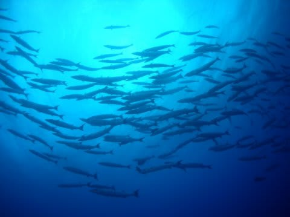
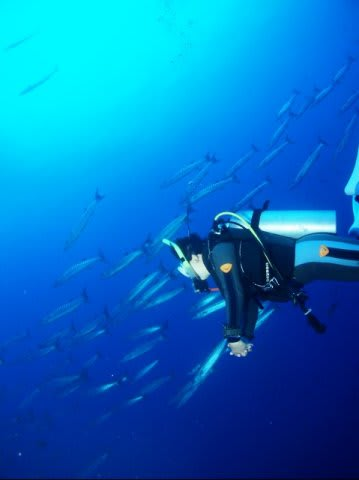
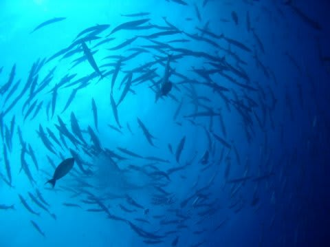
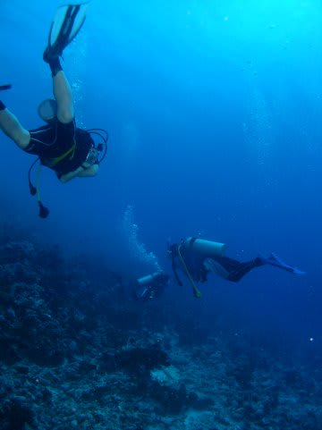
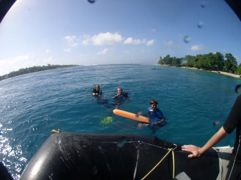

# 2009年　初の海外子連れダイビング旅行記　16　First dive in Rangroa

📅 投稿日時: 2012-09-13 08:24:13

ということで．

現在，シンガポールのチャンギ空港で乗り継ぎ待ち中です．

行く先は…

いや．これは明かさずに，帰ってきてからの楽しみの方がいいかな？

私としては，この国には5回目の渡航でしょうか…

-----

ゴムボートからバックロールで，いざ，ランギロアの海へ！！！

エントリー後…

いやー．さすがタヒチ．文句なし，30mオーバーの透明度です．

前半は，周りに何も見えない完全ブルーウォーターダイビング．

周りに何も見えないので，流れが速いことは分かりませんが，

潜ったり浮いたりしているつもりが無くても気がついたら

深度がけっこう変わってるので，かなりの流れであることを

感じさせます．

10分ほど流れていくと，バラクーダが目の前に群れているのを発見！

それほど大きな群れではありませんが．

しばらくバラクーダと一緒に泳いでいると…．

ぐるぐる渦を巻き始めました．

ををを！

トルネードだ！

パラオでも，シパダンでも．群れは見たけどトルネードは見たこと無かった！

わが人生初の，バラクーダトルネードだっ！！！

…でも，群れがちょっとミニチュアサイズですが…

で，やっぱりバラクーダトルネード見ると，写真撮影にいいポジションに

入ろうとしてだんだん深度が下がっていきますね…

もう少し下がりたかったけど，チームメンバーとあまり離れられないので

このあたりで切り上げ．

その後，チャネルの壁沿いに近づきます．

壁に近づくと…それまで気づかなかったけど，すごいスピード！

すごいスピードで壁が流れていくっ！

あー．…言うまでもなく．

壁が流れてるんじゃないですよ．

われわれダイバーが流されているんですよ．

自分たち，こんなスピードで流されてたのかっ！

ナポレオン．アオウミガメらしきカメ．ブラックチップシャーク，

レモンシャークなどなどがぶっ飛んでいく我々とすれ違っていきますが，

でも，こんな流れで近づけず，ほとんど写真が撮れない…

いろんなものが出たけど，一瞬ですれ違うので印象が残らない…

最後は浅瀬に上がってきますが，地面がすごいスピードで流れる！

速い～っ！

こんな中，ガイドはフロートを上げてます．

こんな流れでExするんかいな？

っと思ったら，チャネルの内側に入ったのか，一気に流れが止まりました．

うはー．

一安心．

さっきの流れでExしたら死ぬわ．

流れの止まったところで浮上し，ボートに拾ってもらいます．

いやー．しかし．ランギロア．

いきなりのぶっ飛びドリフトだったことよ．

…確かに，これはガイドから離れたら危ないわ…

でも．（ちょっと密度は低かったけど）バラクーダトルネードも見れて，満足…

と満足していたところ．

…後からボートに上がってきたもう1チームは，みんななんか興奮してますね．

それも，すごい楽しかったみたいですね．

なんか，いいことあったみたいですね．

話を総合すると…

なんだか．

10頭ほどのイルカに囲まれたらしい．

うち3頭はすごく近くでぐるぐる回ってくれたらしい．

さらに1頭は，かなりフレンドリーだったらしい．

チームのメンバーの間に割り込んできて，10分ほどぐるぐるまわってくれたらしい．

はっきり言って，人間に「触ってくれ～」といわんばかりに近づいてきたらしい．

ものすごく満足したらしい．

グレートダイブだったらしい．

…つ，作り話ですよねっ．．．．

我々をだますための…

え，実話？

ホントの話…？？

…

…

…ぐやじい～～（涙）．

くやし～！

さっきまでの満足気分が吹き飛んでしまった…．
