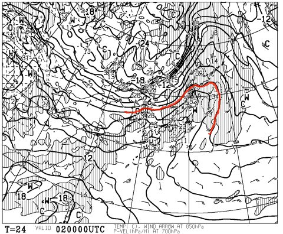

# 今週末も志賀高原なんだけど…

📅 投稿日時: 2013-02-01 23:52:46

あわてて-10度対応のワックスを高温向けのに塗り替えている，Skier_Sです．

昨日は疲れて知らぬ間に寝ていたので，このBlogを更新できませんでしたが…

生きてますので，ご安心を．

ってことで．

明日からまた志賀高原なわけですが…

…

…

うーーーーん．

やっぱり，土曜日の予想天気図，850hpaの0度線は北海道近くまで上がったまま…

すでに現在，志賀高原の気温はプラスになっているようで．

でも．

でも．

風が明らかに西風になり．

低気圧が北側を通過するので．

前回，12月15日に[天気予想を大外し](eec8044396c423cdac2d63d7f17ba7390.md)（涙）したときと同じパターン．

…これは．

もしかすると．

土曜日は，午前中，雨にならずに晴れるかもしれませんね～．

壊滅的な雨は回避できそうっ！！！！

…でも，早朝に軽く雨が降って，昼間もぐんぐん気温が上がるので．

…

…土曜日，ゲレンデは春の雪でしょう．

んで．

夕方近くから冷えて，雪がちらつき始めますねー．

でも．土曜2日の夜から，日曜3日の朝までの積雪はたいしたこと無いですね～．

日曜はそれほど降らなくて，冷える…と，なると．

…日曜は完全アイスバーンのパターンですね（涙）．

この週末．

あんまりコンディションはよくないですね．やっぱり…（大泣）．

## 💬 コメント一覧

### 💬 コメント by (komu)
**タイトル**: Unknown
**投稿日**: 2013-02-02 00:34:28

自然相手のレジャーなので仕方ないとはいえ何故に週末にこうなるのか…

覚悟を決めてアサマへイきます。

ゲレンデ整備品質に期待(=゜ω゜)ノ

### 💬 コメント by (aqura)
**タイトル**: Unknown
**投稿日**: 2013-02-02 18:48:00

いゃー、今日は志賀、コンディション悪かったですねぇ。午後の濃霧には閉口しました。

### 💬 コメント by (Skier_S)
**タイトル**: 最低の土曜日(涙)
**投稿日**: 2013-02-02 22:19:28

>komuさま

いやー．志賀は（も？）最低でした…

アサマはいかがでした？

おそらく，午後は雨だったのではないかと…

>aquraさま

お．今週も志賀高原でしたか…

いやー．

コンディション悪かったですね～

まさかこの時期にここまでひどいとは…

明日はアイスバーン祭りですね（涙） 

引き続きコンディションは悪いかと．

