# 1月30日の志賀高原は…冷え冷え踊りは効いたけど…下地がアイスバーン気味（涙）

📅 投稿日時: 2016-01-31 00:40:39

ということで．

気温が冷える踊りの効果は如何に？？？

と，志賀高原にやってきた，本日．

…まず，焼額に向かう途中で．

なんと．

甘楽PAからチェーン規制…っ！

まさか，碓氷軽井沢ICより手前のこんなところから

高速道が積雪するなんて…っ！！

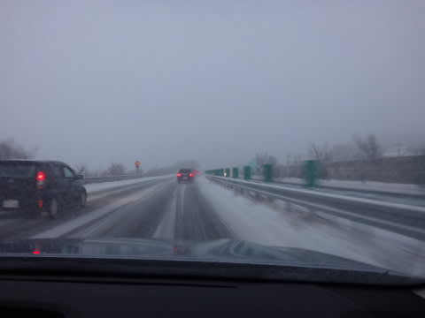

…これは．

もしかすると．

踊り，効きすぎたか！！？？

当然，志賀の上り道も本格積雪路…

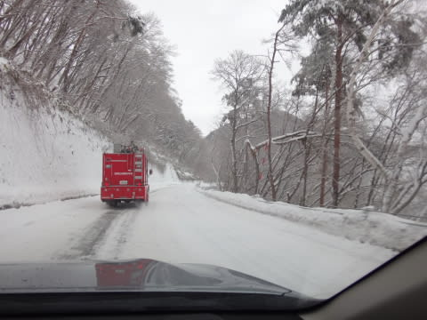

だもんで．

いつもより30分以上余計にかかって．

焼額到着，屈辱の8時50分…（涙）

く，屈辱…

ゴンドラスタートに間に合わないなんて！！！！

…って屈辱感を味わいつつ，

ゴンドラで山頂へ上ると…

山頂の気温は，-5℃…

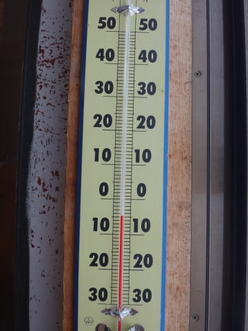

ふはは．

雨の予想を考えると．

冷えてる，冷えてるよ！

そして，ゲレンデに出ると…

高速を走っている間に，ひたすら降り続けていた

雪はもう止んでます．

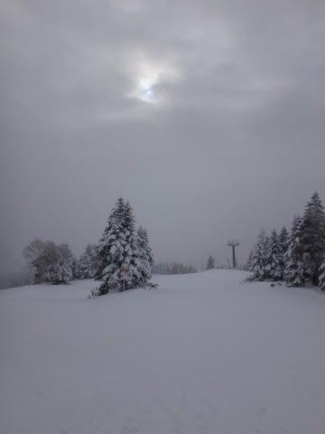

うむ．

昨日最終予想した「9時にはやむ」というのが，

ドンピシャ正解だったなぁ…

コースわきの状況を見ると．

うむ．

…昨晩から10cmほどの新雪が積もったのかな？

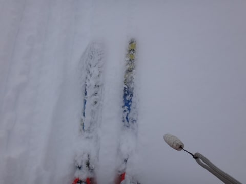

圧雪コースは，この新雪がきれいに圧雪された，

結構快適なバーン！！

今シーズンの1-2を争ういいコンディションかも？？

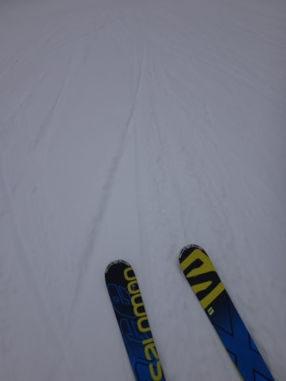

いやーー．

雨の予報だったことを考えると．

これはラッキー！

うっすら太陽ものぞくほどで，かなりいい状況ですよ…

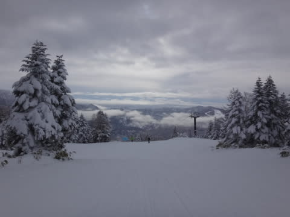

雪質も「重い雪」と予想したところ…

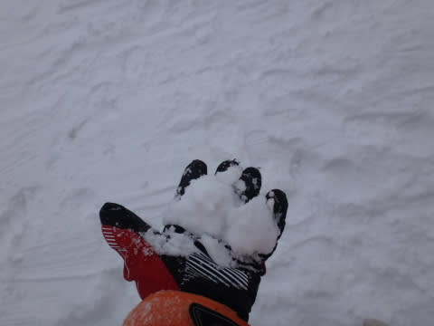

あれ？

握ると固まっちゃうくらいの雪質を想像していたけど…

予想よりはいい感じ！

いやーーーー．

皆さんの冷え冷え踊り，効いたようですよ～っ！！

午前10時を過ぎてくると，ちょっとゲレンデの人が増えてきたけど…

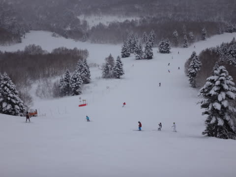

んでも，ゴンドラ待ちはほとんどなくて．

なんだか，心配なくらいガラガラなんですが…

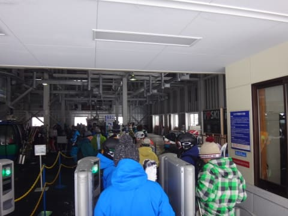

で．

昼近くには，薄日ながらも日が差すタイミングもあり．

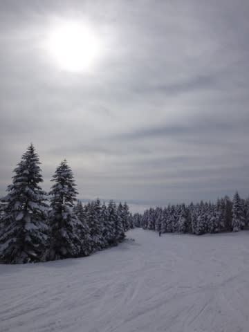

ふははは．

気温が冷えたのはみんなの冷え冷え踊りのおかげだけど．

日が差したのは，やはり私の日頃の行いが良いからに

違いないっ！！←違う．断じて違う

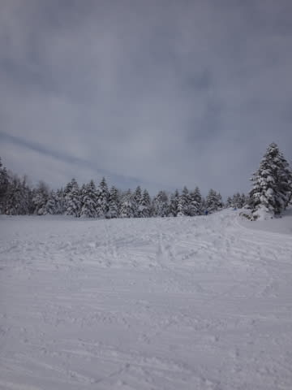

と思いつつ．

快適なゲレンデを滑っていたわけですが…

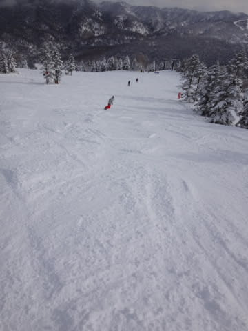

しかし．

昼過ぎには…

あれ？

なに？

アイスバーン？？

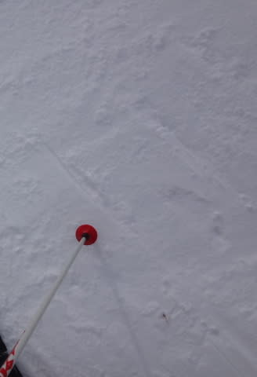

…どうやら，昨日の昼間．

結構な雨だったらしく．

今朝積もった新雪がはがれると，下地に

「どうも～．昨日の雨が凍った，アイスバーンです～（はぁと）」

って感じで．

出てこなくてもいいアイスバーンが…（涙）

ゲレンデ状況はよさそうに見えるだけ，

下地のアイスバーンが，惜しいっ！

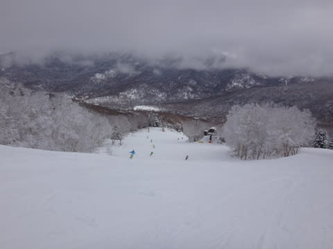

…でも，焼額や寺子屋は，山頂付近が霙っぽい感じで，

完全な雨じゃなかっただけまだマシな方で，

西舘やブナから下のほうは，かなりの本格的カチコチアイスバーン

だったようです…

ということで．

夕方は，ちょっとゲレンデが荒れて，

コブの間に硬い下地が顔を出すような感じになっちゃいましたが…

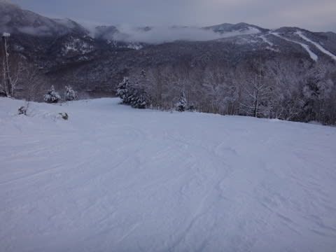

まぁ，日も差す穏やかな天気で．

雨に比べれば，2億4000万倍くらいよかったよ…

と，思いつつ．

いつも通りリフトストップまで滑り続けたのでした…

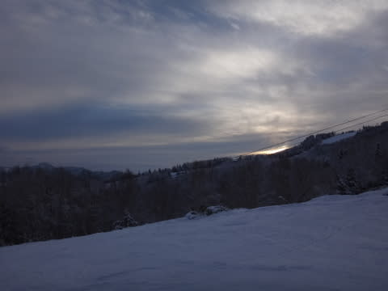

…

…で．

やっぱり．

そうです．

いつものナイターです．

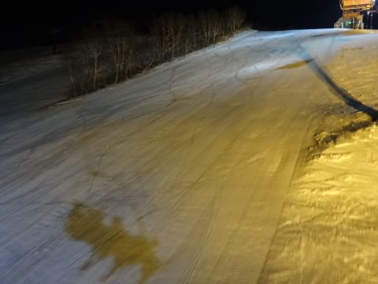

今日のダイヤモンドナイターは，冷え冷え，

やわらかい圧雪の，超最高シマシマバーンっ！！！

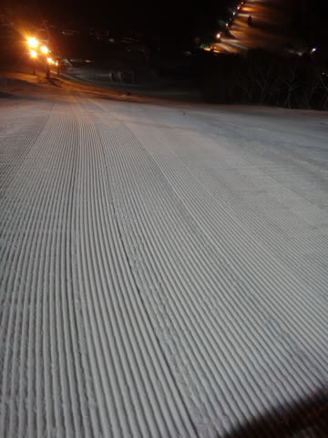

いやーーーーーー．

最高！

雨の予報だったのに．こんなシアワセでいいの？

って感じの快楽バーンでしたよ～！！！

とりあえず．

当初の土砂降りの，壊滅的な予想を覆し．

雨どころか，午後は薄日が差すような穏やかな天気の中，

結構冷えた，いい雪質を滑れた本日．

「ここで滑っているスキーヤー全員，

気温が冷える踊りを踊り続けたBlog読者のみなさんに，

感謝の祈りをささげなくてはならない…！」

と，強く思った今日一日だったのでした…

## 💬 コメント一覧

### 💬 コメント by (はなげ親分)
**タイトル**: 冷え冷え踊り効きました!!
**投稿日**: 2016-01-31 13:01:46

いや～雨を覚悟していたので、ほんとにヨカッタ♪

ところで今日の晴れ間は、どなたか間違って晴れ晴れ踊りを踊ってません？

### 💬 コメント by (ゆうこ)
**タイトル**: アイスバーンでしたね
**投稿日**: 2016-01-31 22:27:51

久しぶりのスノーボード行ってきました。

あまりの久しぶりの足に、アイスバーンは堪えました。

子どもの面倒を見ながら交代で滑ったので、あまり滑れませんでしたが、滑ってること自体に感動しちゃいました。

今回は会えなくて残念でした。

次回は2/20に行きます。

息子には今度は雪が降れ降れ踊りを教えておきます。

### 💬 コメント by (Skier_S)
**タイトル**: いい天気の日曜でした！
**投稿日**: 2016-02-01 00:28:10

＞はなげ親分さま

どうやら，晴れ晴れダンスを踊られた方がいたようです（笑）

http://red.ap.teacup.com/applet/gokurakuskier/20160131/archive

今日は晴れてうれしかったのですが…

これから週末にかけて，またどっさり降って

ほしいところです…

＞ゆうこさま

ゲレンデ復帰，おめでとうございます！

お会いできなくて残念でした…

でも，滑ってること自体に感動ですか～．

分かる気がします…

でも，ゲレンデは，金曜の雨が痛かったですね…

アイスバーンになってしまって，ちと残念です．

一の瀬滑られたんですか？？

…しかし，また一か月たたずに復帰ですか．

2月20日，また志賀高原でお会いしましょう～！

うちは娘連れで滑ってます！

### 💬 コメント by (ゆうこ)
**タイトル**: 一の瀬〜焼額
**投稿日**: 2016-02-01 10:57:18

一の瀬から第一ゴンドラまで遠征してました。

でも、第一ゴンドラ滞在時間が短すぎて、お会いできなかったようです。

息子が場所見知りして、ホテルの部屋にずっといると機嫌が悪いってことがわかったので、次回は吹雪にならなかたらダイヤモンドのキッズパークで抱っこしてソリでもしようかなって思っています。

次回はお会いできたら嬉しいです〜♪

### 💬 コメント by (Skier_S)
**タイトル**: ゆうこさま
**投稿日**: 2016-02-01 23:29:51

1ゴンまでいらしてたんですね～！

うーん．

それでもお会いできなかったのは残念…

うちの娘も最初は宿の部屋がお気に召さない

様子もありましたが，ポータブルDVDをTVに

つないでお気に入りの番組を見せたり，

夏の間もいろいろな宿に泊まったりして

旅行慣れさせることで，どこに行っても

嫌がらないようになりました～．

冬の間は天気が悪いと，どうしても

宿籠りしないといけないので…

ダイヤモンドのキッズパークでそり遊びも

いいですし，スコップ持って雪遊びだけでも

十分楽しめると思いますよ～！！

では，また次の機会に！

