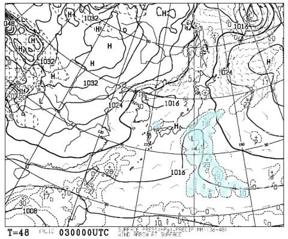
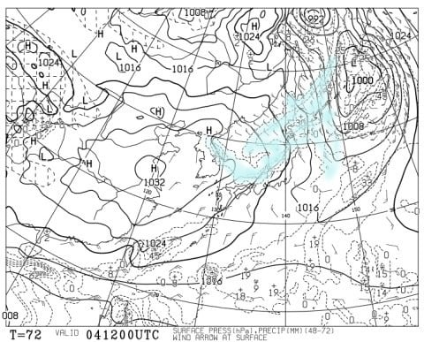
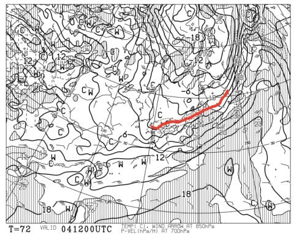
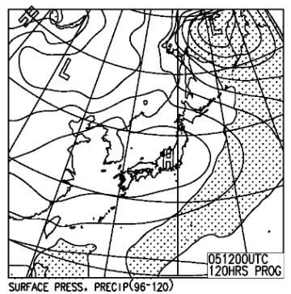

# 11月3，4，5日，3連休のYetiの天気は…3日は微妙だけど，大体晴れそうかな

📅 投稿日時: 2017-11-02 02:29:28

🏷️ カテゴリ: [スキー天気予想](c6554f5c3c106093b511a8daae23757e8.md)

ということで．

台風2連発が過ぎ，ようやっと秋らしい天気に

なりつつある今日この頃ですが．

…なんと．

冷静に考えると．

今週末は，3連休じゃないですか！！！←いや，冷静に考えなくても3連休だから

ということなので．

今週末の3連休の，イエティの天気を

予想してみようじゃないですか…．

えー．

まず．

3日金曜の地上天気図を見てみると…

うーむ．

微妙だ…．

静岡付近，わずかに水色の降水域がかかってます…

うーむ．

でも．

降るのは夜中～早朝にかけてで，

朝になったらやんでるんじゃないかと

思うのですが…

ヘタすると，朝のうちちょっとガス＆小雨が残るかも…

だけど．

降ったとしても朝だけ．

すぐ止んで，午後には晴れていくはず…

そして．

4日の地上天気図は．

…をを！！

完全な西高東低＆日本海側に集中した降水域っ！！

これは…見事な冬型じゃないですか！！

朝鮮半島の付け根から，細長い降水域が

南東に流れてるけど…

これ，JPCZか？？

これがJPCZだったら，かなり本格的な冬型だよ…

この日の，850hpa気温をみてみると…

ふおおお！

0℃線が，志賀高原付近まで下がってきてるよ！

風も北風だし…

これは，スキー場はまた雪が積もりそうな感じ…

あ，冬型ってことは．

太平洋側は晴れるので．

この日のYetiはひんやりすっきりした晴れでしょう．

そして，3連休最終日．

日曜の地上天気図は…

これなら，本州はすっぽり高気圧に覆われるので，

すっきり晴れますね．

ってことで．

まとめると．

金曜：早朝は雨がぱらつくかも…でも，午前中に雨はやみ，

　昼に向かって晴れていく．午後はすっきり晴れ．

　日が射すと暖かく感じるかもしれないけど，

　気温はちょい冷え気味．

土曜：終日晴れ！

　気温はかなり寒いので，ウェアのジャケットは忘れずに！

　朝の雪は結構締まったいい感じかも…

日曜：この日も終日晴れ．

　土曜より気温は上がるかな…

　概ね平年並みだけど，太陽が照るので

　気温より暖かく感じるかも．

…という感じで．

この3連休は，これまでの2連続台風の憂さを晴らすように，

やっとこの時期らしい，まともな天気になりそうです…！！

10月オープンの週以降，毎週営業中止やら雨やらに祟られましたが．

約一か月ぶりに，雨じゃない日に滑れそうです…っ！←なんだか，すごい低レベルなことにかんどうしてないか？？

でも．

この時期，日が射しすぎると雪が緩むし．

さらに晴れると，混みそうだし，

雨が降る方がいいのかも…←台風の中でも滑るような人は，何だか基準がおかしくなっている

## 💬 コメント一覧

### 💬 コメント by (しんちゃん)
**タイトル**: 霊峰富士
**投稿日**: 2017-11-03 00:20:18

秋晴れの滑走レポート、期待しています。

秋の空に、富士山がきれいに映えるでしょうね。(^^♪

### 💬 コメント by (Skier_S)
**タイトル**: しんちゃんさま
**投稿日**: 2017-11-03 12:22:02

金・土は別件があるので，日曜日にレポート予定です～！

すっきり晴れてくれることを期待…

日曜夜をお待ちください！

