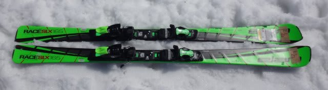
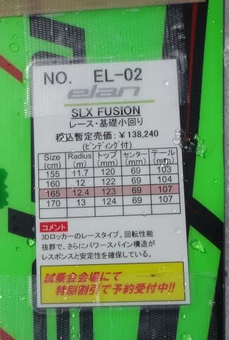
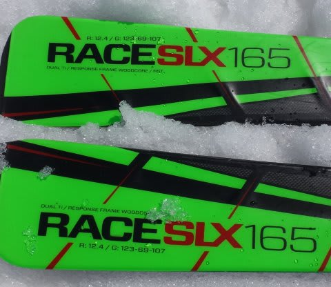

# まだ終わってないよ！2016シーズンモデル，スキー試乗レポート第17回…ELAN編

📅 投稿日時: 2015-05-21 00:10:55

かれこれ5日間．

まだ熱が下がっていない，Skier_Sです…

＃…こ…今週末までには，きっと治すぞっ！

ということで．

実はまだ10機種近く残っている，2016シーズンモデルのスキー板，

試乗インプレッション．

本日は，エラン編です．

では，どうぞ～！

○ELAN Race SLX FUSION 165cm

SLレース用．

見たところ，今年モデルと同じように見えますが．

結構大きく構造的に変わっているらしい，来年のSLX．

でも，乗った感じは…やっぱりSLX.

今年モデルとおんなじような感じを受けました…

やはり，アンフィビオ形状が効いているのか．

内足を畳んでいくと，内足側もしっかりグリップし，

両足がそろったままきれいにレールターン的にキュンと

回っていきます．

エッジグリップは比較的しっかりしており，

全くずれることなく，板のトップとテールが完全におなじ

ラインの上を抜けていくような，きれいなカービングで

いとも簡単に小回りしていきます．

そのままスピードを上げていくと，とても長さ165cmとは

思えない小さい半径で，クルクル回ります．　　

乗り手が操作しなくても，板がサイドカーブに乗って勝手に

クリクリ小回りを初めていく，超オートマチック小回り板…って感じ．

…逆に言うと．

超強力小回り強制板，とも言えます．

大回りは不可能です

小回りスペシャルな板です．

この小回りも，板のばね感による返りを利用したものではなく，

サイドカーブでクルクル回るように感じる小回りです．

ただ，レース用の板ということで．

スピード耐性はあります．

かなりのスピードまで，（乗り手に小回りを強制したまま）

スピードを上げていくことができる板です．

ずらそうと思うと，圧が抜ける感じで，決してズラシで

コントロールする板ではないですね…

グリップさせていると安定感がありますが，

ずらしに行くと安定感を失い，キョロキョロした感じになっちゃいます…．

…低速とか，コブとかはちょいとつらいかな．

ただ，内足をきれいにたためる人は，板の性能に

任せっぱなしでキュンキュン回ることができるので．

カービング小回りスペシャルと割り切れば面白いかも．
