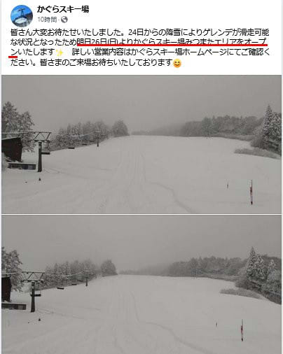
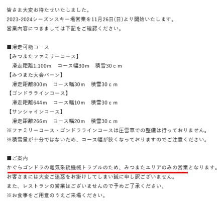
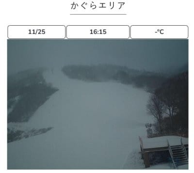
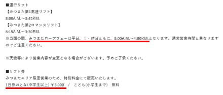
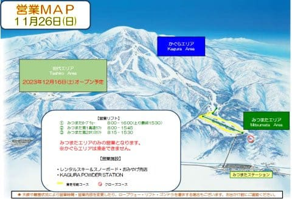
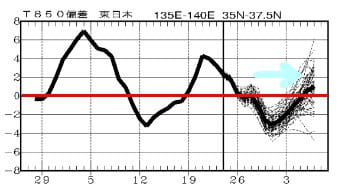
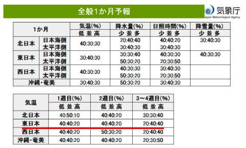
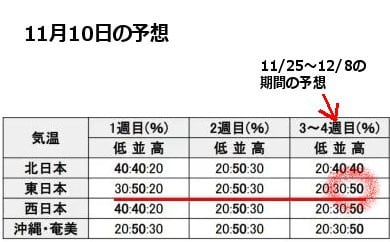

# かぐらスキー場，11月26日オープン！…でも，ゴンドラ故障でみつまたエリアのみ．リフト券3000円！

📅 投稿日時: 2023-11-26 03:46:51

えー．

昨日，かぐらスキー場は

「26日にオープンするかも…？」

とほのめかしていましたが…

どうやら26日にオープンが確定したようです！

（[かぐらスキー場Facebook](https://www.facebook.com/snowkagura/posts/pfbid02KuHutouaPj2AY1FKnqySqFWVxxhPw4a9gfitxs89buDzDayPnaTKSUZsQ8W926Ubl)より）

…でも，みつまたエリアがオープン？？

もうみつまたエリアがオープンできるのは

すごいけど…

かぐらエリアがオープンするんじゃないの？

と，思っていたら．

かぐらゴンドラが電気系統機械トラブルとのことで，

みつまたエリアのみの営業となったみたい

ですね…

（[かぐらスキー場ホームページ](https://www.princehotels.co.jp/ski/kagura/informations/2023winter_kagura_open/)より）

うーん．

ライブカメラを見ていると，かぐらエリアも

十分滑れそうなので，ゴンドラが動かせないのは

かなり痛い感じ…

（[かぐらスキー場ライブカメラページ](https://www.princehotels.co.jp/ski/kagura/livecamera/)より）

しかし．その代わり，

明日26日は滑れるエリアがみつまたエリアのみ

ということで，リフト券は3000円という

強烈格安価格みたいです…！！

（[かぐらスキー場ホームページ](https://www.princehotels.co.jp/ski/kagura/informations/2023winter_kagura_open/)より）

しかしこれで，みつまたエリアのクワッド側と

ゴンドラに滑り降りるペアリフト側の両方，

計4コース滑れるなら，結構いいかも…

（[かぐらスキー場ホームページ，営業マップ](https://www.princehotels.co.jp/file.jsp?id=408281)より）

そして．

昨日書いたように．

この後，27，28日はちょっと気温が上がる

けど…

29日以降は冷えます！！

12月4日くらいまで冷え込みが続きそう

ですね…！！

西風っぽいので，志賀ではドサドサ積もら

なさそうだけど…

終日冷え冷えなので，これなら11/29～

12/3くらいまでは，昼間も人工降雪機が

フル稼働可能だぁ！

で，11月23日発表の一か月予報を見てみると…

11/25～12/1までの1週目，

12/2～12/8までの2週目とも

気温が平年並みか低めの予想に

変わってます…！！

すばらしい！！

今から2週間前，

11月10日発表の一か月予報では…

11月25日から12月8日までの3-4週目の

期間，気温が高くなる確率が高い

予想だったというのに…

…やっぱり，[この記事](ef7315749c54794c48d562976955a8ad6.md)の最後に書いたように．

1か月予報の3-4週目の予想は外れるのだ…！！

ってなことなので．

最新の1か月予想では，3-4週目は気温が高く

なる予想になってるけど…

これも外れるはずなのだ！！

気温が高くなる予想ということは，

実際は外れて気温が冷えるはず

なのだ！！←外れることが多いだけで，絶対外れるわけじゃないから

というわけで．

暖冬が予想されていますが…

この12月は，少なくとも上旬は意外と

冷えて，スキー場はいいコンディションで

滑れそうな感じ…！！

…あとは12月の仕事がご無体にならない

ことを祈るばかり…

（仕事がご無体でスキーに行けないなら，むしろ

超高温か槍かミサイルが降ったほうが精神衛生上よい）
