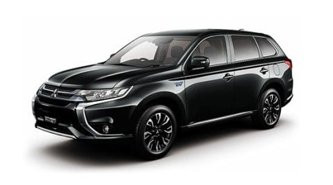

# プロジェクトX2…アウトランダーPHEVに乗ってみたよ…今度は三菱車！

📅 投稿日時: 2018-06-13 01:52:57

ってな感じで．

プロジェクトX2を遂行中ですが…

…いや．

まだ，車を買うと決まったわけじゃないですから．

これからの超巨大物欲選手権（？）に敗れなければ．

BRレガシィに乗り続ける…という選択肢も

あるわけで．

そのような物欲を刺激する車はあるのか！？？？

ということで，いろんな車に試乗している，

今日この頃なわけですが．

今回試乗したのは…

コメントでかなり推薦する方が多かった，この車．

三菱のアウトランダーPHEVです！

（三菱自動車HPより拝借）

ガソリンだと2Lの2WDまたは2.4Lの4WDモデルと

なるこの車．

ガソリン車はほとんどこの世に存在していないのか．

私はPHEV車しか見たことが無いですが…

とりあえず，アウトランダーPHEV．

カタログ値では，フル充電すれば60kmくらい走るという

プラグインハイブリッド車です．

てっきりe-POWERみたいな，エンジンは発電専用の

シリーズハイブリッドかと思っていたら．

エンジン走行もできる，シリーズ＆パラレル両対応の

ハイブリッドのようですね…

サイズ的には，幅・長さはレヴォーグと一緒．

高さのみ，20cmほど高い…というこの車．

押し出しの強いデザインなので，大きめに

見えますが．意外とコンパクト．

アウトバックより小さいです…

とりあえず，能書きはそのくらいにして．

車を見てみますか…

試乗車は，G Premium Packageとかいう，

上から2番目のグレードの車ですが…

うむ．

荷室もフラットで，トランクは十分な広さ．

リアシートは…

アウトバックやCX-8よりは狭く．

レヴォーグやCX-5より広い感じ．

運転席に座ると…

RV車っぽい，ちょいと高めのアイポイントで．

内装も，デザインはちょいと時代を感じる基本

設計だけど．

ステアリングも本革だし．

インパネもソフトパッド仕上げで．

まぁ高級っぽく見えるよう頑張っている感じ．

フロントシートヒーターとステアリングヒーターが

着くのは，スキーヤーには嬉しいけど．

リアシートはシートヒーターが無いのか…

とりあえず．

スタートボタンを押して．

走り出してみますが…

うむ．

当然，PHEVだからエンジンはかからないわけだな…

完全EVモードで走り出します．

で．

アクセルを踏み込むと．

うは．

かなりのトルク！

前後モーター合わせて，35kgmくらいのトルクだから，

CX-8ディーゼルよりはトルクは細いはずだけど…

何にしろ，アクセルを踏み込んだその瞬間から，

太いトルクが出てくるので．

超絶にレスポンスが良い，最高のエンジンでも

ここまで気持ちよくトルク出ないよな…

という．

電動車ならではのすがすがしい加速！！

で．エンジンが掛かってないわけだから．

当然静かで．

ウルトラスムースに加速していきます．

エンジン音がしないので，加速感は無くて．

「あれ？加速が伸びない？」

とか錯覚しますが．

スピードメータを見るとすごいスピードに乗ってます．

これだけスムースでレスポンスいいエンジン，

絶対ないよな…

電動車ならでは…

で．ブレーキングをしてみると．

回生ブレーキと通常ブレーキのつながりは，

気づくけど，それほど気にならないレベル．

モーターがデカいので，かなりのブレーキング

でもしっかり回生が効く感じ．

そして．

この車の感動ポイントが．

電動車なのにパドルシフトがある

のだ！！

…モーター走行時に，このパドルシフトは

なんの意味があるんだろう…？？

と思っていたけど．

どうやらこのパドルレバー．

6段階ある回生ブレーキ強度を選択するレバーに

なるようで．

左パドルを引くと，回生ブレーキがより

大きく効いて，

右パドルを引くと，回生ブレーキの効きが

弱くなる…

ということで．

まるでシフトチェンジしてエンジンブレーキを

調整するように，パドルで減速をコントロールできるのだ！

…これ，頭いいっ！！

考えたやつ，誰だ？？？

素晴らしい…

これはいいよ！！（絶賛）

志賀高原の下り坂でも，これならスピードコントロール

して降りられそう…

サスペンションの取り付け部分の剛性も

比較的しっかりしていそうで．

足回りのばたつきも無く．

バッテリーを積んでいて重めのボディのため，

むしろ車両が簡単に揺さぶられず，

それが安定感を生んでいるような乗り心地．

コーナーも，クイックに横Gをかけると重さを

感じるけど．

ゆっくり横Gを増やしてやれば，結構しっかりと

踏ん張り，不安感は感じない足．

これだけの車重でこれだけしっかり踏ん張るんだし，

バネレートも割と高いんじゃないかな？

ガシガシコーナーを攻めようとは思わないけど．

まぁ，普通に山道をそこそこのスピードで

飛ばす，ってくらいなら．

十分なレベルですね．

そして．

完全停止まで追随のアダプティブオートクルーズも

あるし．

後方車両検知もついてるし…

停止後，ブレーキペダルから足を離しても

停止を保持するオートホールドもあります．

…ただ．

アダプティブオートクルーズ．

停止保持機能が無くて．

さらに，レーン逸脱警告はあるけど，

レーンキープアシストもありません．

ちと惜しい…

でも．

フロント・リアモータをもった4WDシステムで．

4WDモードを選べば，デマンドトルクが少ない

領域でも，フロント・リア両方のモーターを

使って走行するようになるようで．

雪道も行けそうだし．

さらに面白いところとして．

セレクターレバー横に

「チャージボタン」と「セーブボタン」があって．

「チャージボタン」

を押すと．

エンジンが始動して，バッテリーをほぼフルチャージ

してくれるようで…

大体，ガソリン3L分で80%までチャージされるらしいです．

これで，1500Wのコンセントを使って

かなりの時間いろんな電気製品を使ったり，

ひたすらEVモードで走るとかできます…

「セーブボタン」を押すと，バッテリーを

なるべく使わないように，積極的にエンジンを

使っていく走りになるようで．

これらのボタンが押されてなければ，基本的に

バッテリー残量をほぼ使い切るまで，EVで

走ります．

バッテリーの充電と放電を，ドライバーの

意図でコントロールできるという…

うーむ．

これはなかなかいいアイディア．

普通のハイブリッド車でも，

「これから下り坂が続くから，バッテリーは空まで

　使ってもいいんだよ！」

とか，

「これから登り坂だから，今はなるべくバッテリーを

　使わないでおきたいなぁ…」

とか．

そういうコントロールができるといいなぁ…

とか思ってるんですけどね．

しかし．

このPHEVってやつは．

1500Wコンセントがついてるし．

12kWの電池を積んでるので．

1000Wくらいの電力使っても，10時間ぐらい持つし．

車中泊カーとしては，最高かも…？

ってな感じで．

いろいろ乗ってみた結果．

三菱，いい車作るじゃないか

と思った，アウトランダーPHEVですが←なぜそんなに偉そうな上から目線…？

…でも．

最低グレードでも乗り出し400万超え．

上級グレードだと500万って…

補助金が20万出るらしいけど，

高すぎるんですけど…（涙）

そして．

集合住宅に住んでいる私は．

200Vの充電コンセントを駐車場に設置できないので．

PHEVのメリットが活かせない…（残念）

ということで．

残念ながら，私の購入候補からは外れましたが．

でも．

この車．

よくできた車でした…

## 💬 コメント一覧

### 💬 コメント by (ほっぽ)
**タイトル**: アウトランダーＰＨＥＶ
**投稿日**: 2018-06-13 06:43:11

Ｓさん

運転支援システム以外、ほぼ私と同じ印象で安心しました。

パドルで回生ブレーキの強弱調整できたり、充電モードを選択できたり、と

ドライバーの意思で調整できる部分があって、私も感心しました。

志賀の入口までチャージモードにして、バッテリー満充電で

上り坂は通常モードにすると、ほぼバッテリー走行のみで登れます。

以前借りたときに満充電で蓼科の麓から２０ｋｍくらい全開走行しても

バッテリーは空になりませんでした。

上りはモーターを駆使して元気よく、下りは充電モードで充電する、

そんな走り方が楽しめます。

そして、三菱お得意のオールホイールコントロールで

ランエボ譲りの４ＷＤ走り、魅力的でした。

最近、免許返納までにあと何台の車を所有できるだろうか？

と考えると、最後のガソリン車にするか、新しい技術の車に乗るか、悩みます。

でも、あと数年はＢＰレガシィですが。(^^;

我が家も一軒家なのに月ぎめ駐車場のため家庭で充電できないデメリットはありますが、

会社帰りに充電設備で充電してもいいかなと思ってました。

でも、新車は高いので買っても寝落ちした中古です。

多分、この車は低走行車の中古を買った方がお買い得な気がしています。

しかし、プロジェクトＸ２の結末が読めませんね。

### 💬 コメント by (しんちゃん)
**タイトル**: 1泊2日ｷｬﾝﾍﾟｰﾝ
**投稿日**: 2018-06-13 23:37:12

アウトランダーＰＨＥＶは1泊2日キャンペーンをしていて、2日間乗り倒したことがあります。

足回り、エアコン、音響、使い勝手、バッテリーの持ち具合などいろいろチェックできました。

いい車だなと思ったのですが、Ｓ様同様、集合住宅に住んでいるため充電施設がなく、ＰＨＥＶのメリットが生かせないなと残念な思いになりました（泣）

### 💬 コメント by (Skier_S)
**タイトル**: いい車でしたよ～！
**投稿日**: 2018-06-14 02:31:39

＞ほっぽさま

私もパドル回生レベル調整は感動しました…

もし，コーナーを攻めて走るという欲求が

無ければ，かなり有力な候補になりそうな車

でした．

ただ，高かったですが…

16万kmまで，走行用バッテリーの保証が

あるみたいで，満充電の容量が70％を

切っていたら無償交換してくれるらしいのですが．

どのくらいバッテリーがもつのかが気になるところです…

中古も，低走行ならいいですが．

16万kmで保証が切れることを考えると…

我が家では保証が5年もたなさそうな感じ

ですね（笑）．

＞しんちゃんさま

いや．

いい車でしたよ．

予想より．

ただ，やっぱりこの車．

自宅に充電コンセントが無いと，

魅力半減ですよね．

うちは通勤が40kmくらい走るので，

PHEVがちょうどいいくらいなんですけどね～．

