# 2月2日の志賀高原スキー場特派員情報…朝から雪＆強風，未明の雨の影響で下地はガチガチらしいけどいい雪が上に乗ったようで

📅 投稿日時: 2021-02-03 07:28:20

🏷️ カテゴリ: [日記](cc4b5682fb7b8b144980957a978653fb0.md)

今日もちょっといろいろクリティカルな状況で，

更新している時間が無いけど…

なんとか朝に急いで更新！

えー．

昨日の未明，雨が降ったゲレンデがどうなったか，

いつもの特派員情報を…．

まず．

未明の雨は，3時半ごろには雪になり…

志賀高原への登りは雪道になってました！

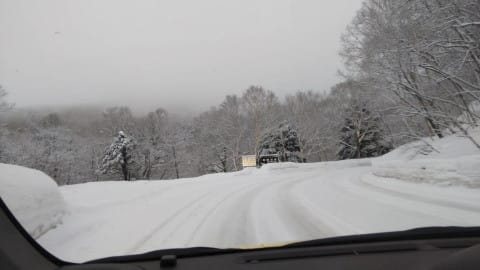

最近定番となっている，おこみん人形比の

朝の積雪は…10cm弱ほどですかね．

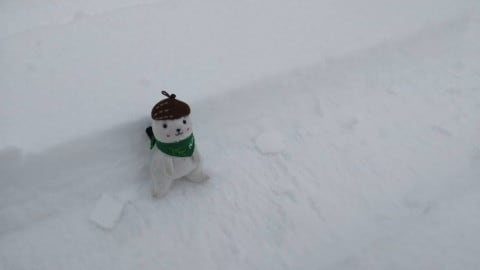

雪になったとはいえ，朝は気温が

0℃をわずかに下回る程度で，

そんなに気温は低くなかったようで…

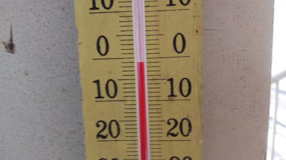

あさイチのゲレンデは，重めの雪が

降り続けていたようで．

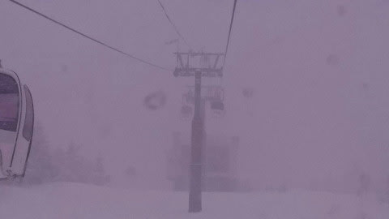

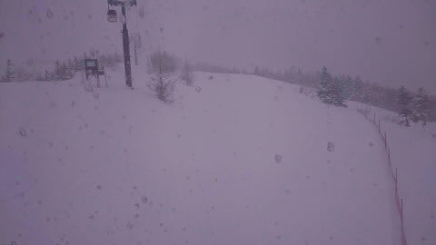

ゲレンデは，圧雪コースの上も，

圧雪の上に重い雪が乗った状況

だったようです…

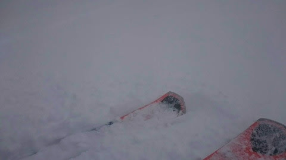

天気は雪＆午前中は山頂付近はガスで，

上の方は視界があんまりよくなかった

ようですが…

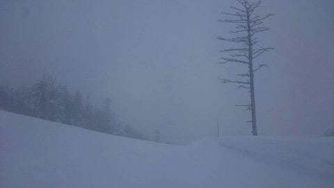

下の方は結構見えてたのかな？

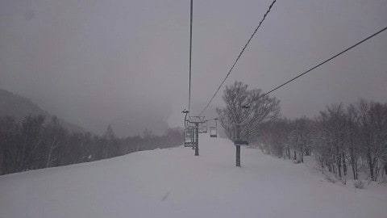

雪は結構強く降るときもあり．

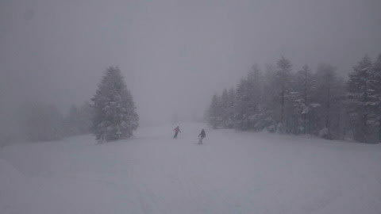

気温がガンガン下がっていき，昼前には

-5℃．

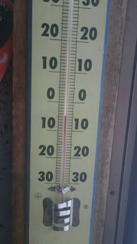

そして，午後には-10℃の冷え冷えになった

みたいです！

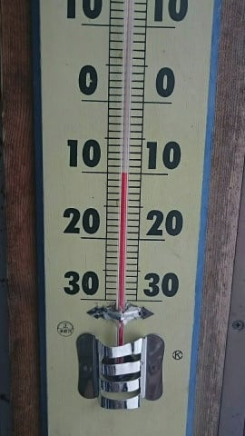

雪は午後まで降り続けたので．

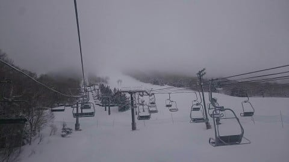

下地は硬かったものの，午後にはそこそこ

冷えたいい雪がゲレンデを覆っていき．

だんだん雪はよくなったみたいです…！

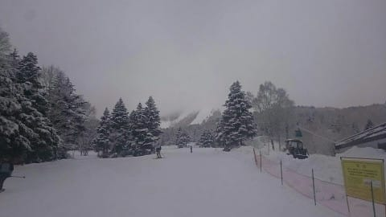

オリンピックコースとかは，午後になったら

いい感じの新雪バーンだったというレポートも

あったので．

下地はガチガチになったものの，2日の一日の

積雪で，ちょっとコンディションは回復に

向かっているようです…！

ってなことで．

また本日も一日雪が降ってくれそうなので．

そんなドサドサ積もらないまでも，

下地の硬いのが隠れて行ってくれるといいな…

…すみません．コメント回答はまた今晩！

## 💬 コメント一覧

### 💬 コメント by (レインボー73)
**タイトル**: Unknown
**投稿日**: 2021-02-03 12:47:24

水曜日の志賀高原情報

ベストな一日です。圧雪の上に新雪が8センチくらい。

廃盤となっているフィッシャーmotive 182cmＲ18　を借りたら、欲しくなっちゃいました。１ゴン上部脇の非圧雪も、ふんわり柔らかなスーパーも、整地されたオリンピックも、どこもかも快適快感快楽。長さを感じさせない取り回しの良さに惚れちゃいました。でも、売ってないそうな。

朝のうちはすごい強風だつたのに、午後には収まりました。

でも、圧雪バーンはオリンピックもＧＳも、やや荒れてきました。午前中が良すぎただけに、もういいかって感じ。

### 💬 コメント by (レインボー73)
**タイトル**: Unknown
**投稿日**: 2021-02-03 14:09:41

水曜日の志賀高原情報２

午後の部、パノラマ、カラマツは、きれいな圧雪バーンのままでした。未練が残りましたが、用があったのでやや早退。

未練の〜波〜止〜〜場〜（古過ぎ。松山恵子）

### 💬 コメント by (西舘)
**タイトル**: Unknown
**投稿日**: 2021-02-03 16:46:17

特派員の皆様、毎日ありがとうございます。

最近、ヒステリックな説教をされて落込み気味で大人しく過ごしておりますが、雪の中で微笑むおこみんのなんて愛らしいことか！

癒やされるわ～

レインボーさま、今日から3日間、銀嶺さんは貸切のためランチ営業休止みたいですね、お昼ご飯はどちらで？

気になって眠れんくなるかも知れん。

それって私だけじゃないと思う。病みつきかぶり付きで読んでます。

イメージしやすいし、なんと言っても楽しい！

レインボーさまって言葉の魔術師ですね。

### 💬 コメント by (週末もレインボー73)
**タイトル**: Unknown
**投稿日**: 2021-02-03 20:35:01

お借りします。

西館様、ありがとうございます。明日は銀嶺を予定していました。一昨日も、我々四人だけで閉店するのを見て、悲しく思っておりました。明日の予定を変更します。ありがとうございました。

今夜は志賀のレジェンドを招いての宴会中。週末もまたご連絡くださいませ。

お互い、エス様のいない間に、こっそり上手になりましょうね。エス様、ご愁傷さまです。

### 💬 コメント by (西舘)
**タイトル**: こそ練、するするするぞ（わ～い）
**投稿日**: 2021-02-04 00:01:27

れ、れ、レインボーさま、よろしいのでしょうかよろしいのですね、なんと幸せな！

連絡しますしますします～、またよろしくお願い致します！

Sさま、素敵なご縁をいただきました、感謝しますありがとうございます～

ところでスキー関連ぐっず投げ売り状態情報ありがとうございます、なのかな、Jr.が例のぶつをぽちりそうです･･･。

### 💬 コメント by (Skier_S)
**タイトル**: この週末も悪くなさそう
**投稿日**: 2021-02-04 01:48:25

＞レインボー73さま

Fischer Motivって…セミファットな板ですよね．

もう廃盤だったんですか…！

まだ通販探すと残ってると思いますが…

しかし，物欲が止まらないですね．

＞西舘さま

すごい人脈が広がってますね(笑)．

そして，物欲も広がってますね(笑)．

ぜひ，日本経済の発展のために，例のブツをポチってやってください…

