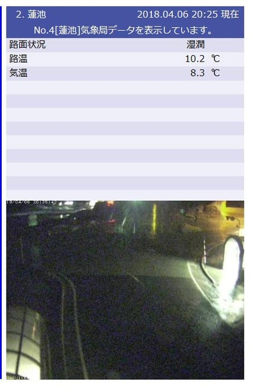
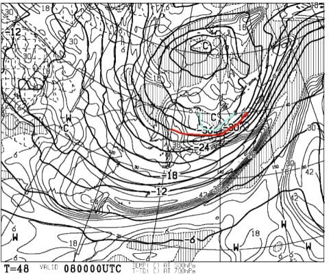

# 今週末も志賀高原！今晩は予想通り雨降り（涙）

📅 投稿日時: 2018-04-06 22:07:33

🏷️ カテゴリ: [日記](cc4b5682fb7b8b144980957a978653fb0.md)

えー．

本日の志賀高原．

曇り空ながらも気温が高く，

そして風が強かったようで…

焼額のゴンドラも朝のうちに止まり，

昼ごろには一の瀬，高天ヶ原含めほぼすべての

リフトが止まっちゃったようですね…

うーむ．

週末がこんな強風にならなくてよかった…

そして．

現在．

志賀高原は雨が降っているようです（涙）．

つい先ほどから降り出したようですが…

（[北信建設事務所ホームページ](http://www.q0.ws302.smilestart.ne.jp/index.htm)より）

この雨は，夜のうちには上がってくれそうで…

土曜の朝は，気温が高めながらも，

曇り空ですね．

雨に降られずに済みそう！

で．

土曜は終日曇り．

でも，気温が高めの朝から，

時間が経つにつれ気温は下がっていき．

西から雪雲が飛んできます．

だもんで．

土曜は基本的に曇り．

雪雲が切れるタイミングは晴れ間が，

雪雲が濃くなるタイミングは雪がぱらつく…

という天気．

夕方に向けて結構気温が冷えて，雨で緩んだバーンは

固くなりそう．

日曜は…

なんと！！

500hpaに赤く印した-30℃という真冬並の寒気が…

それどころか，水色の-36℃が志賀に近づいてますよ！！？？

これは…冷えひえですね！！

土曜の夜から日曜の朝にかけて，

ちょっと積雪があるかも…

朝は-10℃近くまで冷えそう！

…西風じゃなければ，そこそこ積もりそうだけど…

西風なので，うっすら積もる程度かな．

日曜は，早朝は-10℃近くの冷え込み．

曇り空～小雪がぱらつく天気だけど，

うっすら新雪が圧雪された，かなり

滑りいいバーンの予感っ！！！

日曜は終日曇りベースの天気で，

昼間も気温は上がらず．最高気温も-3℃くらい

までしか上がらなさそう．

だもんで，朝の薄い積雪がはがされたら，

急斜面は雨で凍ったカチカチツルツルバーンが

現れてきそう…

ってなわけで．

どうやら結構冷え冷えになりそうなこの週末．

今シーズン何度も繰り返された，

冷えると西風になって，なぜか志賀に積もらないパターン

なので，

雪はガチガチアイスバーンになりそうですが…

でも．日曜早朝は良いはずだし．

そう，超高温で融けるのに比べればマシだっ！！

低温で雪が融けないでいてくれるだけ，

高温晴天よりマシだっ！！

…と思いましょう←いろいろポジティブシンキングを頑張る

ってなわけで．

今週末も志賀高原でお会いしましょう～！

## 💬 コメント一覧

### 💬 コメント by (Goku)
**タイトル**: 欠席届け
**投稿日**: 2018-04-07 07:27:40

本日、休養のためスキーはお休みします。

明日は早朝から参戦予定です！

### 💬 コメント by (Skier_S)
**タイトル**: Gokuさま
**投稿日**: 2018-04-09 01:52:59

いまさらのコメント返しですが，

日曜はお疲れ様でした～！

今日の天気が，ずっとGWまで

続いてほしいですね～．

また来週も温まりそうなので…

うーむ．

これから先，雪がどうなっていくのか

心配です．

