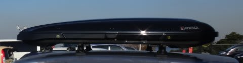
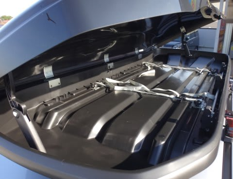
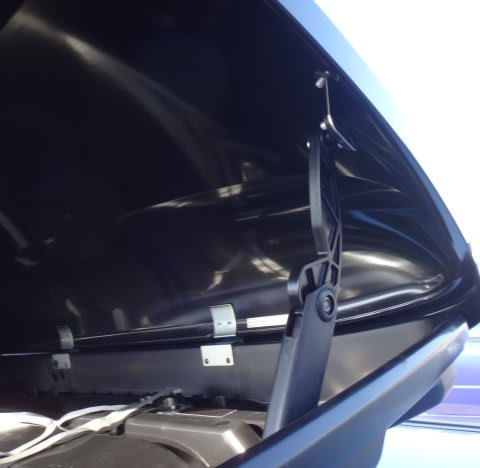
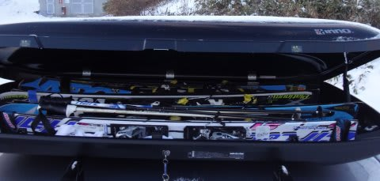
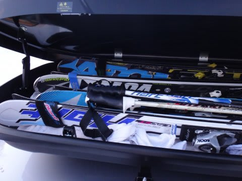
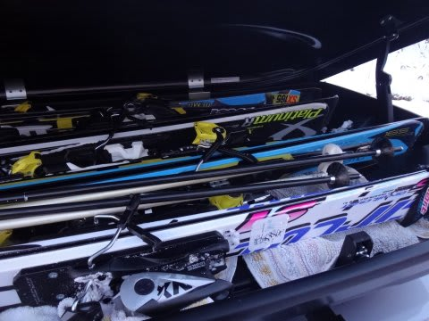

# 激安ルーフBOXを買ってみた…INNO BR55を使ってみて

📅 投稿日時: 2013-12-27 02:12:01

🏷️ カテゴリ: [車](cba0e8330b3f2ded7c1addfacc75d4547.md)

えー．

新車を凹まされた傷が癒えない，Skier_Sです．

なのに，自虐的にまた車ネタを行ってみたりする．

で．

今シーズン．

車を買い換えるのと同時に．

前のルーフBOXは10年以上利用して，かなり傷んでいたので，

ルーフBOXも新しいのを先月購入したのですが．

とりあえず．

車を買い換えたばかりでお金が無い．

＃買い換えたばかりなのに，もう凹まされたけど…←ことあるごとに思い出す

なので．

スキーが入るサイズで，一番安いルーフBOXはどれだ…？

と，選んだのが．

[INNOのBR55](http://www.carmate.co.jp/inno/product/roofbox/#br55)とかいうルーフBOX．

最低でも180cm程度の長さの板が入れられて，

一人当たり2セットを持ってくる人が3人いてもいいように，

最低6セット，できれば8セットくらいのスキーが入れられる…

ってのが私のリクエストだったのですが．

このBR55.

内寸長さが，183cmってことで．

185cmのGS用板なんかは入れられないけど．

カタログには，6-8セットの板が積めると書かれていて．

このBOXが29800円で買える…となると．

…これを買うしかないじゃないですか．

ってことで．

取り付けてみました．

うーむ．

そこそこ薄いな．

＃高さ31.5cm，バーの上の高さ28cm

中は…

ぼちぼち広いな．

ふむ．

ガスダンパーではなく，スプリング式か．

前のBOXは，ダンパーが死んでしまい，蓋を開けたまま固定

できなくなっちゃったけど…

スプリングダンパーなら，ガスダンパーと違って

ガスが抜けて死んじゃわないから，いいな．

板を入れてみると…

寝かした状態で，ぎりぎり4セット入るな．

長さ的には…183cmの板が入れられるのは真ん中近くだけか．

両端は，180cm級の板は厳しそう．

(積んでいる板は，すべて165cm)

板を寝かさないで，立てて積めば，6セット可能．

このBOX．内寸高さが25cmなので．

高いプレートが入っていて，ビンディング高さがかなりあるような

板の場合，立てて積むと蓋が閉まらないことも…

＃ほとんどの板は25cm以下に収まるけど

あ，でも．

高さ25cmなのはルーフボックス中間部分だけで．

前後に近い部分は，蓋が前後に向かって垂れ下がって

きている構造のため，天地高さが意外とありません．

なので．180cmクラスの板の場合．立てて乗せると，

板のテールが蓋と干渉します…．

なので．180cmクラスの板だと，寝かせて乗せないと．

180cmクラスの板だけだと4セットが限度．

私は家族で出かけるとき，普段は180cmクラスの板が1本，

あとは165～160cmクラスが4本なので，180cmの板だけ寝かせて，

なんとかぎりぎり5セット積んでます．

って感じで．

高速も走ってみて，風切音もそんなにしなかったし．

見た目もそんなにチープじゃないし．

まぁ，29000円のルーフBOXで，十分だな．

＃[軽いデジャヴ](eb7b9c411e6dbfe23e183922fc3a41d9f.md)を感じるオチだ…

## 💬 コメント一覧

### 💬 コメント by (michi)
**タイトル**: Unknown
**投稿日**: 2017-07-24 10:21:56

すみません、古い記事へのコメントになりますが少しお聞きしたく、、、

我がレヴォにルーフボックスを検討しているのですがBR55とBR33を比べてみたいと思ってます。

先日、イエローハットでBR55を勧められたのですがアイサイトに干渉しないか気になっています。

逆にBR33にした場合、165センチくらいのスキー板が積めるのか、、、

わかる範囲で結構ですのでコメント頂けると助かります。

### 💬 コメント by (Skier_S)
**タイトル**: michiさま
**投稿日**: 2017-07-25 01:12:10

この記事，BR55で検索するとINNOのページの

次に出てくるらしく．

いまだにかなりのアクセス数があるんですが…

はい．LEVORGでBR55．

問題ないです．

使っている人がいますが，アイサイトに干渉する

ようなことはありません．

アイサイトの視覚に入るほど，前に突き出しません…

むしろ，アイサイトの視野内にいれる方が難しいくらいです．

BR33だと，板の長さがかなり制限されるので，

BR55をお勧めしておきます…

### 💬 コメント by (michi)
**タイトル**: Unknown
**投稿日**: 2017-07-25 18:57:31

Sさま

コメントありがとうございます。

そうなんですね。

であればBR55にしようかな。

あとは価格次第かな。

本体35000、ベースキャリア20000で55000くらいでした。

検討してみます。

### 💬 コメント by (Skier_S)
**タイトル**: michiさま
**投稿日**: 2017-07-26 02:17:19

ただ，BR33の方がBR5５より，高さが高いです．

高さが高い荷物を積みたい場合は，BR33の方が

有利なので…

長い板を積まず，厚みがあるもの，高さが

あるものを積みたい場合はBR33でもいいかも

しれません…

### 💬 コメント by (michi)
**タイトル**: BRQ55購入しました
**投稿日**: 2017-08-07 19:34:05

Sさま、アドバイスありがとうございました。

迷いに迷って結局BRQ55を購入しました。

昨日夕方にYHに行き、場所を借りて、店員に聞きながら取付完了。

位置的にはそんなに前に出ておらずアイサイトは大丈夫そうです。

まだ付けたばかりで未使用なので今週末に使ってみる予定ですが私は背が低い方なのでスキーの上げ下ろしにクルマに傷を付けないか心配です(；´Д`A

### 💬 コメント by (Skier_S)
**タイトル**: michiさま
**投稿日**: 2017-08-08 06:31:29

背の高い荷物を積まないなら，BRQ55で正解だと

思います…

取り付けの前後位置は，リアゲートに干渉しない

ギリギリ後ろに着ければ，

アイサイトは全く影響ないとおもいますよ．

ちなみに，私はルーフボックスの床面全面に

使い古しのバスタオルを敷いてます．

これで，ルーフボックス床の傷つきと

ガタガタ音防止しています…

