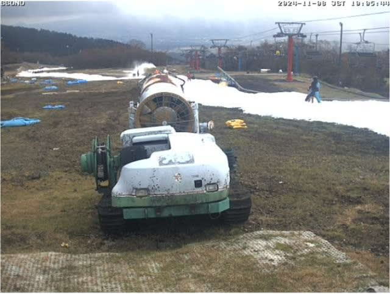
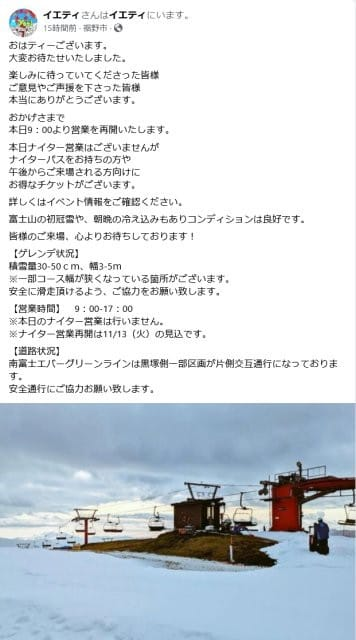
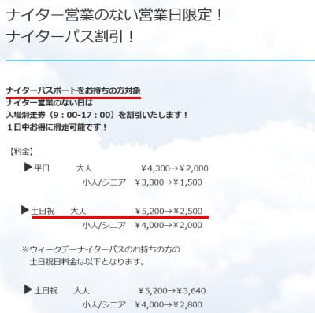

# 明日は2週間ぶりのイエティでスキー滑ってきます～！…ナイターはないけどナイターシーズンパスもっている人はリフト券割引あり

📅 投稿日時: 2024-11-09 00:33:58

🏷️ カテゴリ: [日記](cc4b5682fb7b8b144980957a978653fb0.md)

ということで．

11日間の中断期間を挟んで，

ようやく本日からイエティが再オープン

しましたが…

昼間のライブカメラを見ると，やっぱり

コース幅は狭そうですね（涙）

（[WNIライブカメラ](http://webcam.wni.co.jp/KAC24326/loop.html)より）

とりあえず，本日から12日までは，

ナイター無しで昼間の9時から17時のみオープン．

幅も3-5mと狭いと注意書きされてます…（泣）

（[イエティFacebook](https://www.facebook.com/YetiSnowtown/posts/pfbid0XGhCDHtkuue9TpbuxvyPN6Nyq2ugHmho93nDi9GjgtYuVRfAgHgsbGAVzEy1HWXl)より）

で．ナイターがなくなったイエティ．

ナイターシーズン券をもっている人が不公平に

ならないよう，ナイターシーズン券を

もっている人限定で昼間の1日券

割引があるようです…！

休日は2500円，平日は2000円って…

半額以下ですね…すごい．

（[イエティホームページ](https://www.yeti-resort.com/event/2024/11/post-116.html)より）

とりあえず，今週末の天気ですが．

土曜：水曜予想より低気圧の接近が

　遅れているので，イエティも曇らずに

　終日晴れそうです…！

　軽井沢も終日晴れ．平年並みの気温ですが，

　日が射すと暖かさも．

日曜：軽井沢は曇り．

　イエティは曇りですが，昼過ぎから午後に

　雨が降り始めそうな感じです…

　夕方はそこそこ強く降るタイミングも．

　…軽井沢は降らずに持つかな？

　気温は高め．でも日が射さないので肌寒さも

という感じの天気ですね…

ってなことで．

私は明日，2週間ぶりのイエティで滑ってます～！

…なのに．

相変わらず職場からの帰宅が12時近く（泣）

これから風呂入って寝ます…

でも，イエティなら近いから，5時間弱

寝られるかな…

うん．志賀に比べれば全然楽勝だな…！←平日も睡眠時間5時間切りして，

週末もこれは体に悪いから…！！楽勝じゃないから！！！

ってなことで．

明日帰宅したらまた速報レポートします～！！
