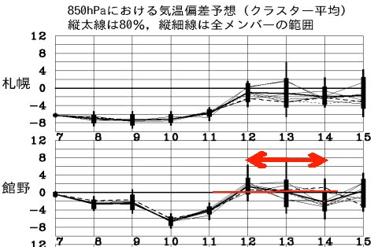
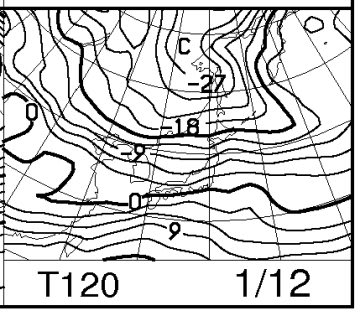
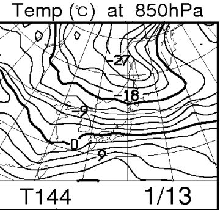
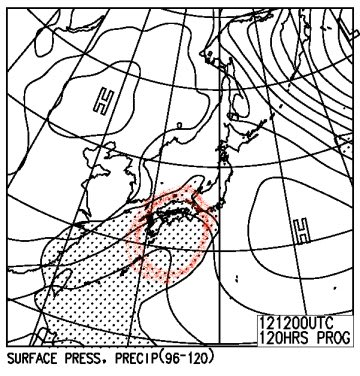
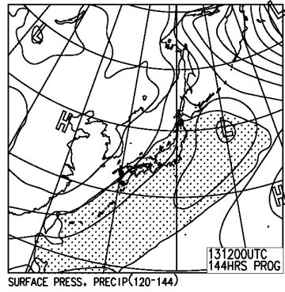
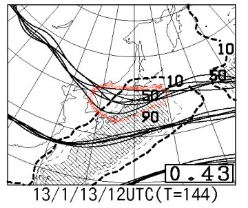

# 今週末…3連休の志賀高原の天気はどうなる？

📅 投稿日時: 2013-01-09 00:28:32

えー．

この週末．

3連休ですね．

この3連休の天気を正確に予想するには，まだちょっと早いんですが．

まぁ，連休ってことで，スキーにいく人も多いでしょうから．

早いうちから，大まかな予想をしてみましょうかね～．

あー．

FZCX50を見てみると…

矢印で示した3連休の期間は…気温は平年並み，ですか．

で．

いつものFXXN519．

850hpa気温予想を見てみると…

こいつが3連休初日，12日．

こいつが3連休中日の13日．

…まぁ，どっちも0度線は日本の太平洋側ぎりぎりくらい．

志賀高原は－3度程度かな．

少なくとも，雨になる心配はないですね…

でも，FEFE19から，地上天気図の予想を見てみると…

こいつが12日．

赤い線で囲ったエリア．低気圧表示はないですが，事実上の南岸低気圧ですね～．

んで．

こいつが13日．

…日本南岸から，低気圧が東に抜けるパターン．

冬型じゃなく，南岸低気圧で降る雪は雪温が高く，重いんですよね～

まあ，この日のFZCX50の特定高度線のクラスタばらつきを見ると…

こんな感じで．スプレッドが0.43と大きな値で．

赤線で囲った部分の予想値のばらつきが大きいため．

トラフが発生するかもしれないし，しないかもしれない．

つまり，低気圧が発生するかもしれないし，しないかもしれない…

ってことで．

南岸低気圧が発生するのかも，地上予想図のように低気圧が進むのかも．

まだ微妙です．

南岸低気圧が発生しなければ，おそらく3日間とも，

志賀高原は雪が降らなさそうな感じですね…．

まぁ．どちらにしろ．

この3連休，パウダーはあんまり期待できないなぁ．

とりあえず．

現時点では．

12日は曇りまたは晴れ．前日冷えて雪が積もるので，それが圧雪されたいいコンディション．

13日は曇りまたは重い雪がちらちら．

14日はおそらく晴れ…コンディションは悪くない

って感じで．

それほど積雪がなく，

正月休みほど強烈な冷え込みもない，

平穏な3日間になりそうかな～
