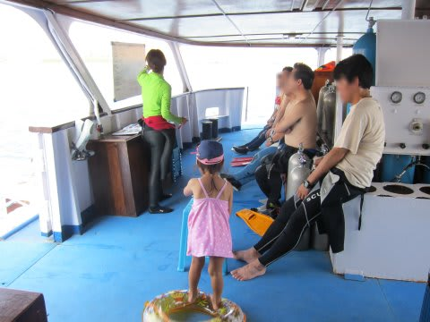

# 子連れコモドダイビングクルーズagain　その4　今年も娘はVIP待遇

📅 投稿日時: 2011-08-30 01:37:41

K村さんによる船内の説明が終わったあとは．

お昼ごはんまで1時間半ほどフリータイム．

ゲストはそれぞれ，ダイビング器材を荷物から出して，

荷物を部屋に運び込んで，カメラを組み立てて…

とやっていると，あっという間にお昼ご飯の時間です．

お昼は…ナシゴレン，鶏肉からあげ，カンクンいため．

娘もおいしそうに食べてます．

日本人向けで，子連れでも食べられるようなメニューが中心，

ってのがいいですね．この船．

で…

乗船直後から移動を開始していた船は，昼食中に1本目のポイントに到着しています．

ということで．昼食が終わったら，12時半からダイビング1本目の開始です．

シアワセの「食べて潜ってまた食べて」生活の始まりです．

で．

ダイビングに行くわけですが．

今回は，去年と違ってベビーシッターさんは乗船していません．

＃去年，[あまりベビーシッターさんは役立たなかった](e762bd0838698b186a1ecf017bac8782e.md)ですから…

ということで．しょっぱなから，娘をおいて潜りにいけるわけもなく．

…夫婦どっちかが，娘と留守番ですな…

…もし．

もし，K村さんが船に残ってくれるなら，

娘もK村さんと大喜びで遊んで留守番してくれるかも知れませんが．

その場合は，われわれはガイドなしでコモドの海を潜るという，

チャレンジャー精神を発揮しなくてはならなくなるため．

ちょっとそれはご遠慮願いたい，と．

ということで．

われわれ夫婦，どちらかが娘とお留守番，

どちらかがダイビング…

と，せざるを得ないわけで．

妻と私による，我が家No.1とNo.2のトップ会談の結果．

1本目は妻がダイビングへ行き．

私は娘とお留守番に決定．

私「ママはダイビングに行って，娘と私でお留守番だね～」

というアピールが功を奏したのか，

単純に哀れに思ってくれたのか．

K村さん「ダイビングに行くボートに娘さんも一緒に乗ってもらって，

　　ダイビング中は娘さんをボートの周りで泳がせてていいですよ！」

との，ありがたいお言葉！

1本目はチェックダイブなので，湾内の流れのないポイント．

なので，娘を泳がせても流されちゃうようなことはなく，大丈夫です．

K村さん「泳いでいるとき，手を振ったらすぐにボートが拾いに行きますから…」

とのことで，安心．

ダイビングボートに乗せて，泳ぎに連れて行ってくれるなんて…

今年もVIP待遇ですなー．娘は．

では，お言葉に甘えて，泳ぎにでかけますか！

ということで．

ダイビングのみんなとK村さんのブリーフィングを一緒に聞いて…

ボートに乗り込み…

娘との海水浴に出発！

