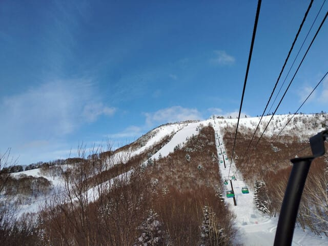
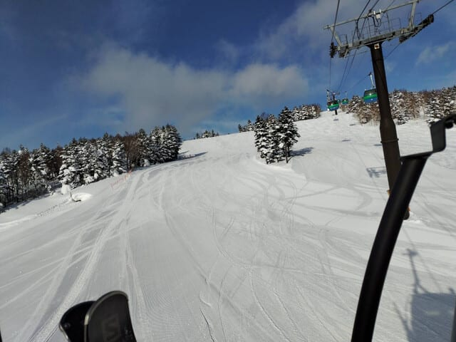
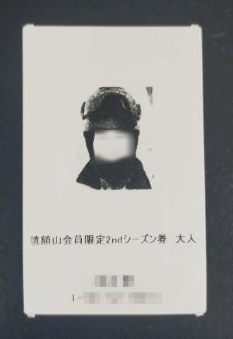

# 今日は朝更新！焼額山スキー場のセカンドシーズン券を買ってしまった…そして2/3(月)の志賀高原は晴れ～曇り

📅 投稿日時: 2025-02-04 10:56:21

🏷️ カテゴリ: [日記](cc4b5682fb7b8b144980957a978653fb0.md)

ダメだ…

月曜はダメだ．

週末に疲れたうえ，一日仕事して，

いつもより早めの23時過ぎには帰宅した

けど．その後，Blogを書く前にまた床で

寝てました…(涙)

久しぶりに7時間くらい寝れたけど，

どうせなら布団で寝たかった…

ってなことで，今日はいつもと違って朝に

更新！（最近月曜は朝更新が多い気が…）

特派員によると，昨日月曜の志賀高原は

予想外に晴れ間が多かったみたいで…

天気は晴れ～曇り空の一日だったようですが，

意外と気温が高かったようで．

標高が低いところはちょっと表面の

雪が緩み気味なくらいになったようなので…

このあと，雪が硬くなりそうだけど．

今，志賀高原はかなり激しく雪が

降ってるみたいで，昨晩から30cm以上

積もってるようだし．

今日からの積雪でまたリセットされるかな…？

今日から明日まで，西風気味だけど

今晩をピークとして結構降ってくれて，

明日まで結構積もりそうですよ～！

ということで，本題へ．

なぜか焼額山の公式ホームページには

出ていないのですが…

焼額山スキー場にはセカンドシーズン券

という優れたものがあって．

2月1日以降，GWのシーズン終了まで．

昼間だけじゃなく，ナイターも早朝も

（3月いっぱいまでのファーストトラックは

　除く．4月からの6時営業スタートの

　早朝営業で利用可能)

滑れるという，素晴らしいシーズン券なんです！

これが33,000円なので…

これから焼額山にちょくちょく来ようって

人にはかなりリーズナブルな券だし．

ナイターが2800円，早朝が4000円である

ことを考えると…

GW期間だけでも10日間くらい早朝

営業があるので，

全山券をもっている人でも，ナイターと

4月～GWの早朝を滑るだけでも

十分元が取れちゃいます！

ナイターを2-3回，早朝を6-7回やれば

元は取れるし．

4月の週末に，朝ちょっと早く着いたから

7時半からちょっとだけ早朝を滑る…

とか，4000円払わなきゃならないなら

絶対できないような，贅沢なことができます！

ということで…

ふははははは．

買っちゃいました，焼額のセカンドシーズン券！

これで，同じスキー場で使えるシーズン券を

なぜか2枚持っているという，不思議な

人になってしまいました…

昨シーズンは1月の段階で雪が少なく，

GWまで雪がもたないだろうなぁ…

と思って，セカンドシーズン券を

買わなかったけど．

今シーズンはパノラマコースにも人工降雪を

ガンガン打っていて，その上雪が多くて

余裕でGWまでもちそうなので．

ガンガン滑りますよ～！！！

PS．セカンドシーズン券は，焼額山スキー場の

ホームページから，Webリフト券購入に進んで，

Wamazingのページに行くと購入可能です！

PS2.すいません…コメント回答はまた今晩！

## 💬 コメント一覧

### 💬 コメント by (大谷超え)
**タイトル**: Unknown
**投稿日**: 2025-02-04 12:51:48

火曜日の志賀高原情報

湯田中は積もってないのに、上は４時頃から降りだして、ニゴンパークで20。以降ずっと降り続いて、10時30分までに車に30降雪。それもさらさら志賀の雪。皆が大はしゃぎで滑ってました。パノラマから唐松へ。足首パフからすねパフまで最高なんだけど、二高リフトは冷凍庫並みで指が凍傷。私だけイースト老人保養所へ。何本も滑ると流石に飽きてくるので、ダイヤへ。ここは未踏の地が多く存在し、この世の天国なんだけど、団体さんが多くてリフト待ち。

最後に滑ったサウスの分流が膝パフ未踏がありこの日のベスト。

所用で10時30分終了。みんな満足したようです。

ちなみに、世間では大谷選手の50-50が話題になりましたが、私は毎年100-100をやってますよ。エス様ならお分かりでしょう。

スキー日数と釣り日数です。最高は120-120です。

### 💬 コメント by (Skier_S)
**タイトル**: ＞大谷超えさま
**投稿日**: 2025-02-05 03:07:47

今日は軽い雪だったんですね…

明日の5日は西風なので，そこまで積もらなさそう．

そして大谷越えですか…！

しかし120-120はすごいですね…

今年もスキー120日越え狙ってください！

