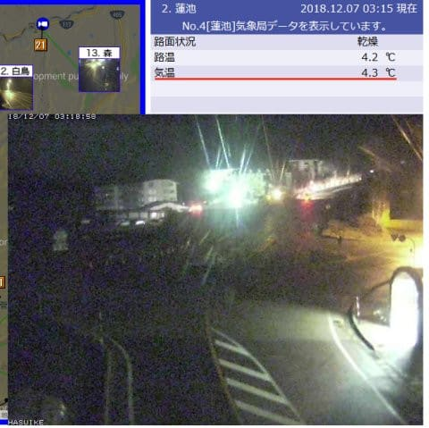
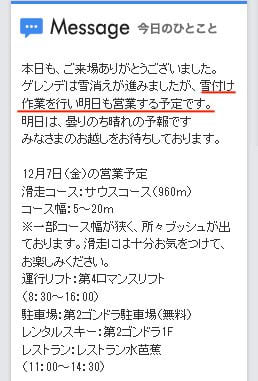

# 第8回，物欲選手権！その2

📅 投稿日時: 2018-12-07 03:43:50

🏷️ カテゴリ: [スキー雑談](c1f9d2cb7478308da16419928ea3945e9.md)

本日も予想通り．

気温が高く．

そして，深夜になっても志賀高原の気温は

プラス気温のままなんですが…（涙）

（[北信建設事務所HP](http://www.q0.ws302.smilestart.ne.jp/index.htm)より）

当然，木曜は人工雪を打てるわけがなく…

熊の湯は営業休止が続き．

焼額も，雪付けをして何とか営業を継続している

状態のようです…（泣）

…でも．

明日金曜の朝から冷え始めます！

金曜の昼間は人工降雪機を動かせるので．

営業してない熊の湯はゲレンデを回復

させられそうだけど…

よく考えると．

昼間営業をする焼額．

お客さんがいるゲレンデで人工雪は打てないから．

金曜夜からの人工降雪作業になりますね…

うーむ．

夜だけの人工降雪で，土曜までに回復するのか…？？

でも．

天然雪も朝までに10cmほど積もってくれるはず！

天然雪＆人工雪で，何とかゲレンデは先週レベルに

までは回復するはず…←先週レベルなのか…

ってなことで．

昨日は天気予想で一日スキップしましたが．

本日は，物欲選手権の続きです！

（前回のその1は[こちら](ea2109ba25f451ea3cb1d5d935d899b91.md)）

---

アナウンサー　「ということで，SALOMON，LANGE，TECHNICAと，

　型落ちのブーツを履いてみましたが，どれも気に入らなかった

　Skier_S選手．

　いったい次は何を狙うのでしょうか…」

解説　「いや，ちょっと待ってください．

　Skier_S選手．

　ブーツコーナーでも，さらに古い型のモデルが

　並んでいるコーナーに向かいましたよ！？？」

アナウンサー　「おっと．そうですね…

　あぁ，2シーズン前のATOMICブーツを

　試し履きしています！

　2シーズン前のRedster WC130を履いています！

　これは，今履いているブーツと同じ型

　なので，買い替える意味があるのか疑問に

　思いますが…？」

解説　「うーむ．

　基本的に，Skier_S選手は，今履いているATOMIC

　ブーツの性能が気に入っているようですから…

　今のブーツは3シーズン，200日以上履いて，

　インナーやシェルがもうかなりヘタっていますので，

　もう買い替え時ですよね．

　気に入っている同じブーツの新品を買う…

　というシナリオもあり得ますよ，ここは」

アナウンサー　「それは危険ですね…」

解説　「この2シーズン落ちのATOMICブーツ．

　さすが2シーズン前のモデルということもあり，

　かなりお安い値段となっているようで．

　これはSkier_S選手の物欲を激しく刺激

　しているようですよ…！」

アナウンサー　「果たしてSkier_S選手，

　ブーツを行ってしまうのか…？

　いや…

　おおっと．

　どうやら，違うようです！

　戻しました！ブーツを戻しました！

　かなりお買い得なブーツでしたが，

　我慢しましたっ！」

解説　「驚きましたね…

　今回は我慢しましたね…

　まあ，今Skier_S選手が履いているのと

　同じ型のこのブーツ．Skier_S選手の

　足型に合わず，かなり強引に広げたり

　削ったり，苦労して履いているけど，

　時々足が痛くなることがあるようで．

　その思いが，今回の購入を見送らせた

　ようです…」

アナウンサー　「そうですね．

　2シーズン前の，かなりお買い得価格の

　ブーツだったので．

　ぜひこれを買って．

　[ATOMICの同じ板が4セット](e8a53c5e38b2ebcf1a084dc391aaad69d.md)と，同じブーツが

　2セット並んでいるという，いかにも

　Skier_S選手らしい写真を撮ってほし

　かった…という思いもあります」

解説　「そんなことしたら，Skier_S選手の

　家では，[板](e8a53c5e38b2ebcf1a084dc391aaad69d.md)だけじゃなく，ブーツも勝手に

　繁殖するという伝説が残りますね」

アナウンサー　「そして…おっと．

　次は，最新モデルのブーツを見ていますね…」

解説　「彼は，人生これまでブーツは3月ごろに

　安くなったものを買うか，型落ちしか買った

　ことがなく，どうしても高額になる，

　シーズン前の新モデルを買ったことがないので．

　基本的には最新モデルのブーツは，購入対象外の

　はずなんですが…」

アナウンサー　「あー．

　新しいATOMICブーツを履いてみて，結構気に

　入っているようですよ」

解説　「今年のATOMICブーツ．

　去年からの継続モデルなので，去年の

　型落ちが残っていればかなり安く同じものを

　手に入れられたのですが…

　昨年モデルが売り切れのため，

　昨年モデルと同じ型の新モデルを，かなり

　高い金額を出して買わねばならないという，

　勿体ないパターンですからね…

　これは，Skier_S選手は避けるパターンです」

　

アナウンサー　「えー．

　そのような解説をいただいたところですが．

　どうやら．

　これは．

　買ってます．

　買っています．

　買っちゃいました…っ！！！

　なんと！

　Skier_S選手．

　車と家を買ったばかりで，節約しなくては

　いけないところ．

　これまでにも買ったことのない，最新

　モデルのブーツをシーズン前に買うという

　暴挙に出ました！！」

解説　「…節約しなきゃいけないこの時期に，

　最新モデルのブーツを買うなんて…

　もう，なにを考えているのか，

　さっぱり分かりませんね…」

アナウンサー　「さすが，さすがは物欲大魔王！

　こんな経済的に厳しい状況にあっても，最大の

　物欲を発揮するとは…

　素晴らしい物欲ですっ！」

解説　「だからそこ，褒めるところじゃないですから…」

アナウンサー　「いやー．

　満足げにいつものお店を後にしました．

　Skier_S選手．今回も見事な物欲を発揮し，

　皆さんの予想通りの結末を迎えたところで．

　第8回　スキーヤーの物欲を刺激する街神田に来て，

　物欲にまみれたスキーヤーが買い物をせずに

　我慢できるか選手権

　これにてお別れとしたいと思います．

　では，また第9回にてお会いしましょう！」

解説　「いや…まだ終わってませんが」

アナウンサー　「え？」

解説　「今回も…まだ別のお店に寄ってますよ」

（[その3](eb4bda6045599e99f977e557f6cd2763c.md)へ続く）

## 💬 コメント一覧

### 💬 コメント by (若杉勲71)
**タイトル**: Unknown
**投稿日**: 2018-12-07 11:02:13

物欲王様。今日のヤケビは前日の雨で地肌がはるかにたくさん顔を出し、コースは更に狭くなり、パリパリのアイスバーン。今シーズンの最悪の条件。今夜の雪に期待です。帰路、ファミリーを気持ちよく滑っている二人連れを発見。ゆみりんさんでした。雪もよくコースも広いので最高だよだって。

### 💬 コメント by (サトシ父)
**タイトル**: やっぱりですね！
**投稿日**: 2018-12-07 15:04:28

このシリーズ大好きです、あと最低2回はあると予想してます。我が家は姉ちゃんのウェアと息子のウェア、グローブ、ブーツを購入しました。自分のは何も買えなくなりました😂

### 💬 コメント by (Skier_S)
**タイトル**: 今週末も焼額
**投稿日**: 2018-12-08 00:40:04

＞若杉さま

パリパリのアイスバーンですか…

最悪の条件ですか…（涙）

でも．

今晩の雪で回復するはず！！

＞サトシ父さま

自分の分は買えないのですね…

私は自分の分から買ってしまいます（笑）

しかし，神田は危険な街です…

