# 12月24，25日の週末の志賀高原スキー場の天気は…24日は終日雪，根性の無いスキーヤーふるい落とし機能フル発動．25日も雪降り

📅 投稿日時: 2022-12-22 03:50:34

🏷️ カテゴリ: [スキー天気予想](c6554f5c3c106093b511a8daae23757e8.md)

ってなことで．

今日もBlogを書いている暇などない

はずなんですが…

毎週水曜夜は恒例の終末天気予想…

ならぬ，週末天気予想の日なので．

（最近，自分の仕事状況になんだか終末感があるけど）

今日はこの週末の天気予想です！！

まず．

明日…というか，日付が変わってもう

今日ですね．

22日木曜の850hpa図を見ると．

昨日書いた通り，赤い0℃線は

志賀高原より北に上がっていて．

志賀には水色の+3℃線が…

…これだと．志賀でも標高が低い

ところは雨~みぞれっぽい感じ（泣）

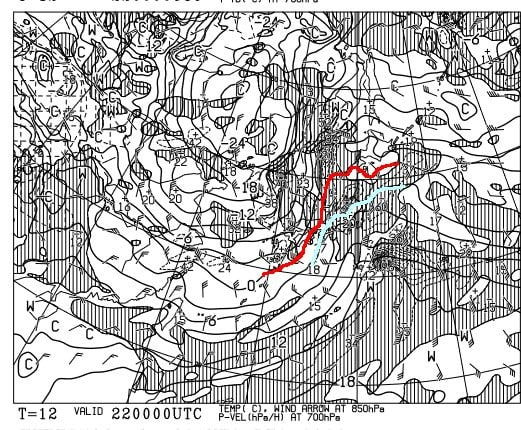

地上天気図を見ると．

降水域が見事に日本全面を覆って

いるので…

まぁ，明日の朝は麓はみぞれ~雨，

山頂付近で雪…

というスタートでしょうか．

気温は朝9時頃をピークに下がって

いくので，昼には雨が雪に変わるかな…

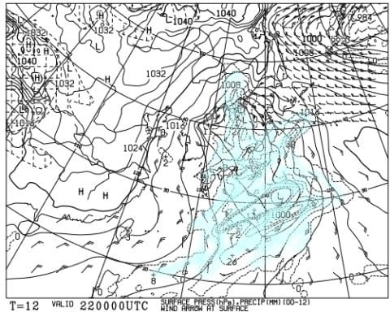

そして続く23日金曜は．

850hpa気温図を見ると…

22日とうって変わって，今度は水色の

-9℃線が志賀に近づく，冷え冷えデー！！

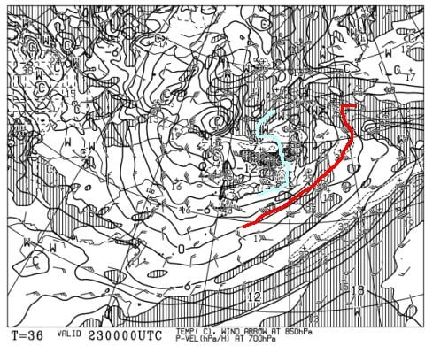

23日朝9時の地上天気図も，日本海側に

降水域がかかる冬型だし．

大雪のしるしである，強いJPCZも

出てるけど…

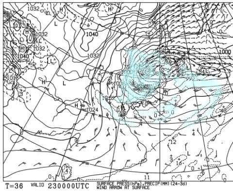

このJPCZ．

拡大すると，真東にたなびいていて…

志賀高原殺しの西風パターンです（泣）

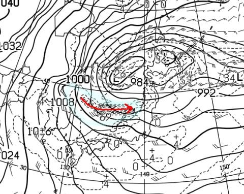

23日は強烈な西風なので…

23日夜9時の地上天気図を拡大すると．

雪雲が赤く印した北アルプスにぶつかって

邪魔されるので，北アルプスより東に

雪雲が行かず．

志賀高原を含む，北アルプスの東側には

降水域が広がってないのが分かります（涙）

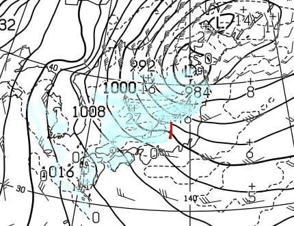

でも．

この日の500hpa気温を見ると…

ドカ雪の目安，水色の-36℃線が志賀に

かかっているので．

このくらい冷えれば，西風でも根性がある

雪雲は北アルプスを越えてやってくるので…

23日，昼間でも10cmくらいは積もって

くれるかな…

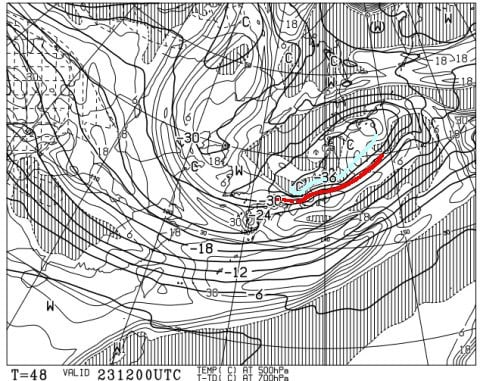

だけど．

降るのは23日ではなく．

23日の夜から24日にかけてです！！

24日（土）の夜9時の850hpa気温図を見ると．

志賀にかかっているのは水色の-6℃線．

激冷えではないですが，そこそこの冷え．

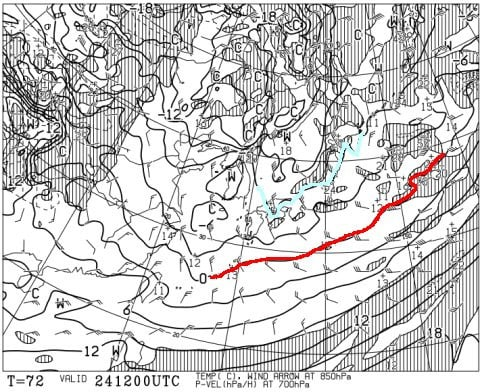

そして，地上天気図を見ると…

うおおお！

見事な縦縞！

これなら，西風じゃなく北よりの風になって，

志賀でも雪が積もりそう…！！！

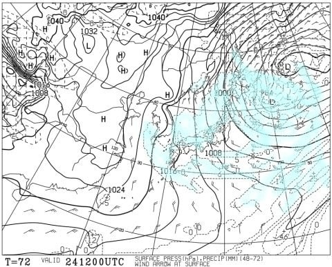

一応，850hpa図を拡大すると…

うむ．

赤で括った部分，風向きが北北西から

北西であることが分かります！

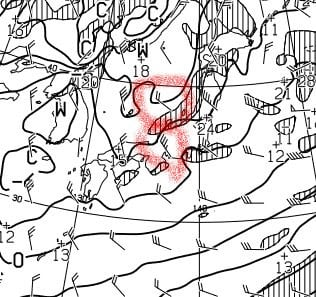

志賀高原に雪が積もってくれるのはいいけど，

寒くて天気は良くなさそうなので…

土曜は根性の無いスキーヤーふるい落とし機能

フル稼働っぽい感じ…

で．

25日日曜の850hpa気温を見ると．

この日も火曜と同じく，志賀には水色の

-6℃線が近づいています．

この日も激冷えじゃないけど，結構

寒い一日です．

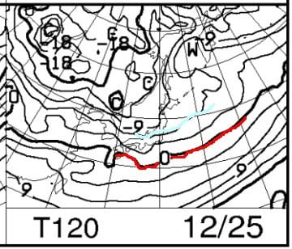

そして，地上天気図は…

この日も見事な縦縞．

おそらく，この日も朝から雪が降り積もりそう…

ってなことで．

まとめると．

22日(木)：朝の気温は0℃を上回り，

　志賀でも標高が低いところは雨~みぞれ．

　でもそんなに強く降らない．

　昼には雪になり，夜までに数cm積もるか…

　それほどドサドサ積もらない．

　夜はすごい冷える

23日(金)：昨晩から雪が降り続け，

　朝の気温は-10℃を下回る激冷えデー，

　朝までの積雪は5cm程度．

　朝は圧雪にうっすら雪が乗った

　滑りやすい雪．

　朝までより昼の方が冷えるので，

　昼からは根性のある雪雲が北アルプスを

　超えてくるので，時々雪が強く降り，

　昼間だけでも10cmくらい積もるかも？

　昼間の気温も-5℃を越えず，すごく

　寒くて雪が降ったり止んだりの一日．

24日(土)：朝から雪．あさイチの気温は

　-9℃くらい．朝までの積雪は10cm程度．

　昼間も-5℃を越えず，終日雪が降り続ける．

　あさイチは圧雪に5cmほどの新雪．

　昼も雪が降り続けるので，急斜面は

　吹き溜まりで雪が溜まっているところと

　人工降雪の下地の硬いのが出てくる

　ところがまだらになって滑りにくいかも…

　昼間だけで10cm以上積もりそう．

25日(日)：この日も一日雪が強く降ったり，

　ほぼ止んだりの一日．

　あさイチの気温は-10℃前後．

　朝までの積雪は10cm以上？

　朝イチゲレンデは圧雪の上にうっすら雪．

　昼間は24日ほどは強く降らない．

　でも，終日雪が降り続け，人が

　少ないところは昼間もコース上に

　雪が積もっていく

…ってな感じでしょうか．

とりあえず，この週末までに

ゲレンデに雪が積もってほしかったけど，

本格的に積もるのは週末になりそうです…

眠いので，どうも天気図の読み込みが

甘くなり，予想が間違ってるところも

ありそうな気がするけど…

　

とりあえず．

週末は冷えそう！！

そして降りそう！！

そこそこ積もりそう！！

…土曜までに焼額のゴンドラ，

動いてくれるかな？？？

## 💬 コメント一覧

### 💬 コメント by (レインボー改めブラボー75)
**タイトル**: Unknown
**投稿日**: 2022-12-22 16:32:09

木曜日の志賀高原情報

朝の湯田中は小雨2℃と暖かい。上林1℃、蓮池1℃まだ小雨のまま。ヤケビに着くと霧雨ですごい風。でも我らが４ロマなら動くはず。駐車場は積雪5センチ。

やっぱり４ロマと2高が動いてくれました。湿雪ながら、小雪→みぞれ→小雨の悪天候を除けば、条件は悪くない。特に唐松は最高でしたよ。

それから、昨日のアリスさんの文章力が高くて笑いましたが、今日お会いできなかったのでひとこと。私はただの一度も直かってませんし、ターンばかりしてたんですよ。減速しないターンに憧れて、その練習ばかりしていますから。最初に離れたからそう見えたのかなと思います。

今は夕方４時過ぎですが、湯田中は雨です。

明日は横手が渋まで滑れるようですが、エス様の２割くらいはヤケビ愛に満ちている私は、明日もヤケビを目指します。

### 💬 コメント by (Skier_S)
**タイトル**: ＞ブラボー75さま
**投稿日**: 2022-12-23 02:25:24

やっぱり，雨が降ったんですね…残念．

しかし，雨の中滑ったんですか！！？？？

明日の朝は，今日の雨で固まった下地の上に，新雪が5~10cmほど積もってそうです．

週末に降るのでコンディション良くなりますよ！

これから年末にかけて，雪が降り続けそうです…

