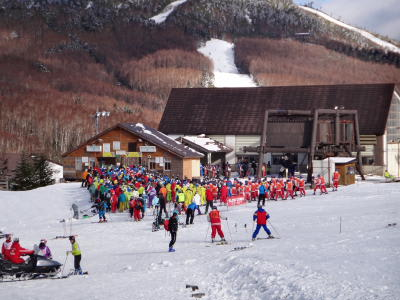

# 12月11日　日曜の志賀高原一の瀬＆焼額　速報

📅 投稿日時: 2011-12-12 00:12:20

うーーーーーむ．

晴れましたな．

一日，晴れ時々曇りって感じで．

全く降りませんでした．

…全く．

…ハイシーズンなら嬉しい晴れですが．

雪の少ないこの時期恨めしい限り…

土曜からの積雪は1mmたりとも増えてません…（涙)

ということで．

相変わらず，一の瀬はファミリー下半分のみオープン．

タンネの森とダイヤモンド，山の神はぜんぜん滑れる状況では

ありません…

で．

本来なら，ダイヤモンドやタンネの森に分散する

修学旅行生が大量に一の瀬に集中…

一の瀬はリフト待ち5分以上，ゲレンデも大混雑に．

…ということで．

車で焼額へ移動．

実に久しぶりに，マイホームゲレンデへ戻ってきたぞっ！！！

焼額は第2高速と第4ロマンスの2本が滑れます．

ところどころ雪が薄いところがありますが，

ほぼコース幅いっぱいに雪がついていて．

下地もそれほど固くなく．

いやーーー．

やっぱり焼額がいい！

滑りいいです．

高速リフトでがんがん滑れますし．

リフト待ちも無し．

今シーズン初めて，本格的にスキーをした気がする…

ただ，人工雪が降らせたてで比較的柔らかかったため，

昼にはところどころでこぼこのコブっぽい感じに

なって来てましたが…

しかし．

とりあえず．

この日は天気も比較的良く．

焼額では久しぶりの高速リフトで待ちなく

ロングコースぐるぐるできたので．

満足の一日であったぞよ．
