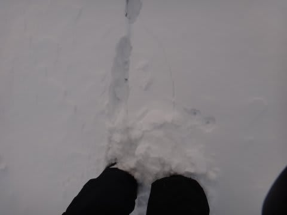
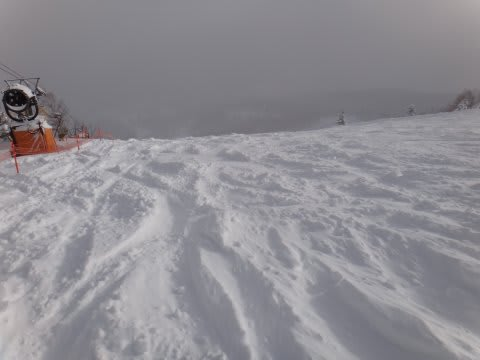
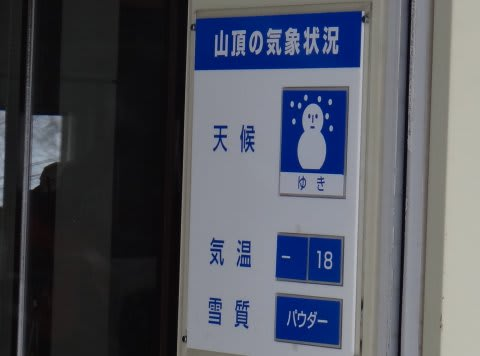
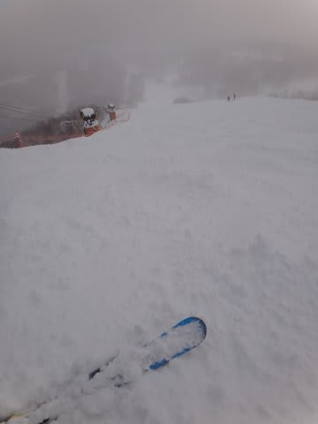
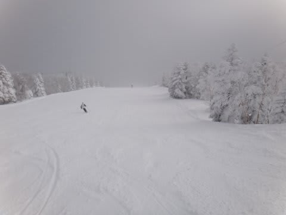
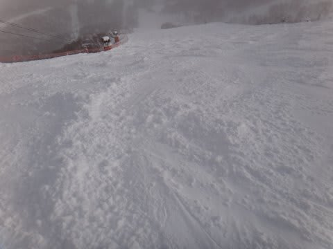
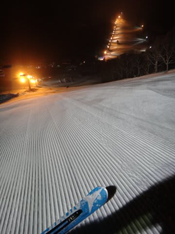
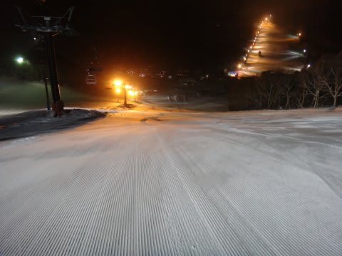

# 1月4日の志賀高原は…トップシーズン到来！

📅 投稿日時: 2013-01-04 21:26:53

…Skier_Sは，いったいいつまで志賀高原にいるんだ？？？

という疑問が出てくるかと思う今日この頃．

今度は，1月4日のレポートです．

＃3日のレポートは5時間ほど前にアップ済み

えーっと．

本日は．

気温も冷えて，

昨日からの積雪も結構ありましたね～．

30cm弱でしょうか…

ってことで．

脛パウダーを楽しめたのですが．

ちと雪が重めだったかな…

＃私はちょっと出遅れたので朝イチの状況は良くわからないけど…

気温は朝マイナス18度という，ありえない低温まで

落ちたんだけど…

なんで重かったのかな？

とりあえず．

ゲレンデ全面．

この2日間の積雪で．

アイスバーンはほぼ完璧に隠れ．

志賀高原のトップシーズンらしい，ふかふかした雪に

全面覆われました！

…ただし．

このやわらかい雪の欠点は．

午後になってくると，掘れてコブになってくるんですね～．

…あと．

平日というのに．

ゲレンデは込んでたな～．

第2ゴンドラは30分待ちまで行ったようですが…

＃第1ゴンドラは5分待ち程度だったけど

そうそう，天気は終日雪でした…．

最高気温がマイナス13度で．

さぶかったよ～っ！

んで．

今回は．

今シーズン初のナイターへ！

いやー．

すいてるし．

雪は圧雪したてのふかふかだし．

もう，なんていうか．

この見てるだけでよだれじゅるじゅるの，ぴかぴか

シマシマバーンを切り裂く快感を味わえるナイターでしたっ！

いやー．最高．

ということで．

完全にトップシーズンのゲレンデコンディションになった

志賀高原だったのでした．
