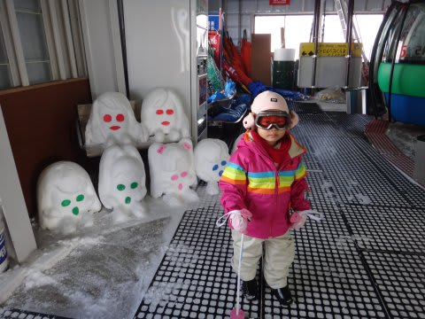
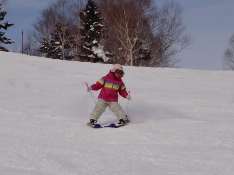
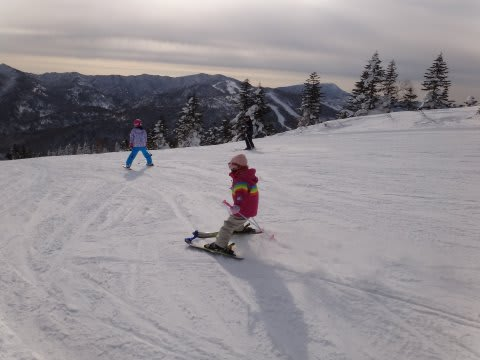
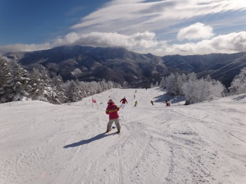

# 我が娘＠4歳がかなりのスキー好きに…

📅 投稿日時: 2012-01-17 01:30:45

[ここ](ee1fe22aee6c9eafdf693254a70b223be.md)や[ここ](efd51d380b145a639f682fe9e2ec3f810.md)に書いたように．

昨シーズンの3月に，ようやくスキーを滑れるようになった我が娘．

そして昨シーズン，生涯滑走日数3日目にして，[一の瀬クワッドを滑れるように](ef37cc7d9e89a9024b6505cba0aa5ff82.md)

なったわけですが…

これまで，滑れるとは言っても，迂回コースとか初級者コースといった，

なだらかなところしか滑らせてなかったんですが．

…ハイシーズンに我が家が利用する焼額山スキー場には，

そんな迂回コースは無い．

というわけで．

スパルタ父親の私は，いきなり焼額ゴンドラで娘を山頂へ．

（山頂にあった雪像と記念撮影)

山頂で．

さも当たり前のように

「じゃ，滑って」

と娘に言ったところ．

…あっさりゴンドラ1本，一人で滑り降りてきました．

お，恐るべし．我が娘．

幼稚園年少にして，焼額ゴンドラ1本を10分程度で滑り降りてしまった…

初級者コースの第3高速リフトなんかは，もう大人と変わらないスピードで

1本滑り降ります．

「待て！止まれ！」

といわないと，止まらずひたすらまっすぐかなりのスピードで

滑り降り続けます．

ゲレンデの一般客びっくりの暴走チビスキーヤー状態．

リフト乗り場に着くと

「もう一回！」

…かなりのスキー好きに育ってしまったようです． 

で．さすがに長いこと外で滑ったので，娘もそろそろ寒くなって来たかな～

…と思ったとき．

「まだスキーやりたいのに，寒くて滑れない～」

と泣き出した娘．

「…何か，育て方を間違ってしまったか…」

と思ってしまった私であった．

## 💬 コメント一覧

### 💬 コメント by (コロネ)
**タイトル**: 凄いです(・∀・)
**投稿日**: 2012-01-17 14:57:03

こんにちは。 

育て方、間違えましたね！

いや、うそうそうそ!! 

素晴らしいです！ 

未知の素質があふれています！ 

お父さんを追い越すのは時間の問題、 

将来は世界を相手に… <(｀⌒´)>

まあ、でも親子で共通の趣味があるって 

本当に素晴らしい事だと思いますよ!! 

一生懸命働いて、たくさんスキーに連れて行ってあげて下さいね(笑)！

### 💬 コメント by (KENKEN)
**タイトル**: 娘さん凄い(・∀・)
**投稿日**: 2012-01-17 22:23:44

明けましておめでとうございます。

スキー編も楽しく拝読してます。

娘さんスキーとても上手ですね。

映像を見てびっくりです。

今シーズンは我が娘もスキーデビューを目論んでました。

ところがスキー場でブーツを履かすと“ブーツが痛い”と泣き喚きとてもスキーどころではありませんでした。

この冬は3回雪山に行ったのですが娘は未だソリ遊びだけです。

Skier_S様の育て方(スパルタ？)を見習いたいと思った次第です。

### 💬 コメント by (Skier_S)
**タイトル**: コロネさま
**投稿日**: 2012-01-18 01:26:31

思いっきり育て方間違ってます(笑）．

実家に帰省するのに関越道を走っていたとき．

娘「スキーに行くの？」

私「違うよ」

娘「ぎゃーん！スキーしたい～っ！！！(激泣）」

ということもあったり…

とりあえず，親子で一緒にスキーができるってのはありがたいことです．

### 💬 コメント by (Skier_S)
**タイトル**: KENKENさま
**投稿日**: 2012-01-18 01:34:58

明けましておめでとうございます～

上手というより，我が娘．スピード好きのようで…

ビデオで見ると，ゆっくり滑ってるみたいに見えますが，実物はかなり速いです(汗）．

ブーツが痛いって泣いちゃいましたか…

うちの娘が初めて履いたのはかなり大きめのブーツなので

### 💬 コメント by (mari)
**タイトル**: はじめまして
**投稿日**: 2012-04-06 11:06:12

はじめまして。

志賀高原をホームゲレンデとしているファミリースキーヤーです＾＾

ただし我が家は常宿が平床のため、熊の湯がメインですが。

お嬢さん、とっても上手ですね＾＾

何より本人の意思でスキーが好きというところが最高！

このまま立派なスキー馬鹿に育ってくれることを心からお祈りいたします♪

我が家は2人の子供がおりまして（中二ともうすぐ3歳）、

上の子は4歳からスキーを履かせて連れまわした結果

小２でジュニア1級と級別2級（大人のやつ）を取得しました。

下の子は昨年1歳半でスキーデビューしたもののさすがに一人で滑るまでには至らず、

今シーズン（2歳半～）やっと横手の第一あたりの超緩斜面なら

少しだけハーネス（フラフープみたいなやつ）なしで滑れるようになりました。

でも斜度がそれ以上になると脚力がないせいか、支えがないと滑れません。

ということで、普段は夫が背負って滑っています。

うちは背負い子じゃなくてふつうのおんぶ紐（？）ですが。

我が家も毎週のように関東から志賀に繰り出してるので、似たような方がいらっしゃるなーと

思ってコメントさせていだだきました。

熊メインですがジャイアントから入って奥志賀までツアーしてくこともあるので、

どこかでお会いしてるかも知れませんね。

今週末は土日ともダイヤモンドで試乗会に参加してます。

板購入予定で、悩んでるところなので＾＾；

もし青ウェア＋子供おんぶの1級程度の男性と濃ピンクウェアの2級程度の女性を見かけたら声かけてくださいませ。

よろしくお願いします。

### 💬 コメント by (Skier_S)
**タイトル**: mariさま
**投稿日**: 2012-04-06 23:27:05

2歳半でスキーで滑ってるんですかっ！？

それはすごいですね～．

うちはスキーデビューは3歳5ヶ月からだったので…

ハーネス使っても，2歳児が自立して滑るとは，驚きです．

で，上の子は小2で大人2級ですか！？

うーーーん．

うちの娘はそこまで行かないでしょうね…

すごいです．

うちは基本的に子連れのときは一の瀬が多いです．

私一人のときはほぼ100％焼額を滑っています．

今週末は焼額プリンス泊まりなので，子供と焼額滑っています…

土曜はダイヤモンドで試乗もする予定なので，もしかするとお見かけするかもしれませんね．

