# 3月7日(火)の志賀高原スキー場特派員レポート！…終日晴天，気温は高かったけど良かったらしい…

📅 投稿日時: 2023-03-08 08:27:18

🏷️ カテゴリ: [日記](cc4b5682fb7b8b144980957a978653fb0.md)

ダメだ…

あまりにも状況がクリティカルすぎて，

Blogを書いている時間がない…(涙)

それでもなんとか時間を作って急ぎ更新する

自分…えらい！偉いぞ！！

(その時間で本当は寝るか仕事をすすめたいんだけど）

ってなことで．

もう昨日になりますが，

7日の火曜も，平日というのに志賀高原へ

複数の特派員が行っていたようで…

まずはおこみん特派員．

あさイチは晴天だったけど…

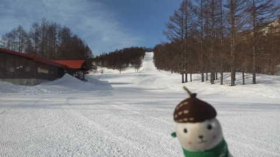

奥志賀の山麓のシマシマは，きれいな

シマシマというよりは，日差しで緩んだ

雪が固まったボソボソな感じの

シマシマですね(涙)

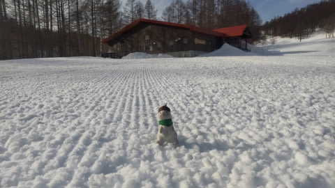

しかし，焼額山頂付近は，

まだそれほど雪が悪くなってない

感じのシマシマ！！！

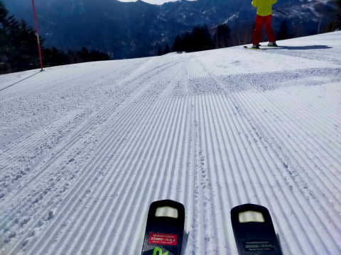

気温も朝は-3℃と，この時期としては

かなり高いけど…

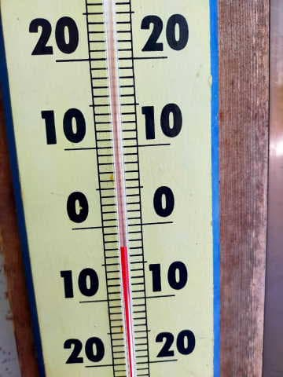

すっきり晴天の，いい感じのシマシマ！！

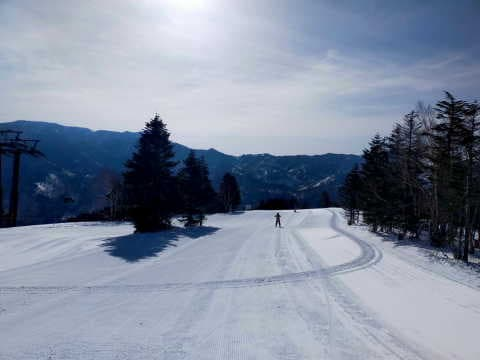

日差しが強いので，雪はちょいと緩み

気味だけど．

逆にそれがちょうどエッジが食い込む

いい感じで滑れたみたいだし…

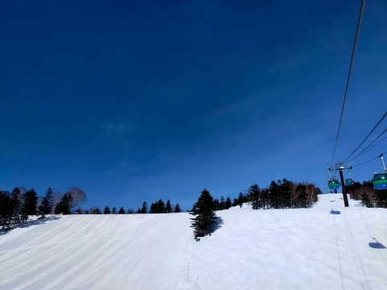

寺小屋も，はさすがに標高が高いし，

朝日が当たらない西斜面なので，

昼を過ぎても，それほど雪が緩まな

かったみたいだし…

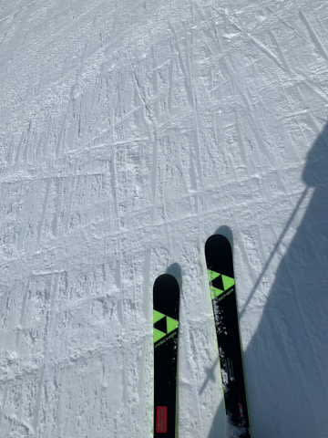

そのうえで人が少なかったので，

バーンは全く荒れずにきれいな

真っ平らバーン！！

いいなぁ…

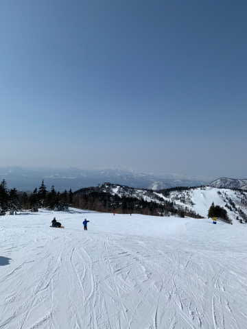

さらに，高天ヶ原は，リフト点検という

ことでクワッドが動かなかったよう

ですが．

一の瀬側から滑りこんで，ちょっと

歩けば滑ることができて…

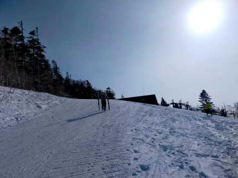

…そして，当然誰も滑ってないので．

午後になっても，ほとんど誰も滑って

ない，貸切りの最高フラットバーンが

滑れたみたいです…！！！

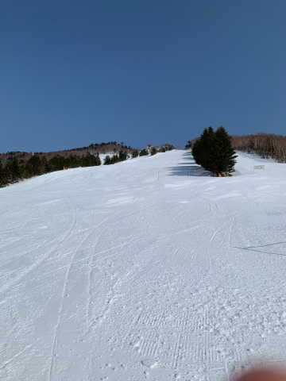

うぎゃー！！

午後になってもこんなバーンが滑れた

とは…

うらやましい～…！！

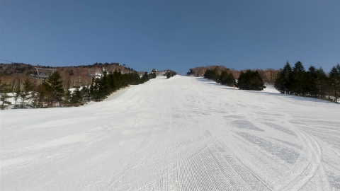

ただ，この日は気温も高く．

昼間はプラス気温になり，

日差しも強めだったので…

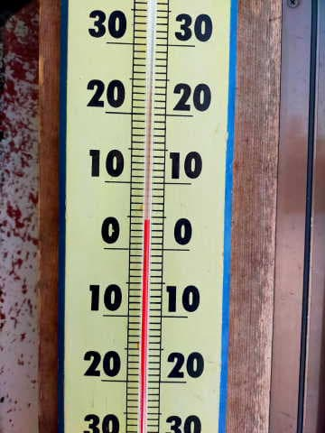

日が当たる焼額のバーンは，

かなり雪が緩んで荒れ荒れに

なっていたみたいです…

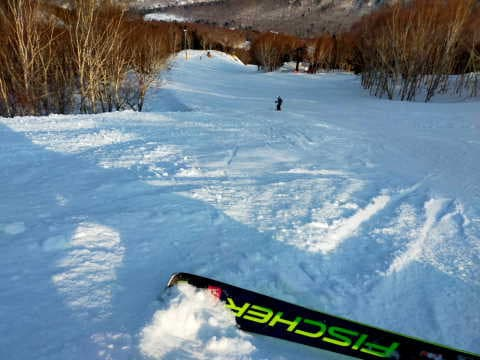

でも，いい天気でガラガラで．

寺小屋・高天ヶ原は良かったみたいなので，

うらやましい～！！

しかし．

これからも週末までは気温が高い日が

続き…

金曜は液体が降るかも…（泣）

もしかしたら，金曜夜から土曜朝は

雪になるかな？

また今晩，体力と精神力に余裕があれば

週末の天気予想します…

…今晩，Blog更新する精神力が残ってるかな…？

## 💬 コメント一覧

### 💬 コメント by (レインボー75)
**タイトル**: Unknown
**投稿日**: 2023-03-08 15:32:50

水曜日の志賀高原情報

いやあ、楽しかったですよ。奥志賀エキスパート、まさに最高の快楽をくれました。アール25のくそ重たい借り物の板は、もはや自分のものにするしかない。

朝から昨日に増して暖かい。もうウエアを考える時期ですよ。

朝一の白樺は朝圧雪とは思えない硬さ。唐松、GSはまずまず。オリンピックは早くも柔らかくなっていてがっかり。

さすれば一路エキスパへ。人が少ない。バーンの出来はベスト。うはうはひたすら滑りに集中。これだけのエネルギーを仕事に向けていれば、もちょっとまともな人間になれたかもしれない。でも、今のエキスパがあればこれでいいのだ。

バスでウエストサイドで豪華昼食したら、暑いしもはや帰るしかなくなりました。

帰路の蓮池14℃、上林18℃。私は春の到来を拒否宣言します。

### 💬 コメント by (Skier_S)
**タイトル**: ＞レインボー75さま
**投稿日**: 2023-03-09 02:41:22

気温が上がったけど，楽しかったんですね…

明日もおんなじ感じの天気になりそうです…

金曜は液体が降りそうなので，それ以降は雪質が悪化するかもです(泣)

