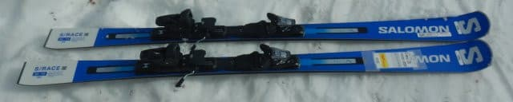
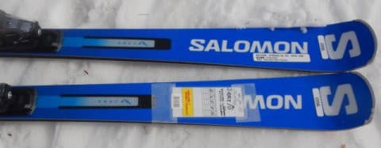
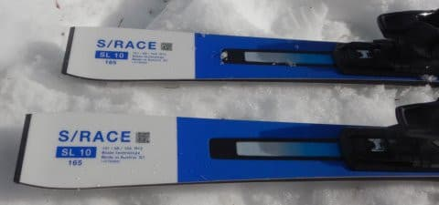
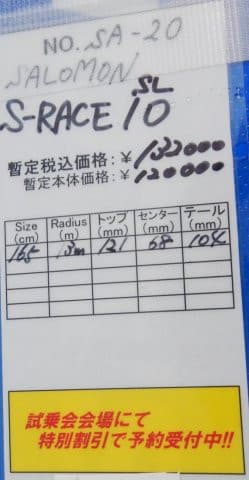
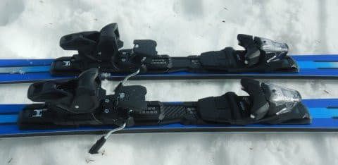

# 2023シーズンモデルのスキー板，試乗レポートその32…SALOMON S/RACE SL10

📅 投稿日時: 2022-07-26 01:26:00

🏷️ カテゴリ: [スキー板試乗](c0bd8048615710cee890e403a36cc9a2b.md)

この土日も，宿題が終わらなかったにも

関わらず．

土曜は疲れていたのか，気づいたら18時間

寝てしまっていたSkier_Sです．

いや…ホントに疲れてたのか．

金曜は1時過ぎという，私にしてはかなり

早めに寝たのに．

昼過ぎに一度目が覚めかけたものの．

次に気づいたら夜8時だった

という…

せっかくの休日，ほとんど一日寝てるだけで

終わりました（涙）

まさか，前日普通に夜に寝て．

次の日の夜まで寝てるとは…

「明日の朝は寝たいだけ寝る！」

と宣言して寝たけど．

夜まで寝るとは，自分でも思わなかったよ…

結局この日は，当然ながら朝も昼も食事抜きで

夜1食だけだったので．

ただでさえ減らしたくない体重を，すごく

減らしてしまいました…（泣）

うん．

睡眠ダイエットでも提唱してみようかな？

瘦せられますよ～！！←毎日18時間寝てられないから

ってなことで．

今回も2023シーズンモデルのスキー板試乗レポート．

本日はサロモン編です．

では，どうぞ～！

○SALOMON S/RACE SL10 165cm

基礎小回り用

S/RACEの小回り用板では，最もお手軽

グレードになるこの板．

ビンディングも，

PRIME SL, SL PROがX12 LABビンディングなのに対し，

SL 12がX12 TL GWと，金属バーが入らない優し目の

ビンディングになるのですが．

このSL 10はさらに優しいM12 GWビンディングになり．

SL 12以上のモデルには全て標準のRACE PLATEも

なくなり，ビンディング直付けになります…

ってなことで．

滑ってみると．

…非常に低中速から良くたわみが出ます．

楽に，均一なたわみが出ます．

このたわみの出方が絶妙で，

普通これだけ低中速からたわむような

柔らかい板だと，同時にトーションも弱く

なるので，どうしてもトップとテールの

グリップが弱くなりがちだけど…

この板は，優しくたわむのにグリップが

弱くなくて，トップからテールまで

きれいにエッジグリップして，たわみに

沿った見事なカービングでスルッと

回っていきます．

比較的低速から簡単にたわんで，その

たわみをものすごく感じやすい板で．

そして，たわみやすい板にありがちな

ズルズルさが全くない，気持ちよく

キレて回っていく系の板なので．

これ，たわみに沿ってターンすることを

練習して上達したい人には，すごい

良い板なんじゃなかろうか…？？

ホントに何もしなくても，そんなスピードを

出さなくてもきれいにたわんでくれて，

サイドカーブじゃない，たわみに沿って

曲がっていくというのをまさに体感できる

板です．

やはり，スピードを出すと

「ちょっとたわみすぎるかな？」

と思う時もあるけど．

それでもグリップが抜けていくという

感じではなく，思いっきりたわんだ中で

グリップします．

その中でも，ずらそうと思えばSL12や

SL PROに比べれば板を動かしやすくて，

ズラシのコントロールも容易です．

さすがに私のトップスピードだと，

もう少しグリップがあってもいいかな？

と思う時もあるけど．

それでもだらしなく板が流れていくというより，

こらえて行けばグリップして行ってくれます．

とりあえず，この板は優しいグレードの板に

ありがちな，優しくたわむけどスピードが出ると

ズレズレですよ…という板ではなく，

低速からガンガンカービングで切っていく

快感を味わえる板です．

ちょっとナメてた．

小回り板の最低グレードだと思って

ナメてたけど，これ，今までどうしても

ズレを伴うターンばっかりになっちゃってた

人が，板のたわみを感じてキレキレで

ターンしたい…

という上達するための道具としては，かなり

いい板なんじゃないかな？？
