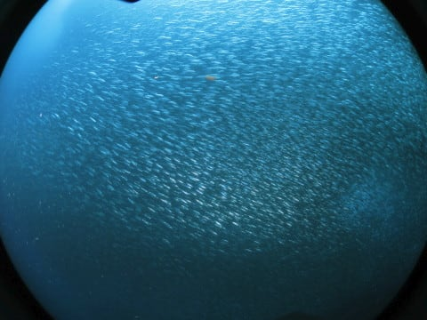

# 2016年8月　子連れで再訪！モアルボアル旅行記その19…そしてモアルボアルのラストダイブは…またイワシです

📅 投稿日時: 2017-09-29 03:42:40

🏷️ カテゴリ: [ダイビング日記](ce3a7a8d424d112fce83ee85c81a0e344.md)

えー．

本日の記事は，ハリアーターボの

試乗レポートだとお思いでしょうが．

ええ．

お思いのことと思いますが．

…自分も，ハリアーターボの試乗レポートを

書く気マンマンだったんですが．

…ちょいと今日は新しい記事を書く時間が無いので，

書きためてあったダイビングレポートの記事でごまかす…と．

ってなわけで．

今日はいつも不人気，ダイビング旅行記です←いつもの開き直り

では，どうぞ～！

＃試乗レポート期待していた人ゴメンナサイ

----

ってな感じで．

本日1本目のダイビングが終了したわけですが．

本日がダイビング最終日の我々．

明日，帰国の飛行機の出発時間が朝早いので．

潜水病予防のための，

「ダイビング終了～飛行機搭乗までのインターバル

時間の確保」

を考えると…

うううーーむ．今日の午後のダイビングは，

止めておいた方がいい感じ．

…だもんで．

大変残念なことに．

自分でも納得できない状況なのですが．

大変悲しいのですが．

次の1本が，我々のラストダイブとなるようです…．

ってことで．

ボートは我々のラストダイビングとなる，

2本目のポイントへ向かって移動しますが…

あぁ．

なんということだ…（涙）

次で最後の1本か…

たった3日間のダイビング，なんと短いことよ…（泣）．

なんか，昨日日本を出てきたばっかりくらいに

感じるんですけど…．

で．

今日の午前は，2本続けてぺスカドール島かと思ったら…

あらら？

船はぺスカドール島を離れて，陸地の方へ向かいますね…

そして．

見慣れた桟橋前にやってきました…

どうやら今日一緒のボートのゲストが，

午前中のみのダイビング参加で．

そして，1本はイワシの群れを見てみたい！

…と，リクエストしたので．

今日2本目は，イワシダイブになったようです．

しかし．

ダイナミックなイワシダイブが大好きな我々夫婦．

3日間連続して，毎日1本ずつイワシダイブでも

問題なし！

それどころか，ラストがイワシダイブって

望むところ！！

ってことで．

今回も，娘はアサミさんと一緒に留守番してくれるとの

ことなので…

また，夫婦そろって，エントリー！

いやーー．

娘も成長して，船の上で留守番できるようになったし．

今回全8ダイブ中，6本を2人で潜れたよ…！

ありがたや…

で．

あとは，今回3本目のイワシダイブ．

もう，写真は見飽きたでしょうが．

この迫力のイワシの群れを，

しつこくもご覧ください…

この，群れの動き．

そして，スケール感．

この感動は，一度実物を見てみないと分かりません．

ワイド好きなら，イワシの群れを見るだけのために

ここに来る価値は十分あります…

目の前まで近づくとこんな感じだし．

遠くまで離れるとこんな感じで．

他のダイビングでは味わえないスケール感と

迫力があるし．

そして，他の魚が群れにアタックをかける時の，

激しい動き．

見てても，飽きません…

オーナーの小宮山さん曰く．

毎日イワシポイントを潜ると飽きる人も

いるようですが…

私は飽きませんでした．

いや，全く飽きることなく，

いつまでも眺めてられます…

さすがに一日3本ここだとちょっと考えますが．

ここには，ぺスカドール島のきれいなサンゴや，

マクロものもあるし．

やっぱり，モアルボアル，気に入ってます…

ってことで．

このダイビングは，エグジットのタイミングでちょうど

ショップ前だったので．

ビーチに係留されたボートへのエグジットと

なりました…

ってことで．

またまたイワシダイブでしたが．

いや，やっぱり満足でしたっ！！！

## 💬 コメント一覧

### 💬 コメント by (マルハバ)
**タイトル**: 私も・・
**投稿日**: 2017-09-29 09:49:46

こういう魚の渦に巻かれるのが大好きでした。

群れに出会うといつも

そ～っともぐり込んじゃう衝動に駆られるんです（笑）

### 💬 コメント by (Skier_S)
**タイトル**: マルハバさま
**投稿日**: 2017-09-29 23:34:59

いや～．

この群れは，見ごたえありますよ．

ぜひ，モアルボアルでイワシの群れにそーっと

潜りこんでやってください（笑）

