# 2026シーズンモデルのスキー板，試乗レポートその2…FISCHER RC4 NOIZE ST PRO

📅 投稿日時: 2025-05-21 01:07:30

🏷️ カテゴリ: [スキー板試乗](c0bd8048615710cee890e403a36cc9a2b.md)

えー．

本日，おこみん特派員ともう1名の特派員から

横手＆渋の写真が送られてきましたが…

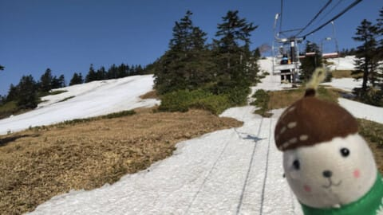

写真を見てみると，渋峠はあんまり昨日と

変わらないのでいいとして．

横手第4リフトの海和ゲレンデ，かなり幅が

狭くなってますね…！

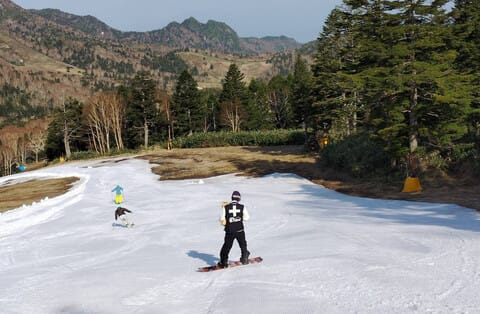

このあたりはまだ幅があるけど．

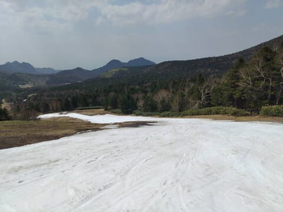

ここから先はヤバい感じで…

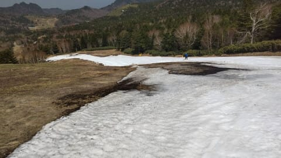

このあたりは，もう幅2mくらいしか

ないんじゃないかな？？？

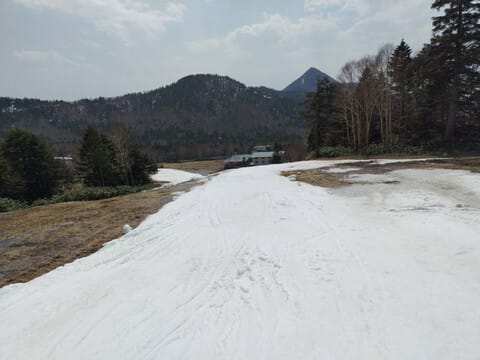

降り場付近も，貯めてあった雪がもう

そろそろ底をつきそうで…

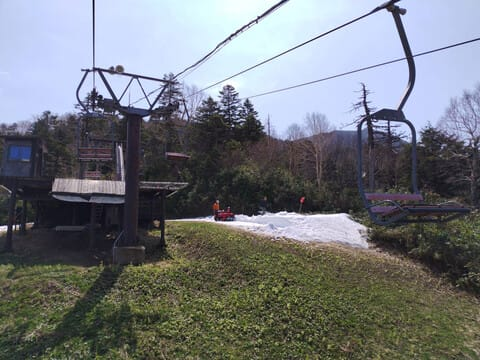

この降り場からの道をキープするのも，

あと1-2日が限度では？？？

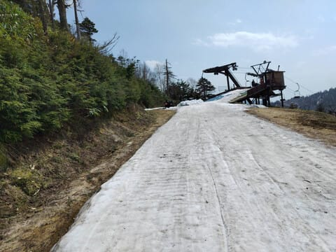

海和ゲレンデ，雪がある限り営業となって

いたけど．

これ，渋峠より間違いなく早く終わっちゃい

そう…（泣）

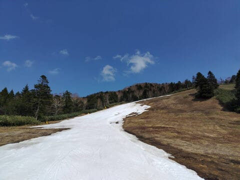

と，思っていたら．

海和ゲレンデの営業は5月22日で終了

と，本日横手山のFacebookにアナウンスが

流れてました…（泣）

（なぜか横手山のホームページにはこの案内が書か

れてません…FacebookとXだけで周知されてます）

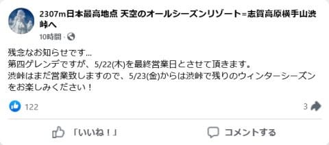

（[横手山Facebook](https://www.facebook.com/yokoteyama2307/posts/pfbid025qgu4oDcSPzqEpjbMRoo5aZ7qv7K1op95UPF6YCcSXhu4nMPKKe37iEqKf9KZAkfl)より）

あぁ…

横手が5月22日で終わりなら，渋峠はまだ

雪が残りそうだから，渋峠の営業を延長して

5月25日以降もやってほしい…

とりあえず．

渋・横手も，5月25日で営業終了です…（涙）

あぁ…シーズンが終わっていく…

ってなことで．

シーズンも残りラストスパートですが．

まだまだスキーネタを続けるこのBlog．

今日も2026シーズンモデルのスキー板の

試乗レポートです！

今日も昨日に続いてフィッシャー編．

では，どうぞ～！！

〇FISCHER RC4 NOIZE ST PRO 165cm

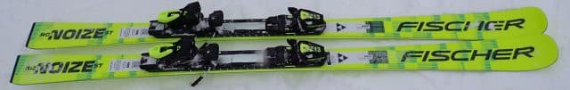

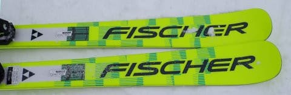

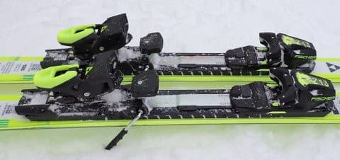

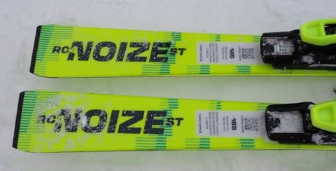

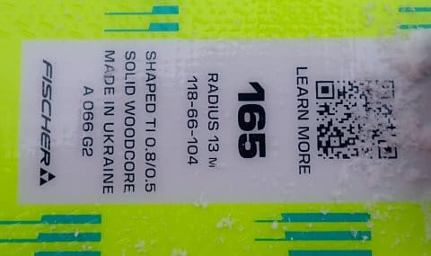

基礎小回り．

前回はRC PROの後継機になるLT PROでしたが．

この板は今シーズンのSC PROの後継機にあたる，

ST PROになります．

LTと同様，来シーズンからNOIZEテクノロジーを

搭載してフルモデルチェンジ．

プレートは今シーズンと同じMプレートです．

履いてみたところ…

うん．今シーズンまでのSC PROと，そこまで

大きくは変わらない乗り味．

板がきれいにたわんでくれて，トップからテールまで

しっかりグリップして，板のエッジをすごく長く

使える感じ．

キレイに丸くたわんだエッジに乗って，

丸いカービングの弧を描いていけます．

フレックスは，LT PROよりはしっかり感が強く，

板の短さもあるのか，すっとたわむLT PROより

張り・バネ感を強めに感じるので…

小回りに近いターン弧までもっていくと

圧が強く溜まる感じがあって，

この圧が横っ飛び方向じゃなくてスッと

テールに抜けるように開放される感じ．

なので，反復横跳び系小回り板ではなく，

あくまで板のたわみに沿って丸く回って

行き，切り替えで気持ちよく加速していく感じ．

だもんで，ターンの抜けが可なりいい感じで…

ものすごい深回りができます．

ムチャクチャ傾く快楽の激烈深回り

カービングターンができます．

かなりの脳内麻薬系カービング小回り板です．

それでいて，NOIZEの効果なのか．

板のバタつきが少なく，かなり滑らかに

滑っていく感じ．

雪面の荒れを感じにくく，雪が多少荒れて

いても，バタバタする感じなく，荒れの上を

滑らかに滑っていけます．

今シーズンと来シーズンモデルの違いは，

この滑らかさかな～…．

この荒れを感じない振動吸収性のおかげか，

そこそこのスピードで滑ってもゆっくり

滑ってるかのように感じるので，高速も

そんなに怖くなく，高速耐性は高め．

グリップの強さと安定性の高さで，

結構な高速まで安心して滑れます．

かなりのハイスピードで滑っても，エッジが

逃げるような感じを微塵も感じさせない

強めのグリップだけど，どうしようもなく

エッジが外せないという板ではなく．

履いた感じが思ったより軽く感じることも

あり，ずらしていこうと思えばずらせる

操作性の高さもあります．

…ただ，エッジに乗って切っていくのが

あまりにも快感で，あまりずらして滑ろう

とは思いませんが…

回転弧の自由度が高く，重さのわりに

履いた感じの軽快さがあるので．

そこそこのスピード派の人が，小回り

専用機ではなく小回りベースの

オールラウンドとして使うには，

結構いいんじゃないかな～…

私は気に入りました！
