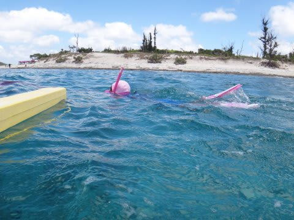
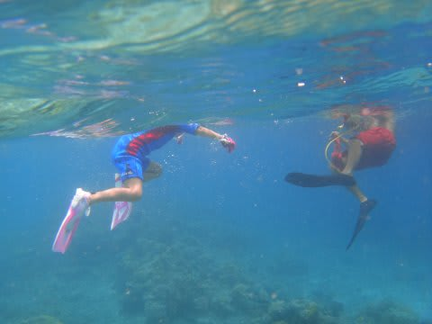
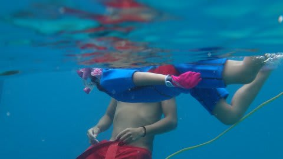
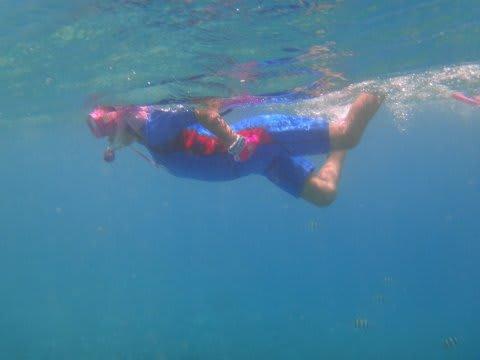
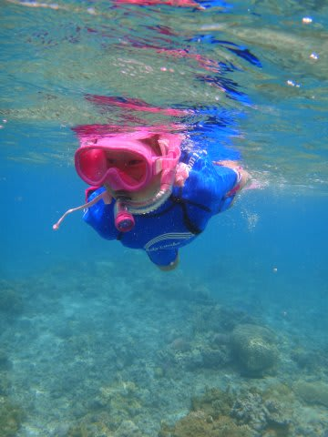
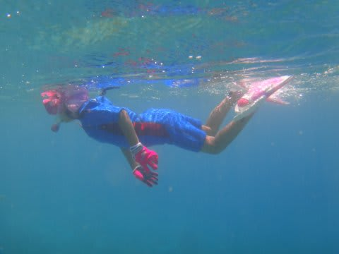

# 2013年7月　子連れ座間味ダイビング旅行記その13…娘，5歳にして余裕のシュノーケリング

📅 投稿日時: 2013-08-08 01:33:34

ってことで．

ライフジャケット無しで娘を海へ送り出したわけですが．

はっきり言って．

娘はライフジャケットの有り無しは，全く気にしてない様子で．

雄大さんに誘われて，泳ぎだしたなぁ…

と思ったら．

そのまま，勝手にばしゃばしゃ泳ぎ始め．

…

なんだか．

完全に．

好き勝手に泳げるようになっちゃいました…

…まぁ，ウェットスーツ着てますから，浮力もあるので．

ライフジャケット要らないかな～，って思ったんですが．

大人でも怖がる人がいる，足が着かない深さの，船からのシュノーケリング．

なんだか，ぐるぐる回ったり，いろいろできるようになり．

もう，船に帰るころの最後のほうなんか，余裕で泳いでますね～

ここなんか浅く見えるけど，水深5m以上です…

…まさか，幼稚園年長でここまで泳げるようになるとはっ！

ってことで．

どうやら我が娘．

ライフジャケット無しで，足がつかない深さの海で．

普通にシュノーケリングができるようになったのでした…

## 💬 コメント一覧

### 💬 コメント by (KENKEN)
**タイトル**: いつもながら
**投稿日**: 2013-08-08 22:14:05

すごいですね。

ウェットを着てるとは言え、足のつかないところでジャケットなしに泳げるのは。

これはダイビングをやりたがるのもすぐっぽいですね。

10歳まで我慢できるかな？

ところで先日娘をバイクに乗せて公道走っていいかな？と妻に聞くと、何考えてるの？と怒られました。

うちの娘とツーリングを楽しめるのははまだまだ先のようです。

### 💬 コメント by (Skier_S)
**タイトル**: KENKENさま
**投稿日**: 2013-08-09 01:32:40

いやー．

子供の成長は親の予想を超えますね～．

ダイビングはもうやりたがって困ってます…

船の上でガイドにレギュを吸わせてもらって

喜んでました…

とりあえず，10歳まで待ってもらうしかないかな．

…でも，その前にスキンダイビングを仕込まないと．

我が家は妻もライダーなので，バイクに対する理解は

深いです…

というか，「早くバイクにのせようよ」

って感じでした…

でも，やっぱり年長さんくらいにならないと

怖いですよね(笑）．

