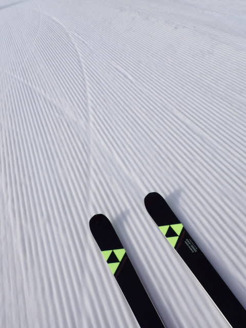
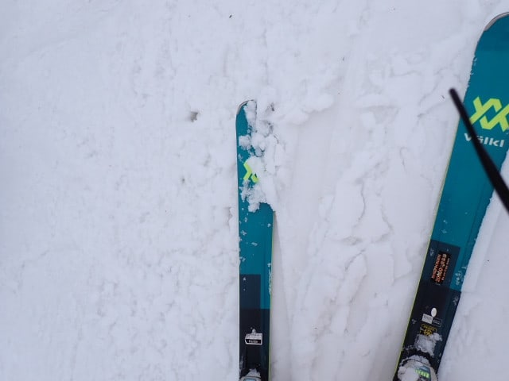
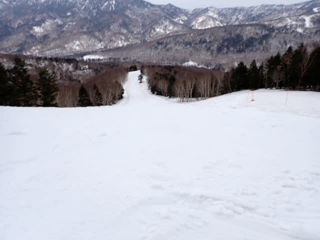
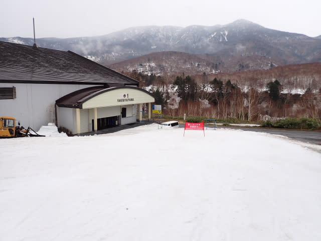

# 2025/4/28(月)，GWの谷間の志賀高原スキー場滑走レポート…薄曇り→曇り→午後2時ごろから雨(泣)，雪の滑りは悪かった

📅 投稿日時: 2025-04-28 21:45:45

🏷️ カテゴリ: [2025スキー滑走日記](cacd3fbf84d4a679ee61a5894c3f95e14.md)

ということで．

予告通り，今日は休みを取って志賀高原に

復活しました～！！

…しかし，私がいない週末の志賀高原は晴天で，

私の怨念にもかかわらず雨やみそ汁は降らな

かったというのに．

なぜ私がやってきた日に限って，雨が降る

のか…（泣）

とりあえず，本日の志賀高原．

朝の志賀高原までの上り坂は晴れてたん

ですよね…

…でも，サンバレーの雪，減ったなぁ…

かつて，雪が多い年はGWまでこのバーンが

滑れた時があったけど．

サンバレーの雪がほとんどなくなったという

ことは，昔の大雪の基準に比べると，そこまで

雪は多くないということかな…

早朝６時過ぎに登ってきたというのに，

気温は結構高く，路面凍結は全くなくて，

今日はスキー場までは夏タイヤで問題なく

来れるレベルでした～！

（明日の朝は冷えるので，凍結してる可能性

あり！明日は凍結に注意してきてください…）

とりあえず，昨日は深夜２時半に起きて

頑張って運転してきたので，

何とか早朝営業開始45分後の，6:45には

1本目のゴンドラに搭乗！！

山頂の気温は…わかりにくいけど，早朝の

時間帯なのに，もう+7℃もありますね…（涙）

でも，夜明けのころに結構冷えたらしく，

山頂に出ると，雪は結構硬めで，太陽も

うっすら雲で隠れて日差しも弱まっている

ので，朝の雪は緩んでませんよ！！

早朝開始から45分後のスタートだったけど．

バーンは比較的締まっていて，平日という

こともあり，滑っている人も少ないので…

まだ結構シマシマが残ってますよ！！

そして，バーンは硬いながらも表面が

わずかに緩んで，エッジが食い込むのに

スピードが乗る，かなり楽しいバーン

ですよ…っ！！

しっかり硬くていい感じでフラットだし，

スピードが乗るし，ガラガラだし…

…これ．うかつなトップシーズンの日より，

この時期の早朝のフラットバーンのほうが

楽しいんじゃないか＞？？？

今日の早朝は，空は明るめながらも

太陽が雲で隠れていて日差しが和らいで

いたおかげで，9時近くまではかなり

いい感じのスピードが出る楽しいバーンを

滑ることができて．

これだけでも，志賀に来たかいがあった…

という朝を過ごせました～！！

…ただ，GSコースは昨日かなり荒れた

バーンが圧雪でフラットにしきれなかった

ようで，朝イチはところどころかなり

凸凹のままガチガチになっていて．

危険な部分はポールで規制されてたのですが．

GSコースのこの部分，幅が半分くらいに

狭められてました…

…そして，先週日曜日まではコース全面

ほぼ真っ白で，普通に滑れたオリンピック

コース．

1週間で，かなり雪が減りましたね…(泣）

この1週間，結構暖かかったから…

ということで．

朝イチは結構楽しめたけど．

気温は早朝から+7度と高かったため．

さすが曇り空でも，9時を過ぎると雪が

緩み始め…

緩斜面では，雪の汚れがかなり浮いてきた

こともあり，10時を過ぎる頃には，かなり

滑りが悪くなって来ちゃいました…(泣）

そして．

朝10時には．

大変残念なことに，雪はもうユルユルに

なっちゃって．

その当然の帰結として，バーンは早くも

荒れ始めてきましたね（激泣）

日が射してないから，もう少し締まったままで

いてくれると思ったのに…

早い…荒れるのが予想より早すぎる…

GSコース，上の写真の突き当りを右に曲がる

あたりの部分，わずかに地面が出かけている

所が出てきましたね…

うーん．こうなると，雪が解けるのが早いので．

GW最後の日は，この辺りは結構ぎりぎりの

狭い幅のみ滑れる感じになっちゃってるかも…

ってな感じで．

ハッピーパラダイス早朝シアワセタイムが

終わった後は．

最高気温が10℃ほどに上がったこともあり．

…2週間前の，+15℃の晴天よりはまし

だろうと思っていたのが裏切られて…

雪にかなりの汚れが浮いてきている

こともあり．

午前11時ごろには，もうすでにバーンの

かなりの部分に，妖怪板つかみが

大量発生してきました（泣）

パノラマの上部やGSの上部，そして

2ゴンから1ゴンへ戻る連絡コースなどの

緩斜面部分．

先週までは，妖怪板つかみの子供，

「幼体板ちゅかみ」

程度だったけど．

今日はかなりブレーキがかかる感じで…

今日のは明らかに，大人の妖怪板つかみ

でした（泣）

バーンは荒れてきたし．

雪の滑りは悪くなってきたし…

朝が良すぎただけに，11時ごろには

かなり戦闘意欲が失われる感じ…（泣）

そのせいで．

早朝から搬器1－2台待つか待たないかで，

それほど人がいなかったゴンドラ乗り場．

さらに人が減ってほぼ無人になり，

かなりさみしい感じ…

バーンにも誰もいませんね…

まぁ，雪は荒れていて滑りは悪いとは

言いながらも．

この時期にGSコースとパノラマコース，

パノラマインコースが滑れるし．

2ゴンから1ゴンへの連絡路も，まだまだ

雪があって，GW終わりまではもちそう

だし．

パノラマコースもGSコースも，まだ

幅いっぱい滑れるし．コンディションと

しては恵まれてるほうかな～

と，自分を慰めていた，午後1時半過ぎに．

…なんか，来たよ．

ゴンドラの窓にぽつぽつと水滴がついて

来たし，滑ってるとゴーグルにも

水滴がつくんですが…（泣）

まぁ，降り始めたとはいえ，まだポツポツ．

水滴がつくなぁ…ってくらいでびしょ濡れには

ならない降りだったので，

「もう少し降ってくれれば，板の滑りが

良くなるかも…もうちょっとだけ強めに

降ってくれないかな？」

などと不純なことを思いながら滑っていたら…

この思いが本人の意向より効きすぎて．

午後2時半ごろに．

ずぶぬれになるレベルの本降りになって

しまったんですけど…（泣）

だのに…

かなりの雨が降ってきたというのに．

なぜか雪の滑りは良くならず．

レインウェアを着てもびしょ濡れに

なる上に，板の滑りも悪いという

ひどい目に…（泣）

さらに，雨のせいで滑っている人が

さらにいなくなり．

誰も滑ってない雪に浮いてくる汚れが，

さらにパワーアップ！（涙）

まぁ，強い降りだったのは30分ほどで．

3時過ぎには降りは弱まってくれたので

良かったけど…

そこから残りの営業時間はあとわずか(泣）

（結局，朝にGSコースのボコボコ穴あき

圧雪部分に立っていたポールは，営業終了

までそのまま残ってました…）

ということで．

朝9時ごろまではかなり良かったけど．

10時過ぎからは滑りの悪い雪＆荒れあれに

なっていき．

14時前から雨，14時半には強く降り，

ガラガラにはなったけど板の滑りは

良くならなかった

という，後半は残念だった一日が，

15時半のゴンドラ営業終了とともに

終わったのでした…

うーん．

どうやら一昨日は晴天なのにこんな

ストップ雪じゃなかったみたいなので…

やっぱり土曜に滑っておきたかった…

今晩からちょっと冷えて，明日の朝までに

山の上では数ｍｍ程度だけど，雪が積もる

かもしれないほどに冷えそうなので…

明日はバーンコンディションが一日中

良いことを期待…！！

## 💬 コメント一覧

### 💬 コメント by (油漏＠あちこち+筋肉痛)
**タイトル**: 28日
**投稿日**: 2025-04-29 07:04:59

お疲れ様です。

日曜日からの一泊二日で私も昨日滑ってました。高天原に泊まったので高天原→一ノ瀬→焼額山→奥志賀と滑りました。

この時期はコブのラインがあちこちにできて、それを巡礼してました。焼額山は小籠包コースと第４ロマンス沿いのライン、それからGSコースのゴンドラの下をくぐるあたりからの長いこぶライン、奥志賀の第４ゲレンデのこぶ道場、こぶ道場エキスパート支部などなど、１人で巡礼しました。一ノ瀬のモーグルコースも底割れしていなくて、人もいないし、下手なりに楽しみました。

雨が本降りになった時点で体力が尽きていたので、何の未練も無くあがり温泉入って帰宅しました。

ちなみに高天原と一ノ瀬ですが、早朝スキー用の固目のゲレンデが10時頃まで楽しめました。

### 💬 コメント by (アツシ)
**タイトル**: Unknown
**投稿日**: 2025-04-29 08:46:27

今週も入れ違いでしたね。私は土日滑って月曜は出勤でした。土日は晴れて、板も滑ってましたよ。今季ここまで雨にも妖怪にも遭わないまま(この土日、幼体は一部で遭遇)滑走35日となりました。雨にも妖怪にも遭いたくなければ、私が滑る日に滑りましょう😁このまま雨にも妖怪にも遭わないままシーズンを終えたいところですが、次の5/3〜6はさすがに妖怪祭りでしょうね。

あと、大変残念なのが、土曜の午後の滑走で、シーズン34日目にして、ついに転倒してしまいました。これまで無転倒を継続してたのに。しかもそんな急斜面とかでなく、サウスで。うーん、悔しい。ちょっと気を取られてよそ見した隙に荒れ荒れ雪に片足を持って行かれてそのまま、両スキーとも外れる大転倒。２回くらい回りました😅誰もいなかったので、誰にも転倒は見られてないはずなので、無かったことにしようかなとも思いましたが、まあスキーは紳司のスポーツなので(？)自己申告しておきます。来シーズンに、持ち越しです。

### 💬 コメント by (Skier_S)
**タイトル**: まだ志賀高原滞在中
**投稿日**: 2025-04-29 20:54:28

＞油漏れ＠あちこちさま

あら，昨日焼額にいらしてたんですか…！

全く気付かず．

昨日は雨が降る前に上がるのが正解だったと思います(笑)

＞アツシさま

今回も入れ違いでしたね…

月曜はかなり板の滑りが悪かったです（涙）

そして遂に初転倒！惜しかったですね…もう少しでシーズン未転倒記録だったのに．

来シーズン，また未転倒チャレンジして下さい！

