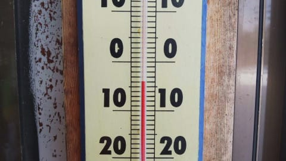
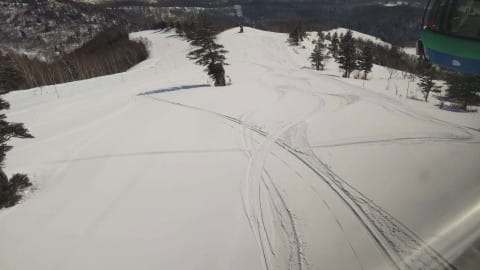
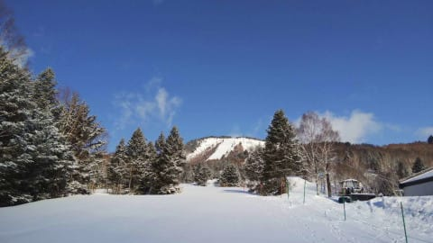
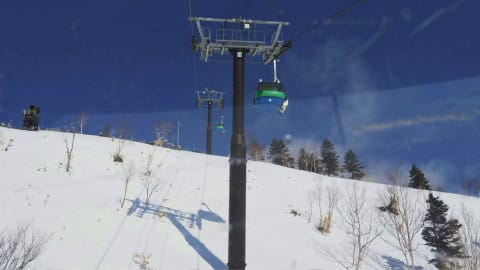
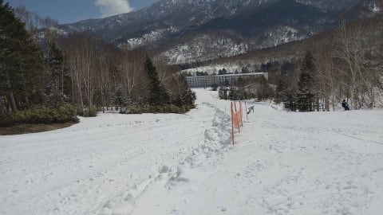
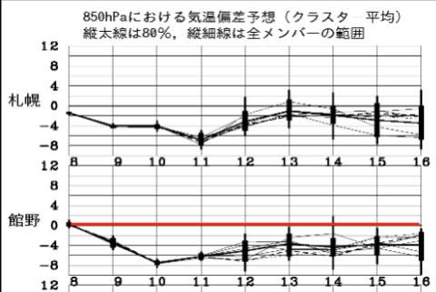
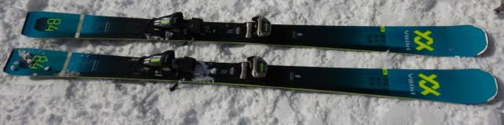
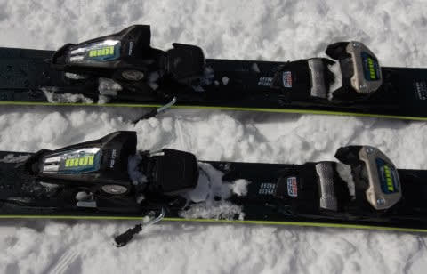
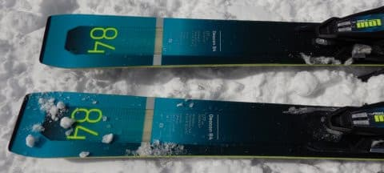
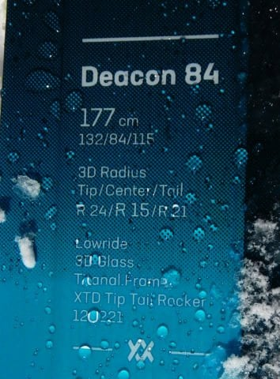

# 2021シーズンモデルのスキー板，試乗レポート…VOLKL Deacon 84

📅 投稿日時: 2020-04-10 00:43:49

🏷️ カテゴリ: [スキー板試乗](c0bd8048615710cee890e403a36cc9a2b.md)

なんだか，緊急事態宣言が出た直後に

八方が営業休止を決めて．

「もしかすると，他のスキー場も八方に続くのか…？」

と思ってましたが．

それ以降は，栂池が続いただけで．

他のスキー場は，淡々と営業を継続してますね…

とりあえず，我が焼額は本日も営業を続けており．

　9日(木)：朝イチは-5℃と冷え冷えで，

　2-3cmほど，うっすらと雪が積もった朝．

と書きましたが．

予想は当たったのか…？

と，特派員からのレポートを

見てみると．

うむ．今朝の気温は-4℃！

予想からわずか1度のずれ！

…そして．

あさイチのゲレンデは，うっすら雪が

積もってますよ！！

ここまでは，かなりの精度で

予想を当ててますね～！

…ただ．

曇り空でそれほど日差しが強くないという

予想は外し．

結構青空が広がったようで…

そのせいで，昼前には雪が緩み，

焼額では一部滑りが悪い雪に

なったようです…（ちょい涙）

でも，一の瀬方面は昼ごろまでは

いい感じだったんじゃないかなぁ…．

とりあえず，この時期としては

晴れたのに，雪がザブザブにまでは

ならず，結構良い一日だったのでは

無いでしょうか…

ってことで．

まだ志賀高原には雪はたっぷりあるし．

そのうえ，焼額はイーストコースを

クローズして雪出しを始めたようですし．

さらに，これからの850hpa予想では．

なんと．

今シーズン初めての，一週間ぶっ続けで

平年より気温が低い一週間になりそう！！

ホントに，今シーズンは低温になっても

せいぜいそれが続くのは3日程度．

その後に異常な高温ですぐに雪が

解けちゃうパターンが続いたので．

こんなに長く冷え続ける予想は，

今シーズン初めてです…

…これなら，GWまで雪がもってくれそうな

感じ…！！！

でも．首都圏の緊急事態宣言が

5/6まで続くことになっちゃった今．

志賀がGWまでもっても．私には関係ないの

ですが（涙）．

…でも．

GW後のかぐらに期待…っ！！

…ってなことで．

いつも通り，普通のBlogならこれだけで1本の

記事になりそうな長い前フリでしたが．

長い前フリのあとは，本題へ．

今回は，3月7日の志賀高原で試乗した

スキー板の試乗レポート．

本日はフォルクル編その2です．

では，どうぞ～！

○VOLKL Deacon 84 177cm

オールマウンテン

Volklのオールマウンテンタイプの板で，上級向けになる

このモデル．

…センター幅が何種類かあるみたいだけど，

これが一番太い板なのかな？？

その名の通り，センター幅は84mmと

結構太く，

トップ/センター/テールは132/84/115．

サイドカーブはR24/R15/R21の複合サイドカーブのようです．

センター付近は小さめのサイドカーブで

低速から小さめのターンができ，

スピードが出るとトップ・テールの大きめの

サイドカーブが効いて，大きめのターンが

可能…という事らしいのですが．

そういう予備知識をもたずに滑った印象としては．

「センターR15ってわりには，かなり

　サイドカーブが緩めの大回りっぽい感じ…」

という第一印象．

サイドカーブもゆるく感じるし，板の返りもゆったりと

帰ってくる感じなので．

板なりに滑っていくと，小回りというより

ゲレンデを大回りでクルーズする板に感じます．

ただ，私のリアルトップスピードを出すと，

板のトップがちょっとばたついてくるので，

ガンガンに高速で攻める板じゃないのかな…

実際の重さはそれほど軽くないのですが，

履いた感じはかなり軽く感じるので．

スピードを出していった際のどっしり感は

無く，比較的楽に履ける板です．

エッジグリップもギンギンに強い板ではなく，

雪面へのあたりが柔らかい感じで，

自然にずらしていくことができます．

かなり動かしやすい板です．

スピードを出していってエッジグリップで

大きく傾くというより，新雪なんかのふわふわ雪の，

エッジが効かない斜面で，板を適宜動かしながら

滑り降りていくのに適した感じの，

エッジグリップの柔らかさ．

ただ，板なりに滑ってくれば，縦目のロングターンで

エッジに乗って滑ることもできます．

エッジグリップは優し目だけど，ちゃんとメタル素材が

入っている感じで，フレックスがやわやわではないため，

板がたわみすぎてミドルからショートターンに

なっていくような感じではないです．

楽に縦目のロングターンでゲレンデをクルーズ

して行ける板です．

ただ，板を積極的にたわませて弧を小さく

しようとすると，板のグリップがそこまで

頑張らないので，板がずれる形で小回りに

なっていきます．

板がずらしやすいので，楽にズラシの小回りも

作って行けます．

ガンガンに硬い斜面をしっかり切っていく

板ではなく，柔らかい雪で本領を発揮しそう．

でも，普通のゲレンデでも，緩めの斜面は

板なりに，急斜面はズラシで気楽に

滑れるので．

そんなにキレキレターンでガツガツ飛ばさない人だけど，

新雪や荒れた雪から春の柔らかい雪まで，

楽に滑りたい…

って人に向く板かな～．
