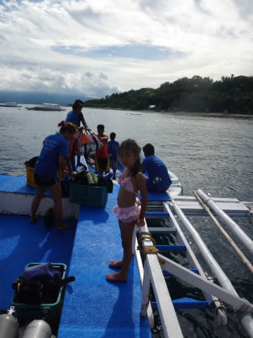
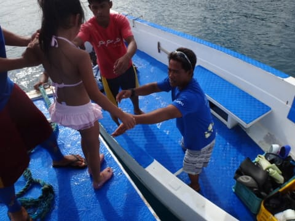
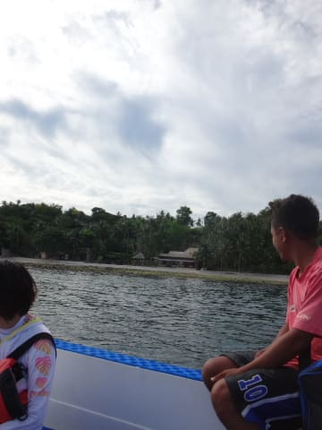
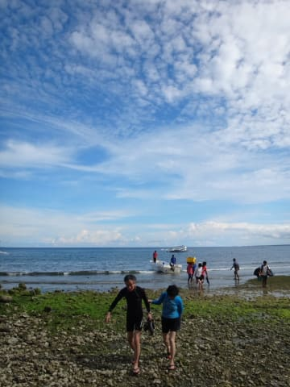
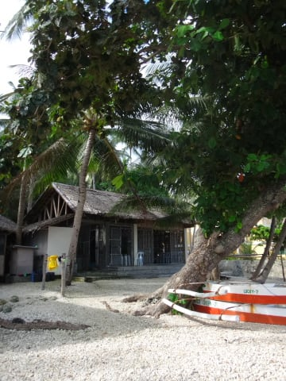
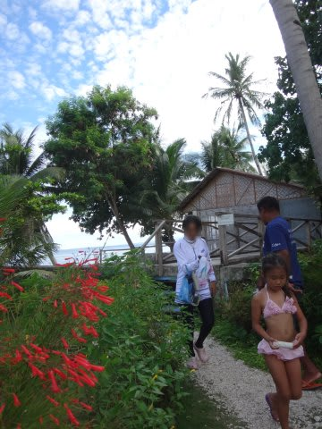
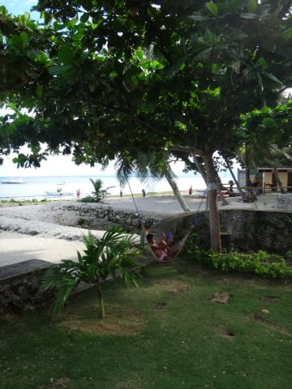
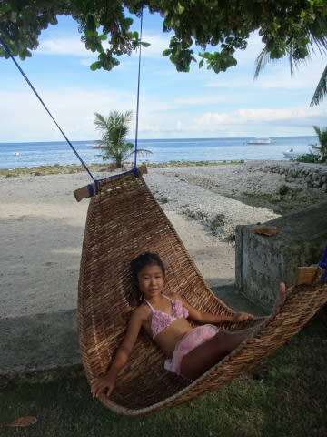
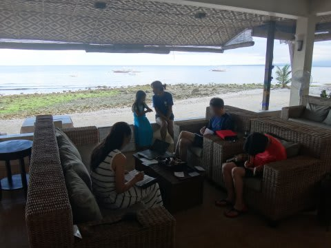
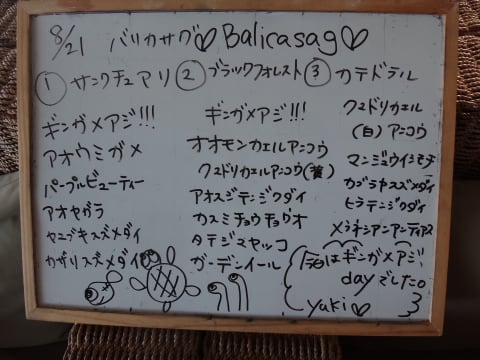

# 2014年8月　オスロブagain…再び，子連れでジンベエザメと泳ぐぞ！　その11

📅 投稿日時: 2014-09-17 00:27:24

🏷️ カテゴリ: [ダイビング日記](ce3a7a8d424d112fce83ee85c81a0e344.md)

ってことで．

1日目のバリカサグ遠征も終えて，

船に揺られること1時間半．

午後3時半ごろ，船はホテル前に戻ってきました．

小舟に乗って…

ホテルへ帰還！

フィリピンはいわゆる「殿様ダイブ」なので．

ホテルへ戻って器材を洗う必要はなく，

スタッフが洗って干しておいてくれます．

…なんだか．

フィリピンにいると．

ゲストは何もしなくていいので，

王侯貴族の気分ですな…

ってことで．

上陸したら，何もすることなく．

すぐにホテルの部屋に戻り…

シャワーを浴びればよいという．

なんて楽なんでしょう…

でも．

ダイビングショップから，部屋に帰る途中の

ハンモックにトラップされるわが娘．

気持ちよさそう…

ってことで．

ハンモックでちょっとくつろいだ後．

シャワーを浴びたら，

レストランにみんな集まって

ログづけタイムです．

うん．

今日は1本目，2本目続けてギンガメが

出てくれたので．

確かにギンガメアジDayだったんでしょうね～．

…これで．

今日，夫婦のどちらかしかギンガメを見てなかったら．

今晩の夫婦の平和が保たれるか微妙でしたが．

二人そろって見られてよかった…

で．

この日のログづけの途中で．

一緒に潜ったゲストがガイドに尋ねました．

ゲスト「街に出たいんですけど…」

私（ええええっ！？街って…この周りに街なんてあるの？）

このホテルの周り，すごい田舎で，何もなさそうなんです．

前回来たとき，外に出ようとは全く思わなかったのに…

歩いていけるようなところに街があるの？

治安は大丈夫なの？？

と，驚いた，Skier_Sなのだった．
