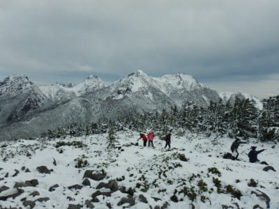
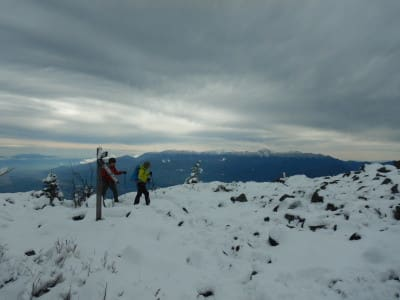
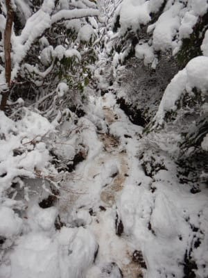
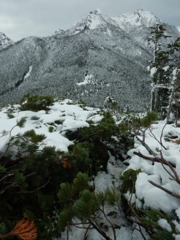
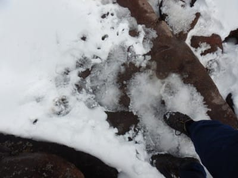
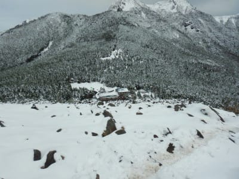
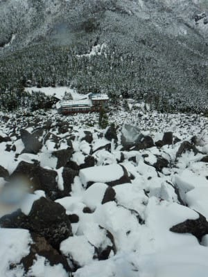
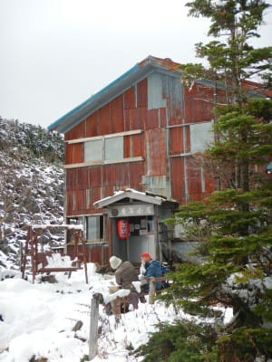
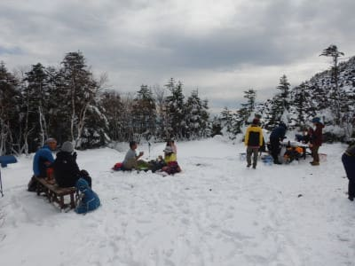

# 2020年10月，八ヶ岳の編笠山に登ってみた，その6

📅 投稿日時: 2021-08-11 02:37:47

🏷️ カテゴリ: [登山・旅行](c1d637a11a25b457ac978d197adbdafc5.md)

予約枠が一瞬で埋まってしまい，

ワクチン予約が取れなかったSkier_Sです．

うーん．

いつになったらワクチン打てるのかな…？

とりあえず．

本日も編笠山登山レポート．

では，どうぞ～！

ーーー

ってなことで．

最後の積雪の岩登りで結構な時間が

かかったものの．

それでもほぼコースタイムで登頂して．

山頂でくつろぐこと，しばし…

いや，これ．

完全に冬山みたいな景色ですね…

とりあえず．

山頂で20分ほど休憩したので．

さて，出発しますか…

と，山頂から青年小屋に向かっての

下り坂を歩き始めますが…

ハイマツに挟まれた，こういう狭い道を

下り始めてわずか5分後．

膝に，ビキッとした痛みが…！！

…痛い．

いきなり，痛い．

普段なら，下り始めてしばらく経って，

膝に負荷が溜まったころからじわじわ痛みが

出てくるのに…

下り初めていきなり5分で．

膝を曲げると飛び上がるほど痛いん

ですが！？？（激涙）

もう，ここからは一気に強烈にペースダウン．

膝を曲げると激痛が走るので，

右膝を曲げないように歩くと…

これは，スピードがでませんね（泣）

そして，ちょっとでも曲げると激痛が…

こんな足場の悪い道を，膝を曲げないように

降りるのは…

かなり難しいですね(激涙）

さらに追い打ちをかけるように．

青年小屋に近づくと．

完全にゴロゴロ岩場に出くわしました．

うむ…

全く膝が曲げられない状態で．

このゴロゴロ岩を乗り越えて，

あそこの青年小屋まで行けと

おっしゃるわけですな？？（涙）

かなり辛い思いをしながら．

痛いほうの足を曲げないように，

そろりと着地させ，

岩場を降りていくという．

傍から見ると，

「あの人何やってんだ？」

と思われる不自然な降り方で

岩場と格闘すること，20分以上．

なんとか青年小屋まで下りることが

出来ました…

山頂からここまで，コースタイム17分のところ．

倍の40分近くかかってるよ（泣）

そして，私が降りてくるのを見ていた

青年小屋の周りにいた人に，

「どうしたんですか？転んだんですか？」

と心配される始末．

「いや…膝を傷めてまして…」

と，本当のことを伝えたのですが．

こいつ，雪で転んじゃったんだろうな…

と思われてるんでしょうね（涙）

しかし．

ヤバい．

ここから順調にいけば，駐車場まで

残るコースタイムはわずか3時間なんだけど…

積雪の岩場登りやら，膝の痛みでのゴロゴロ岩

下り等のロスタイムで，すでにもう12時…

…そして，残りのほとんどは膝に厳しい

下り坂（泣）

この状況で．

この積雪の山．

日が暮れる前に，無事下山することが

できるのか？？
