# 12月11,12日の週末の志賀高原スキー場の天気は？…土曜は晴れ，日曜は積雪があるかも？

📅 投稿日時: 2021-12-09 01:44:39

🏷️ カテゴリ: [スキー天気予想](c6554f5c3c106093b511a8daae23757e8.md)

えー．

昨晩から志賀高原は雪が降り．

昨日の予想通り，今日は一日雪が

降り続けたようです！！

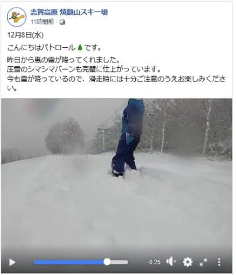

（[焼額山スキー場Facebook](https://www.facebook.com/yakebitaiyama/)より）

…ただ．

気温はそんなに下がらなかったので，

標高が低いスキー場は雨だったようで…

かぐらスキー場は，今日からみつまたを

滑って降りられなくなったようですね（涙）

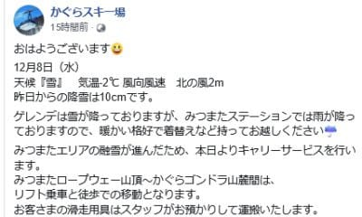

（[かぐらスキー場Facebook](https://www.facebook.com/snowkagura/posts/4399549770172309?__xts__%5B0%5D=68.ARBe_nnitazVoKBn4kaSpqG23zY4_A9AN8_bvMDObTsCtQVS-hMwKjXIMxKTzRlaGMcINzM4DtDJV333gtbSpRY1R9mhSEWW5f8Fe1bYx838GsXegMIFMfEMNdH-36eyxaXmvOxkb-lkh4rFzvxu-02bCIWghz5F3yvYXm9QzFw0fhmVux17iLYZF_ivsLUDJlxtgOjpLbJMUPFKUNtfj0naOj7wIefv1gSQOD1uuAeWjG9-PQpSYcHhLgae7DAL2VnR8TLI3wr_H08UfjDyYZWoCxfShOEPvmnmD1ssbyiC_8y1yRzNTg&__tn__=-R)より）

残念…（泣）

とはいえ，特派員情報によれば，

志賀の焼額では一番下のゴンドラ乗り場まで

ちゃんと雪で…

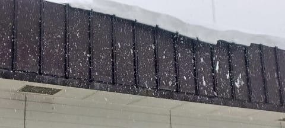

朝までに10~20cmほど積もっていた

ようです！

ブルドーザーが雪まみれですね…

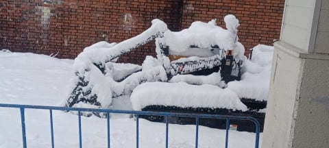

そのおかげで，昨日はブッシュ危険個所を

示すポールが数か所に立っていたパノラマ

コースも，完全にブッシュが隠れて

危険個所を示すポールも無くなったし…

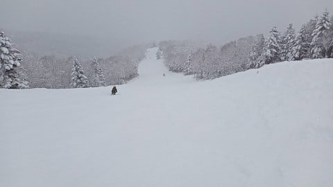

昼間もひたすら雪が降り続け，

昼間だけでも，さらに10cmほど積雪が

積み増されたようです！

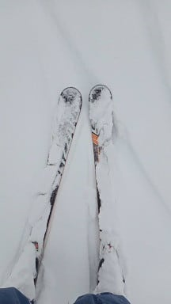

…先日の雨でヤバかったゲレンデに，

恵みの雪でしたね～．

よかった…

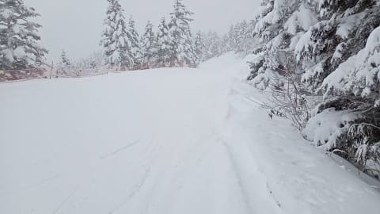

ってなことで．

本日は，水曜深夜恒例の，週末の志賀高原の

天気予想です！

（最近はほぼ毎日天気予想してる気がするけど…）

えー．

まず，9日木曜の850hpa気温図から見てみると．

赤い0℃線がかなり北に行っているみたいに

見えますが…

この日も，今日8日に奇跡の積雪になったのと

同じ形で，なぜか志賀高原を囲むように

0℃線が張り出してきていているので…

志賀高原は朝はそこそこ冷えます！

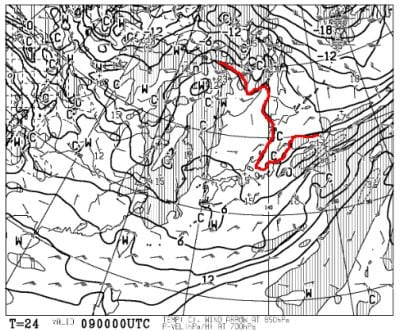

でも，西から+3℃線が迫ってくるので，

午後に向かって気温が上がっていきそう

だけど…

で，この日の地上天気図は，水色の

降水域が志賀にかかってないから．

まぁ，晴れそうですね．

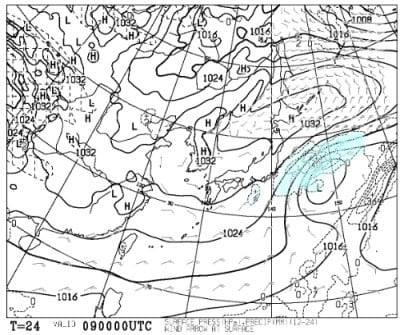

で．次の日10日金曜日の850hpa図は．

うううう――む．微妙．

赤い0℃線はかなり北まで上がっちゃって

ますね…（涙）

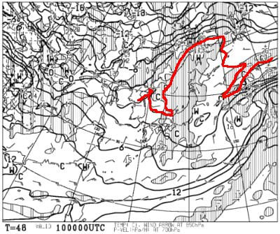

ただ，この日も降水域は志賀にかかって

ないので．

液体が降る危険性はなさそう．

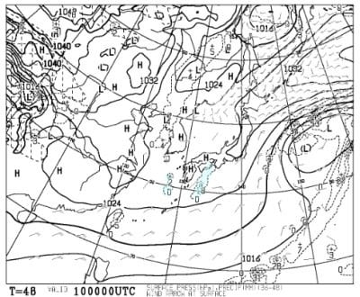

そして，肝心な週末．

11日の土曜の850hpa図は…

うーむ．

この日も微妙…

まぁ，ギリギリ0℃線が志賀高原に

かかっているので．

朝はそこそこ冷えて，締まった雪に

なってくれるかな．

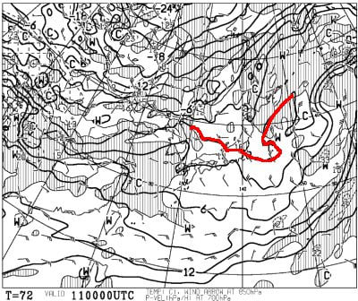

土曜の地上天気図は…

志賀高原はちょうど高気圧の中心

なので，晴れそう！！

…昼間は日差しもあるので，ちょっと

雪も緩んで荒れそうだけど…

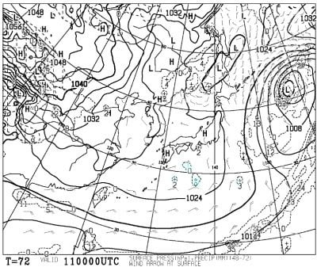

で，続く日曜の850hpa気温は…

うーーーむ．

この日も微妙…

0℃線がギリギリ志賀にかかるか

かからないかという程度．

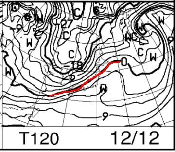

ただ，地上天気図を見ると…

あれ？縦縞の冬型の気圧配置？？

…そして，日本海側に降水域の

網掛けが！？？

…標高が1500mより低いスキー場は

液体になる気温だけど．

…これ，志賀高原だと個体ですね．

雪が降るかも…？？

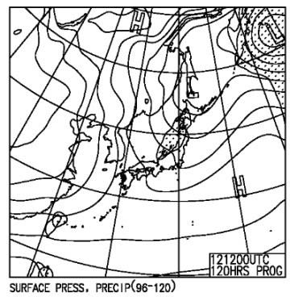

ってな感じで．

まとめると．

9日木曜：朝の山頂の気温は-2～3℃．

　昨晩降った雪が圧雪されたやわらかバーン．

　天気は晴れそう！昼間はちょっと暖かく

　感じる．

10日金曜：朝は0度を下回る程度．

　この日も晴れそう！

　昼間は気温が’+3℃くらいまで上がり，

　ちょっと雪が緩んで荒れるかも．

11日土曜：朝は-3℃くらい，

　あさイチは冷えて締まったいい感じの

　シマシマバーン！

　天気は晴れ，時々雲が多いか…

　昼間は気温が上がって，プラス気温に．

　人が多いとゲレンデはちょっと荒れ気味．

　急斜面は硬い人工雪の下地が出るか．

12日日曜：難しい…この日の予想は難しい．

　たぶん朝は曇り．

　朝の気温は0度をちょい下回るくらい．

　数日間積雪が無いので，雪は締まり気味．

　昼ごろから雪がぱらつきだすかも．

　気温が高めの重い雪が，夕方まで

　ぱらつき続ける．

って感じでしょうか…

昼間は気温が上がり，冷える夜に

なんとかちょっと人工降雪機が

動かせるかどうか…って気温で，

さらに週末までほぼ天然雪がなさそう

なので，週末のバーンは締まり気味かな．

むしろモサモサよりいいかも？

とりあえず，この週末まで雪は

降らないものの．

週末まで，雪が壊滅的に解ける

高温や雨はなさそうなので．

8日に降った雪のおかげで，

結構いいコンディションで滑れそうです！

…という，週末の予想をやった後は．

来週月・火曜の13，14日の850hpa図を

見てみると．

ををを！

赤い0℃線は太平洋まで下がって，かなり

冷えそうな予感…！！

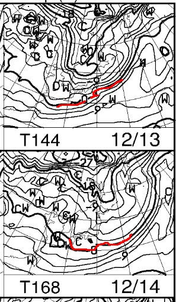

そして．

地上天気図では，13日は冬型で．

日本海側に網掛けの降水域がある，

雪が積もりそうな天気図！！

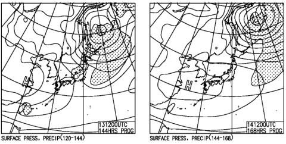

…と，ちょっと期待させる天気図だったけど．

FZCX50の予想ばらつきを見ると…

赤く囲った部分，特定高度線の予想

ばらつきが大きく．

このあたり，予想があまり正確に

絞り込めてないことを表してますね…

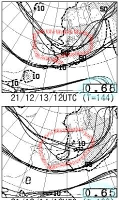

スプレッドも，0.68とか0.65とかの

大きな値なので．

今はまだ，13，14日の予想はあてに

ならない感じですね…

うーむ．

でも，13日に冷えて雪が降る予報は，

当たってほしいなぁ…

## 💬 コメント一覧

### 💬 コメント by (レインボー74)
**タイトル**: Unknown
**投稿日**: 2021-12-09 16:02:43

木曜日の志賀高原情報

さわやかな晴れ。朝の上林1℃ 蓮池-3℃。先行した友人から電話。「坊平橋ツルツルやで」　

坊平は海抜1215m。そこから上はヤバい道でした。志賀へお越しの際はお気をつけくださいませ。

さあゲレンデは予想通り特上の上。快適なんてもんじゃない。メイン板にしてよかった！

だけど某スクールのレッスン隊が多数。しかも、端から端までのトレインをしている。あのーこれだけはやめていただきたいんですけど！

昼は南館の水芭蕉。私は1300円のカレー。隊員は1400円のエビフライカレー。たった100円の違いで、立派なエビフライが２つも！無知は怖い。皆様も私の二の舞をしないことをお祈りします。

今年からドリンク飲み放題がつかなくなったので、すばやくゲレンデ復帰。ゆるんで削られてかなりぼこぼこになったけど、さほどの支障のないレベル。

だけど10年前に転んで傷めた膝に異変が！

まあやめろってことかと、午後は３本で終了。多分今シーズン一番のゲレンデでしたよ。エス様、どうぞ悪しからず！

### 💬 コメント by (アリス)
**タイトル**: Unknown
**投稿日**: 2021-12-09 19:36:43

S様

こんばんは😃🌃

今日の志賀高原良かったです🎵

一番にレインボーさんとそのお仲間の皆様とお会いご挨拶が出来ました☺️

ゴンドラが頂上に到着後、私はシマシマの写真撮影中に、皆様は、あっと言うまに飛んで行ってしまいました☺️

皆様、元気で速いです🎵

前半ヤケビ、後半は横手山を楽しみましたが、足の筋肉が、、、

若さんと、皆様を見習わないといけないです😅

アマズフィットですが、機能選択画面は出ますがスワイプが出来ず切り替え不能です😅

### 💬 コメント by (Skier_S)
**タイトル**: 祝！週末ヤケビ2高運転！
**投稿日**: 2021-12-10 01:10:51

＞レインボー74さま

特上の雪…ぐはぁ…うらやましい．

うらやましい！！

膝，十分ケアしてくださいね．

これからシーズン長いですから…

＞アリスさま

あぁ…今日滑れたってのがうらやましすぎます…

いいタイミングでしたね．

Amazfit Pace，時計から選択できるアクティビティをスマホアプリ側で

選べると思うのですが，アクティビティを全部消しちゃってたりしませんよね…

うーん．故障かな？

