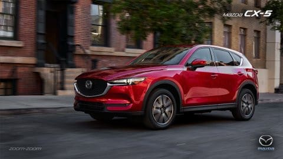

# マツダCX-5のディーゼルとガソリンを乗り比べてみた…試乗レポート

📅 投稿日時: 2017-09-09 21:54:51

🏷️ カテゴリ: [車試乗](c07dec5709d34bd74e1f6cb9c8291061b.md)

最近，いろいろ評判の良いマツダ車．

その中で，最も売れているのがCX-5．

いまさらの感が有りますが．

今回，このCX-5に試乗してきたので，

そのインプレッションをば…

それも，今回は．

ディーゼルとガソリン2.5Lの乗り比べをしてきました～！

（マツダHPより拝借）

まず．

運転席に座ってみると．

ふむ．

内装の質感は結構いいですな．

シートは…長時間乗ってみないと何とも

言えないけど．

ドイツ車っぽい感じの，あまり沈みこませない，

しっかりと固めのシートで．

つくりは良さそうな感じです…

後ろ座席は…

天井まで高いので，圧迫感はなく．

長さ4500mmちょいという車長にしては，

室内は結構広めに感じさせますね～！

トランクスペースも，まぁこんな感じかな．

前の型より，荷室の奥行きは増えた気が…

ただ，やはり車長が短めなので，今の

BRレガシィよりはちょいと荷室が短いか…

でも，

よっぽど大きな荷物を積まなきゃ，

これだけあれば十分かな．

で．試乗ですが．

今回乗ったコースは街中のみ．

山道を攻めたかったですが，

平坦な普通の混雑した町中の道だったので，

残念ながら，スピードを出したり，

横Gをかけたりした領域の特性は

良く分かりませんでした…

まず，

ディーゼルから乗ってみましたが．

予想以上に，静粛性がすごい．

エンジン始動もかなり静かで．

遮音がかなりしっかりしているのか．

アイドリング時は，エンジン振動は全く無く．

エンジン音も，遠くで小さく鳴ってる感じ…

普通のガソリンより，よっぽど静かだよ？？これ？？

で，走り出してみると…

もう，トルクモリモリ感．

この一言に尽きます．

1.6t越えという，重めのボディを

回転数を上げることなく軽く引っ張る

どトルクのエンジン．

アクセルを大きく踏み込んだ時の

絶対的加速感というより，

アクセルを踏んだ時の車の加速の仕方が気持ちいい．

エンジンに低速から圧倒的なトルクがあるので，

ATのロックアップをキープしたまま，

トルコンのトルク増加作用を使うことなく

加速して行ける感じで．

ダイレクト感が高く．

6速多段ATだけど，変速ショックや

変速時のトルク段付き感なし．

普通の町中なら，2000回転以下でほとんど

走り切れちゃいます．

アイドリングストップからの再始動も，

振動も少なく，静かにすっと再始動．

すごい…

と，やはりこのディーゼルエンジン．

エンジンフィールに関心が行っちゃいますが．

ブレーキフィール，ステアフィールに注目すると．

ブレーキ，ステアともインフォメーションが弱めだけど．

どちらも操作感は軽く，楽かな．

あまりコーナーを攻めれたわけでないので．

足回りはそれほど評価できませんが．

サスストロークが長いSUVというのもあり，

比較的バネレートは低そうに感じます．

そのため，段差の継ぎ目などは十分柔らかくいなす感じで．

乗り心地は結構いい感じ．

さらにディーゼルエンジンでは，フロントがかなり重いのか，

路面からの突き上げがあっても，フロントのばね上が簡単には

動かない感じで，フロントの安定感（マスの大きさ感？）

を感じます…

ただ．バネレートが低め＆背が高くて．

町中では，自然にロールを出させる設定のように

感じたので…

ハイスピードでコーナーを攻めた時のロール大丈夫かな…？

ここら辺は，山道をしっかり攻めてみて改めて

評価したいところ．

あ，そうそう．

町中では，G-ベクタリングの効果は

全く分かりませんでした．

で．次に，ガソリンに乗ってみますが．

え？

ディーゼルよりエンジン音が響く感じ…

意外…

このエンジン音．

動弁系や吸気系ではなく，排気系の音をわざと

聞かせているのか，いかにも「エンジン音」

といった音が，運転者に伝わってきます．

こういう演出なのかな？

超サイレントだったディーゼルとは違うなぁ…

そして，ディーゼルに比べると，トルクも細いため．

ATも，発進加速時のトルコンのスリップ領域が大きく．

ちょっとロックアップが遅い感じ．

アクセルを大きく踏み込んで加速しよう…と思ったとき，

ロックアップしてない領域で回転数がクッと上がって，

そこから遅れて加速度がついて行くという，

「トルコンAT」らしい加速感…．

ディーゼルのダイレクトさと比べると，

ちょっと劣ります．

また，アクセル開度が大きいときは，ディーゼルに

比べると回転数を引っ張るので．

低回転のまま，重いボディを引っ張る

ディーゼルの「余裕の加速感」と比べると，

やはり「エンジンが頑張ってる感」があります．

しかし，アクセル開度が小さい領域では

ロックアップも早く（というか，ほぼロックアップ

しっぱなし？）

アイドリングストップからの再始動は，

ディーゼル同様，振動も少なく静かに再始動します．

安全装備ですが…

ディーゼル，ガソリンとも，試乗したのは中くらいのグレードで，

フロントガラスにかなり大きなヘッドアップディスプレイがあります．

スピードと，速度制限などの道路標識の読み取り結果が

フロントガラスに表示されます．

そして，完全停止までサポートする前車追随オートクルーズとか，

レーンキープアシストとか，80km以下で動作する

自動ブレーキとか（80km超えたら動かないの…？），

一通りの安全装備がついてますが…

このあたりは，残念ながら試せなかったので．

今回は評価無しです…

とりあえず．

売れてるだけのことはあって，

CX-5ディーゼル，よくできてる車です．

ただ，ガンガン走るというより，

町中や高速をゆったりと楽に走れる車…

という印象で．

もう少し何か刺激があったらうれしいんだけど…

と，思ってしまうのは，ゼイタクでしょうか…．

## 💬 コメント一覧

### 💬 コメント by (しんちゃん)
**タイトル**: 私も同感
**投稿日**: 2017-09-09 22:51:54

私も以前ガソリンとディーゼル乗り比べました。

インプレッションは同感です。

あと、アクセルペダルがオルガン式だったので、山道などをきびきびというよりは、町中や高速をゆったりと楽にという感じが強かったです。また、Ｇベクタリングコントロールのおかげか、よく曲がる感覚がありました。

### 💬 コメント by (Skier_S)
**タイトル**: しんちゃんさま
**投稿日**: 2017-09-11 01:36:32

あ，CX-５のガソリン乗りましたか…

やはり，ディーゼルの存在感が圧倒的なので，

ディーゼルの前に乗るか後に乗るかで，

印象が変わってしまいそうな感じでした．

で．

私は試乗が街中だったので，Gベクタリングの

効果は全く分からずでした…

