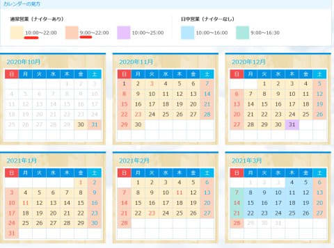
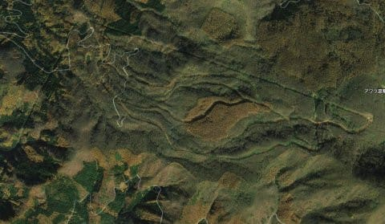
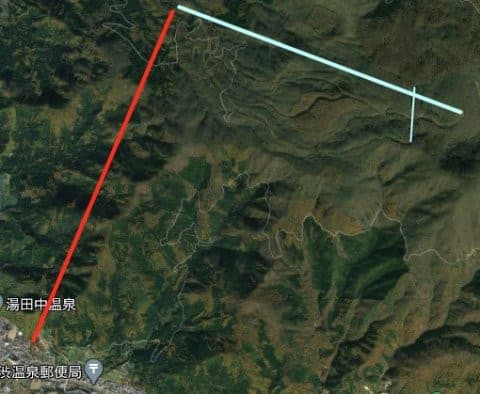
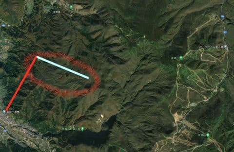
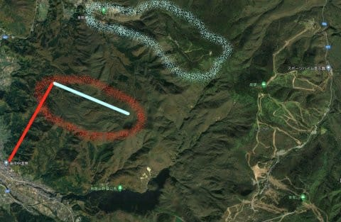
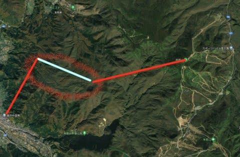
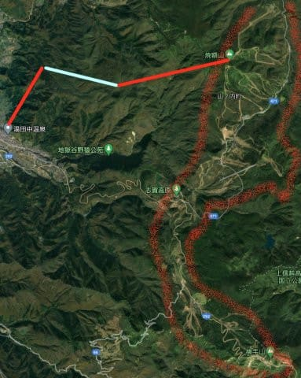
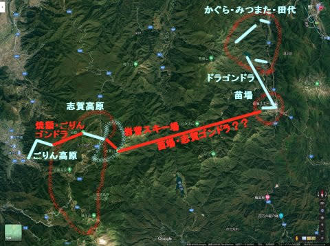

# 湯田中から志賀高原を通って苗場までのスキー場をつなぐ，壮大な計画が昔はあったんだよなぁ…その２

📅 投稿日時: 2020-10-27 01:09:13

🏷️ カテゴリ: [スキー雑談](c1f9d2cb7478308da16419928ea3945e9.md)

えー．

一昨日，たむさんからもらったコメントで，

Yetiの営業開始時間がこれまでより

1時間遅くなっている

ことを知り，ショックを受けている

Skier_Sです．

確かに．

Yetiの営業カレンダーを見ると．

平日10時オープン

休日9時オープン

と，昨シーズンまでより1時間遅くなってます…！

（[スノーパークイエティ，営業時間・料金ページ](https://www.yeti-resort.com/service/)より）

…まぁ，2シーズン前（だったかな？）は

ナイターが21時終了だったのに比べると，

平日・休日ともにナイターが22時まで

やってくれるぶんマシですが…

でも，休前日のオールナイト営業が無くなった

ようですね…

なんというか…

いろいろなスキー場で，営業がひそかに

縮小されていくのが寂しい…

というところで．

本題へ．

[前回，苗場ー志賀接続計画について
説明](ef7c17358b78109bbe3ad932d11fcd6a5.md)しましたが．

今回は，湯田中―志賀接続計画の

お話です！

…で．

今から10年ちょい前まで，湯田中から

ロープウェーで行けたごりん高原スキー場．

このスキー場を知っている人が，どの

くらいいるでしょうか…？

私は，親に連れられて何度か行ったことが

あるのですが…

このごりん高原スキー場．

1988シーズン…つまり，焼額に2ゴン＆

1高＆2高ができたのと同じシーズンに

開業した，ゴンドラ1本，ペアリフト1本の

スキー場でした…！

（[こちらにゲレンデマップを載せている方がいます](http://old-skier.seesaa.net/upload/detail/image/P1010673a-thumbnail2.jpg.html)）

今でも，衛星写真でゲレンデ跡が

残ってるのが見えますね…

湯田中から赤い線のロープウェーで

登った先に，水色の線で示したゴンドラが

かかっていて．

山頂付近に1本，短いペアリフトが1本

あるゲレンデ．

ロープウェーはゲレンデと麓の連絡用で，

往復乗車です．

滑ることはできません…

で．このスキー場．

一見コンパクトに見えますが．

このゴンドラ，長さ2.5kmほどもあり．

全長2km弱の焼額第1，第2ゴンドラより長い

という，意外なロングコース．

斜度は全体的に緩めでしたが，

かなりのロングコースが3-4本あったのを

覚えています…

で．

この，ごりん高原．

どのあたりにあるかというと…

こんな感じで．

なんと．右側すぐそばに，焼額が

見えるじゃないですか！

ちなみに，北志賀竜王もすぐそば．

水色で囲った部分がそうです…

で．

このごりん高原山頂から焼額山頂までの

距離は，わずか4km！

栂池ゴンドラと同じ長さのゴンドラで

両者を繋ぐことができます！

竜王山頂経由でつないだら，

もっと短いゴンドラで繋げますね…

そしたら，志賀高原とごりん，

北志賀竜王が繋がってたかも！？？

ちなみに，ごりん高原は，さらに

クワッドリフトをかける計画が

あったという噂も聞いているので．

ゴンドラから山頂方面にクワッドが

伸びていたら，さらに短い

ゴンドラで繋げてたかも…

ってなことで．

もし，この計画が実現されていたら．

湯田中から山道を通らなくても

志賀高原へ行くことができたという，

実にすごい計画だったんですが…

…残念ながら，スキーバブルの頃は

志賀高原の混雑を嫌って，そこそこの

お客さんが入っていたごりん高原．

スキーバブル崩壊後，一気にお客さんが

減ってしまい．

プリンスホテルが経営譲渡先を探した

ものの見つからず，2007シーズンをもって

営業終了となりました…（残念）

ということで．残念ながら実現されなかった

この計画ですが．

もし，ごりん高原のこの計画と．

前回説明した，苗場との接続計画が，

両方とも実現していたとしたら…

このように，湯田中から志賀高原の

岩菅山スキー場を通って，

苗場・かぐらまで，

全てプリンス系列のリフトだけで行き来

できてしまうという恐ろしい計画

だったのです…っ！！！

（赤線が建築されなかったゴンドラ，

　水色は実際に建設されたゴンドラ&リフト）

いや…

ホント．

あと数年間好景気が続いて

この計画が実現していたら，

どんなことになっていたのか…

でも．

距離5kmちょいのドラゴンドラが

乗車25分近くかかるから．

苗場―岩菅ゴンドラの18kmは

1時間以上かかっちゃいますね．

ゴンドラに1時間閉じ込められるのは

厳しいし（トイレとか行きたくなったら致命的（笑）），

苗場・志賀共通券リフト券なんて，

料金もすごそうだし．

もしかすると，あんまり利用者が

いなかったかも…？？

とか．

余計な心配をしてしまった，Skier_Sだったのでした…

## 💬 コメント一覧

### 💬 コメント by (ozuriski)
**タイトル**: なぜに三国と？
**投稿日**: 2020-10-27 23:58:24

いつも楽しく読ませてもらっています。

三国はペア2本・シングル1本だけのスキー場だったと聞きますが、3km離れた苗場とわざわざゴンドラで繋ぐ価値があるのだろうかと思うのは、バブル期の苗場を体感していないからでしょうか。

どうせ志賀（岩菅山）と繋ぐなら、苗場の山頂エリアと繋いだ方が、距離もそう変わらないし、いいように思うのですが。

志賀と苗場が背中合わせと最初に知ったときは驚きましたが、といっても20km近くあるわけで、そこに索道を架けようというのはかなりぶっ飛んだ発想かと。ピーク時来場者300万人の2大スキー場を結ぼうというのだから夢のある話です。ましてや、湯田中に泊まって苗場を滑るとか。

竜王と焼額は2kmもないのだから、竜王がコクドのものだったら繋がってた可能性高そうですし、それは今でもお願いしたい。

### 💬 コメント by (Skier_S)
**タイトル**: ＞ozuriskiさま
**投稿日**: 2020-10-28 02:04:30

ご愛読ありがとうございます～！！

三国はコンパクトなスキー場でしたが…

苗場が死ぬほど激込みだった時に，逃げ込むのにはいいゲレンデだったようです．

私も三国と苗場山頂だと，岩菅から距離はそんなに変わらないなぁ…

と思いましたが，三国と繋ぐ方が多少アップダウンが

少なくて済むのかも？

…志賀と苗場を繋ぐって，あまりにも壮大な計画すぎて…

技術的になんとかつないだとしても，スキー客が多かった時代ならまだしも，

今だとおそらく乗る人が少なすぎて，運転するコストと見合わない

ゴンドラになってた可能性が高いと思います（笑）．

量スキー場の共通券を買って，1時間かけて乗る人が何人いることやら…

往復2時間かかると，一日の2時間を無駄にしちゃいますから…

### 💬 コメント by (michi)
**タイトル**: Unknown
**投稿日**: 2020-10-28 17:41:23

今ではその存在すら知らない人が多い、ごりん高原で2シーズンもバイト経験があります（笑）

当時、焼額山と繋げる話は聞いていましたが、実現せず残念でした。もし焼額と繋がっていたら今どんなだったでしょうね。

### 💬 コメント by (はやと)
**タイトル**: Unknown
**投稿日**: 2020-10-28 22:50:51

苗場～焼額山までの計画は、常宿の従業員の人から聞いた事が有りました。

プリンスだから西武鉄道でトンネルを掘って、電車を通すのかなって勝手に思っていましたが、ゴンドラだったんですね。

ごりん高原の存在は知っていましたが一度も行った事がなく、焼額山と繋ぐ計画は知りませんでした。

近い将来にスキー大ブームが訪れて、湯田中～苗場までのルートが実現する事を期待しながら布教に励みます。

### 💬 コメント by (Skier_S)
**タイトル**: ごりん高原は食堂がひとつしかなかったのが欠点
**投稿日**: 2020-10-29 02:49:13

＞michiさま

スキー場でバイトしてたんですね…！

それもごりん高原などというマイナースキー場を選ぶとは！

で，焼額とつながっていたら…

あの駐車場が無いロープウェー乗り場だとパニックが起こってたと思います（笑）．

＞はやとさま

苗場~焼額は，私はゴンドラでつなぐと聞いていました…

ごりん高原も，コースは緩いですがロングクルーズができるし，

ロープウェーで上がれる人数しか来ないので，混まないスキー場でした．

またスキーブームはある程度来てほしい気がしますが，

昔のスキーバブルのような混雑はちょっと避けたい気がします（笑）．

### 💬 コメント by (Unknown)
**タイトル**: Unknown
**投稿日**: 2022-05-21 13:38:54

苗場・かぐらは遠いので志賀か野沢辺りから行けたらなぁと思っててここに辿り着きました（名古屋に住んでるので志賀・野沢でもまぁまぁ遠いけど）

実現してもゴンドラ片道1時間かぁ。1時間あれば車で行けそう...

### 💬 コメント by (Skier_S)
**タイトル**: ＞Unknownさま
**投稿日**: 2022-05-21 21:27:25

まさかこんな古い記事にコメントがつくとは（ちょっと驚き）

コメントありがとうございます．

志賀からかぐらまで，車で行って1時間半くらいなので，

確かにゴンドラ1時間なら，車で行ってもあんまり変わらないかも…

でも，壮大な計画ですよね…！！

