# また蛭ヶ岳を全力往復してきた…その3

📅 投稿日時: 2023-08-15 10:52:44

書類上の夏休みということで．

出社はしなくていいので，家でたまった

仕事をやっつけているのですが…

昨晩，仕事をやっつけている途中で寝て

しまいました…←休日も平日も変わらん…

でも．

今日は職場は休みなので，昼にBlog更新

できるな…

と，いつもと違って昼更新！！

ってなことで，[前回](ecc30ff9bd19fc9d2fc349b563f12181d.md)の続き．

昼に蛭ヶ岳の続きを書きますが…←オヤジギャグ

登山開始後，途中で1回水を飲むのに

立ち止まった以外は，

完全無休憩で登り続けること2時間44分．

9時前に蛭が岳山頂に立ちましたが…

さすがに無休憩で登ってきたので，

ここで小休止．

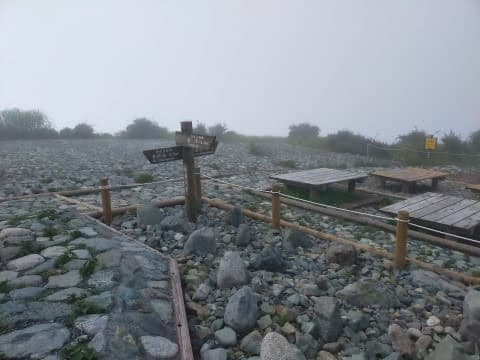

…山頂にいる間に，2人ほどがやってきましたが．

さすがに朝9時前に蛭が岳山頂にやってくるのは

かなりのスピードハイカーばっかりですね．

話を聞いていると，甲斐駒日帰りとか，

猿倉からの白馬三山ルートをかなりの

高速で回っちゃうとか．

そういうレベルの人がそろってる…

標高差2500m超えのルートを10時間くらいで

回っちゃうのか…！！

そもそも私が前回7時間かかった，

丹沢山→蛭が岳ピストン

私より距離が長い大倉スタートで，

6時間で往復しちゃうとか…

普通のトレイルランナーより速くない？？

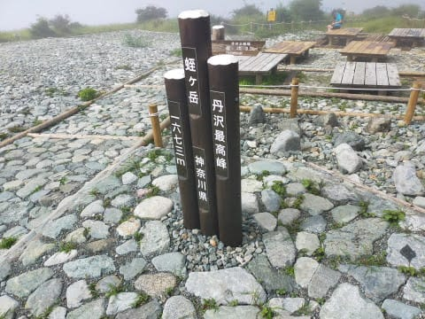

ってなことで．

朝9時前に蛭が岳につくような人は，

やっぱり凡人からかけ離れた人が多い

ということを再確認して．

山頂でいろいろ刺激を受ける話を

聞くこと30分．

そろそろ下山しましょうか…

と，9時半過ぎに下山スタート！

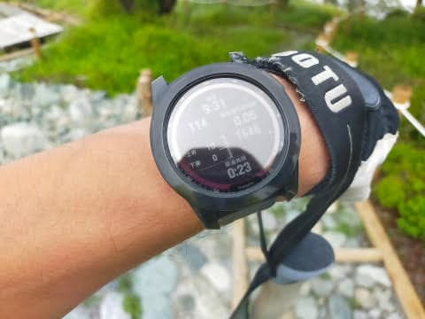

最初は階段地獄が続きますが…

まぁ，下りは楽ですね．

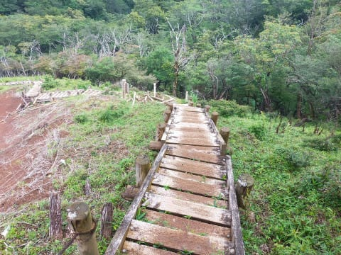

そして，このころになると，

ぽつぽつ降ったりやんだりだった雨も

完全に上がり…

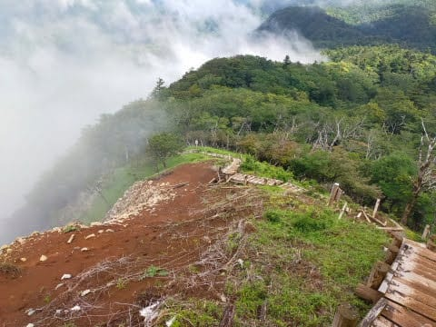

ちょっと幻想的な雰囲気になってきました～！

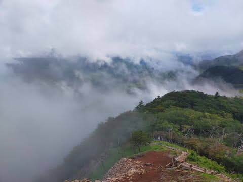

ただ．

昨年よりどのくらいタイムを縮められるのか？

という不純な目的で山を歩いている今回．

景色には目もくれず，下りも休まずに

ひたすら移動！

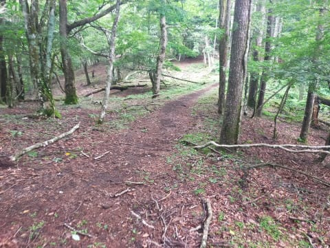

山頂から49分で姫次を通過し…

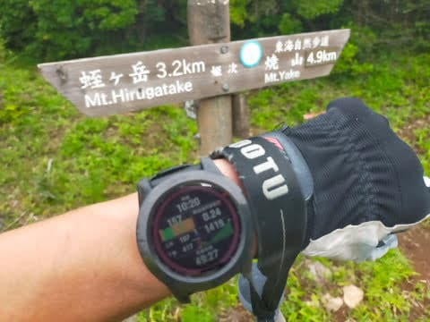

さらに誰もいない木道を走ること10分．

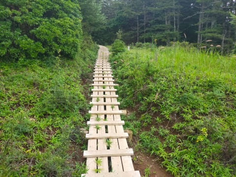

何とか山頂から1時間以内の，

ギリギリ59分で八丁坂分岐を通過して…

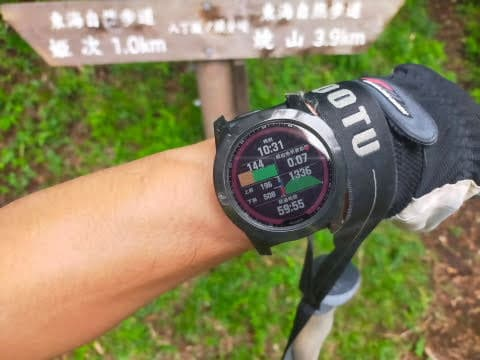

さて．

昨年は，ここから駐車場まで40分ちょい．

今回はそのタイムを切ることができるのか？？

…と．

全力疾走を続けたかったところだけど…

このあたり．

雨を吸った地面はかなり滑りやすく

なっており…

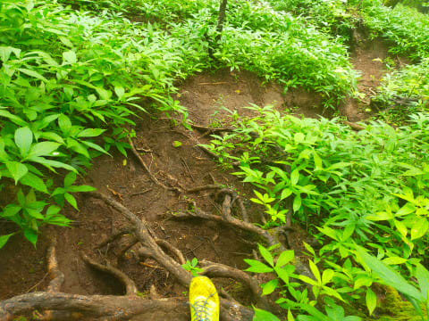

危ない…

この斜面で，スピードを乗せると

危ない！

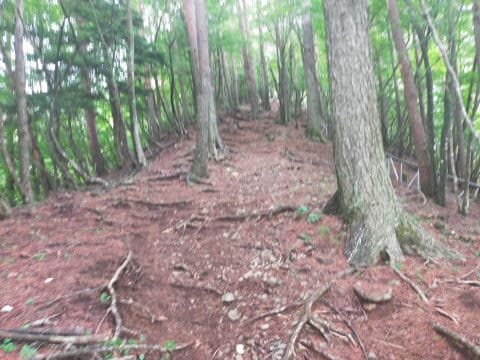

かなり怖いので，ブレーキをかける

ような下り方になってしまい…

無駄な力も使うし，せっかくの下りなのに

重力を味方につけて加速できない…！！

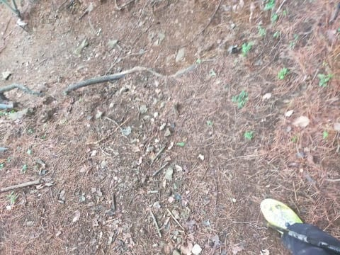

その中でもギリギリのハイペースで下り．

林道との分岐点を，山頂から1時間42分で

通過…！

くぅぅ…この地点，昨年より5分遅れ！！

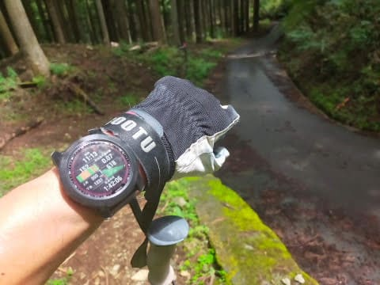

そこから下りの舗装林道．

昨年もかなりのペースで走ったけど…

今年も全力疾走！

重力にひかれるまま，ブレーキをかけずに

スピードを乗せていく！

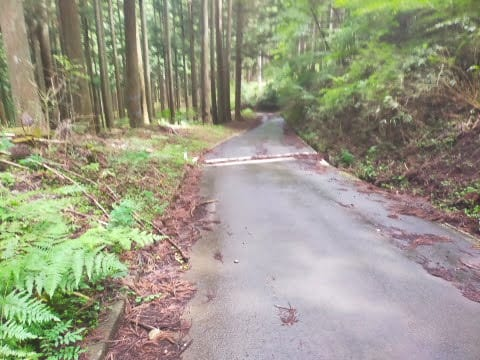

最後の1㎞のラップが，8分ちょい．

山を歩く人ならわかる，かなりのハイペースで

飛ばしたけど…

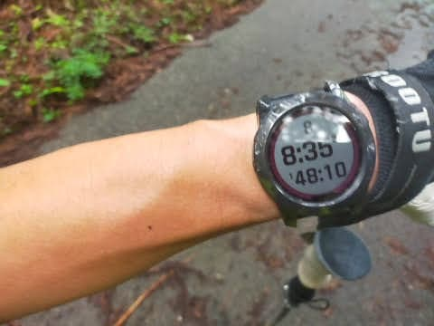

駐車場到着は，山頂から1時間48分…

…昨年の1時間44分から，4分遅れ…

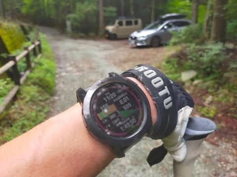

うがーーー！

残念…

昨年のタイムを抜けなかったか…！！

とりあえず．

登り2時間44分，

下り1時間48分

ということで．

去年と比べ登り-1分，下り+4分で…

往復で昨年より3分タイムを落としたか…っ！！

やはり，[昨年のあれ](e214af79d9db30113dfbe4e8a627604aa.md)は．

「全力で往復してみた」

と書いただけあって．

ホントに全力疾走だったんだな…

と，あらためて認識したのでした…

（まだ終わらない．[続く](e7dc41681642c5dcac9954a261d3b620d.md)）
