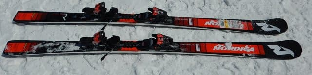
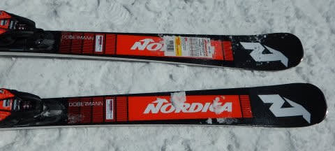
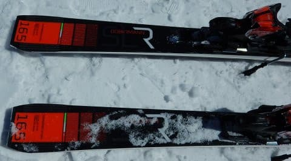
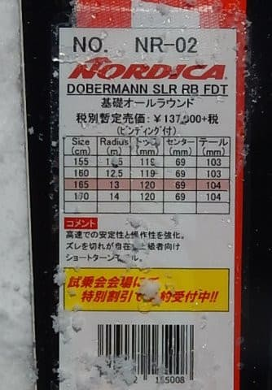
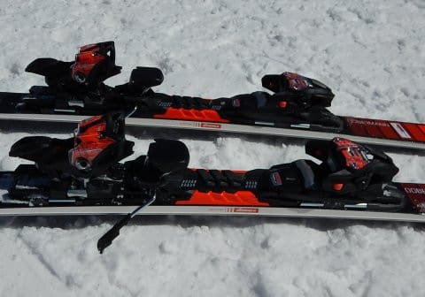

# 2020シーズンモデルのスキー板，試乗レポート…NORDICA編その1

📅 投稿日時: 2019-05-15 01:31:03

ってなことで．

GW前後はかなりバタバタしていたので．

しばらく，スキー試乗レポートを

書いていませんでしたが．

…この板を試乗したのも，3月下旬なので．

もう1か月半以上前になりますか…（遠い目）

ってなことで．

久しぶりのスキー試乗レポート．

本日はノルディカ編．

では，どうぞ～！

○NORDICA Dobermann SLR RB FDT 165cm

基礎小回り．

写真の説明書きには，基礎オールラウンドと

書かれていますが…SLRはR13なので，

どちらかというと小回り板ですね．

まぁ，小回りベースのオールラウンドと

言うのかな．

この板，今シーズンモデルは履いていないのですが．

昨シーズンモデルとプレートがちょっと

変わったのかな？

とりあえず．

滑ってみると…

うは．

これ．

気持ちいい…っ！！

硬い斜面では，かなり最高なんですけど？

板が良く食いつくし，良く回るし，

回ったあと，エッジのテールまで

使い切った後にすっと抜けていく

抜けの良さもあるし．

切り替えの時の返りも，

適度なばね感がありいい感じ．

この気持ちいいバネ感とヌケとで，

谷回りで板が体から遠く離れていく

小回りができます．

…むちゃくちゃ傾けて，

超気持ちいい．

多少の重さは感じるものの，

その重さは安定感につながっていて．

さらにグリップの粘りもあるので，

スピードを出していっても安定感が

あるし，スピード耐性も高いです．

どっしりして良く食いつく板なのに，

板の動かしやすさもある不思議な感じ．

板を動かしやすいので，そこそこの

スピードでもコントロールはできます．

履きこなすにはある程度の技術と

体力を必要としますが．

ある程度のスピードを出して，傾いて

行くのが大好きな人なら，この板に

嵌るんじゃないかな～．

気に入った．

来シーズンの主力戦闘機候補その2だな…

（だから，来シーズンは板を買わないから…っ！）

## 💬 コメント一覧

### 💬 コメント by (Goku)
**タイトル**: Unknown
**投稿日**: 2019-05-15 08:29:16

去年の試乗会で一番気に入ったのがコイツでした。

履いた瞬間、最高～って思いましたから‼

値段がもう少し下がれば欲しがったんだけど、結局安さに釣られてあのロシになりました。

### 💬 コメント by (Skier_S)
**タイトル**: Gokuさま
**投稿日**: 2019-05-16 02:18:30

いやーー．

この板，確かにいい板でしたよ！

ただ，結構強くてどっしりした感じの板だったので．一日この板を履いていると疲れるかも…

Fischerのほうが軽快さがあるので，

軽快さのFischer RC4 SCか，

力強さのNordica SLRか…

という選択でしょうか．

