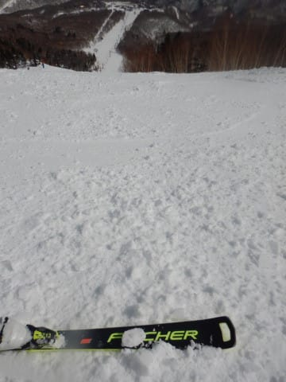

# 2022/3/13(日)の志賀高原スキー場詳細レポート！…天気はうす曇り時折晴れ．気温は高く昼間は妖怪板掴みが発生(涙）

📅 投稿日時: 2022-03-15 04:13:39

えー．

本日の志賀高原ですが．

特派員からの写真によると…

明け方近くまで雨が降ったにもかかわらず．

朝から日が射したようです！

昨日段階で，曇ったり日が射したり…

と予想したところ．

曇らずに終日晴れていたようで…

高温で雪は緩かったものの，

日曜のような張りつき雪にならず，

滑りは比較的良かったみたいです！！

うーん．

そう考えると，日曜が一番コンディションが

悪かったのかも…？

しかし．

いま，朝4時にライブカメラを見ると．←一体どんな時間にBlog書いてるんだ？？

志賀高原，また雨が降ってます（泣）

気温プラス5℃ですか…（涙）

でも．

これから火曜の朝にかけて，

再び雨になりますが．

明日の火曜もリフト営業開始までには

雨は止んでくれて，曇り～晴れの

天気になりそう…

この2日間，雨が降るのは見事に

選んだように夜だけで，昼間は

晴れるという．

月曜・火曜に滑る人に，日ごろの行いが

かなりいい人がいるようです…

ってなことで，本題へ．

日曜の志賀高原，詳細レポートです！

えー．

まず．

高温で雪が解けてしまい，

志賀高原へ向かう道に雪が全く

無いという，衝撃の朝．

路面も凍っておらず，夏タイヤでも

突っ切れるレベルの道路状況でした…

（ホントに夏タイヤでこの時期の志賀高原に来てはいけません）

で．

いつも通り8:30営業開始前に，

焼額第1ゴンドラに並びますが…

意外と人が並んでますね．

そして，あさイチの山頂気温は…

なんと！！+2℃！！

…予想していたとはいえ．

朝からプラス気温ですよ！（涙）

あさイチは曇り空でスタートですが，

とても志賀高原の朝とは思えない

生暖かい朝です…

でも．

あさイチは，硬めのバーンが緩み始めた

エッジが効く感じのシマシマバーンで，

これは意外と楽しい…っ！！

…と，思ったら．

営業開始直後から時折日が射す

天気になり…

シマシマバーンの硬さは一気に

緩み始めました…（泣）

でも，ザブザブになるほどは緩まず．

表面が柔らかく，ボソボソした感じに

なってきたなぁ…

という程度．

まぁ，これなら許せる！←だからなんで上から目線？

と，思ってたら．

ゲレンデの人がちょっと多くなってきて…

あうーーーん．

9時半過ぎには，ゴンドラ待ちが10分を

越えてきました…（泣）

ゴンドラ待ちが10分を超えると，

焼額の呪いが解ける設定の私．←だれがそんな設定を決めたんだ？？

生息地の焼額を抜け出し，

奥志賀へ！！

第2高速ペア側，エキスパートコースは

最初は悪くなかったけど…

10時半を過ぎると…日差しに照らされた

下側の緩斜面が，何だか板に貼りつく雪に

なってきちゃいましたよ（泣）

あぁ…

ついに来たか．

土曜はまだ大丈夫だったけど．

ついに今シーズン，妖怪板掴み

が発生する時期になってきましたか…（激涙）

急斜面部分は雪もそこまでひどく緩んでなく，

板も滑るんだけど．

下の緩斜面が残念な感じ…

ただ，12時近くになってくると，

さすがにエキスパートコースの

急斜面もちょっとダマダマ雪が

大量発生して，快適度が落ちて

きました…（泣）

だもんで．

今度は一の瀬へ脱出！！

…でも，昼の一の瀬ダイヤモンドも

ところどころ引っかかるような雪で…

そして，一の瀬ファミリー正面バーンは

もう荒れてます（泣）

パーフェクターコースは，ちょっと

荒れてたものの，板も滑って

そんなに悪くなかったかな？

でも，やっぱりここも高温＆中途半端な

日差しのせいで，下の緩斜面が

かなりブレーキ雪に…（涙）

標高が高い寺小屋も，妖怪板掴みが

発生し始めたということなので．

一の瀬方面もダメだな…と．

焼額へ戻りますが．

日曜昼からはゴンドラ待ちが少なくなる

焼額．

法則にしたがい，12時過ぎにはゴンドラ

待ちがゲート内まで短くなってます！

今日はかなり多くの人が，板に貼りつく

雪に嫌気がさして帰っちゃったのか，

ゲレンデもガラガラになりました！

タイミングによっては，全く無人状態です…！

ただ．

気温は昼間，最高でプラス6℃まで

上がり…

ゲレンデの雪はザブザブにならないまでも，

コース全面，重いモサモサした感じの

春スキーの雪になっちゃいました（涙）

急斜面は大丈夫なんですが，緩斜面では

板掴みの気配をそこかしこに感じます（泣）

でも，午後2時半を過ぎてくると．

気温もピークを過ぎて，さらに

太陽が陰ってきたのもあり…

板が滑るようになってきました！

これは，ここまで昼間の滑らない雪に

耐えたご褒美だ！！

と．

多少荒れてはいるものの，板が滑る

ようになった無人バーンを，

今日も営業終了まで，しっかり滑り

倒してきたのでした…

しかし．

わずか一週間前は．[昼間も-10℃以下で
冷凍人間になるかと思う激冷え吹雪だった](e25e32e3171eac3d1fb439535ba7a96e8.md)

というのに．

それから一週間で，朝からプラス気温の

暑いくらいの春スキーになるなんて．

ちょっと極端すぎる…（泣）

来週の3連休は平年並みの気温に

戻ってくれそうな気配…

あぁ．

冷え冷え雪よ，もう一度！！

## 💬 コメント一覧

### 💬 コメント by (レインボー74)
**タイトル**: Unknown
**投稿日**: 2022-03-15 17:05:24

火曜日の志賀高原情報

朝の上林+6℃　蓮池+5℃。夜の雨で道路から雪が消えてる。

朝イチは強烈な霧。な～んもわからん。怖い怖い！

ところがしばらくすると、晴れてきたではあーりませんか！

雨のあとでとっても滑る雪。快適だったけど、今日で帰る隊員がいるので２時間で終了。妖怪には会えませんでしたよ。

### 💬 コメント by (Skier_S)
**タイトル**: ＞レインボー74さま
**投稿日**: 2022-03-16 02:12:51

朝の霧は一瞬で晴れたようですね．

明け方まで雨だったのに，営業開始時には止んで，じきに晴れてきて．

それで板掴みも出ないなんて…

恵まれた一日でしたね！

