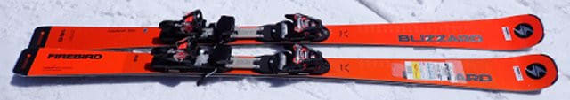
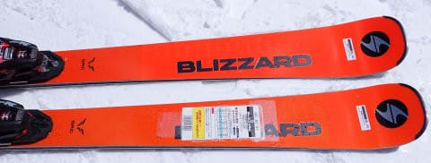
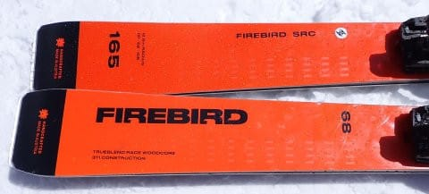
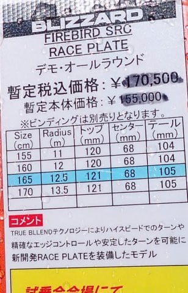
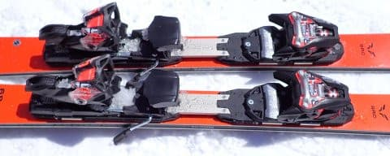

# 2024シーズンモデルのスキー板，試乗レポートその29…BLIZZARD FIREBIRD SRC

📅 投稿日時: 2023-07-16 01:03:16

今朝は，昨日の記事で予告したように

山に行ってきたわけですが…

結局，睡眠時間わずか1時間半でした(涙)

で．

今回も午前10時から娘と約束があり，

ゆっくり山に行っている時間がなかったので．

結局，いつもの小仏P⇔陣馬山往復に

行ってきました…

睡眠時間1時間半で16㎞の山歩きは

ちょいときつかったけど…

全力で往復して8時過ぎには下山，

無事10時前に帰宅でき，娘との約束を

守ることができました…←いや，そこまでぎりぎりで山にいかなくても…

で．

今回はTECHNICAのトレランシューズで

行ってみたので，またほかの靴との

比較データが取れました～！

だもんで，また後日記事にしますね．

ってなことで，本題へ．

今日はまた，2024シーズンモデルのスキー板の

試乗レポート．

今回はブリザード編です…

では，どうぞ～！

〇BLIZZARD FIREBIRD SRC Raceplate 165cm

基礎小回り

SL用ではなく，基礎小回りモデルとなるSRCですが．

BLIZZARDがノルディカと同じテクニカグループになり，

NORDICA Dobermann SLRと同じ板になるんじゃ

ないか疑惑もありましたが．

ノルディカとは全く違う板ですね…

で．

今シーズンまでは確かピストンプレートが標準

だったと思ったところ．

来シーズンモデルはピストンプレート付きは

なくなり，RacePlateが標準になるようです．

ってなことで．

このアルミのごっついバーが入った

RacePlate付きの板を履いてみますが…

基本的にはウッドコアサンドイッチらしい，

オーソドックスな乗り味．

コア材が結構硬いのか，プレートが硬いのか，

結構踏みごたえに硬さを感じます．

コアが硬めだけど，サイドカーブがR12.5mと

比較的小さいこともあり．

レールターンのように角付けをしていくだけで，

板がたわむ前からサイドカーブに沿って

板が回っていきます．

ただ，そこからスピードを上げていっても，

板に粘りがあってすっとたわみが出ていくという

しっとりタイプではなく，コアが突っ張って

なかなかたわみが出ないタイプ．

たわみ量で半径をコントロールして回って

いく感じの板じゃなく，どちらかというと

強いサイドカーブに沿った強い旋回力で，

板の行きたい方向へ回されていく感じ．

なので，板の旋回力が非常に強く感じ，

板がクルクル回っていきます．

たわませないでまっすぐ目に板を落として

行くとかはできないため，どうしても

小回りになっていく小回り専用機という

感じ．

その中で，グリップは強めながらも，

グリップを外していくことはできて，

しっかり硬めなのでむしろずらしは

やりやすい感じ．

キレが中心の板だけど，ずらしていく

コントロール性もそこそこあります．

フレックス・グリップとも強めなので，

スピード耐性もありそうだけど，

スピードを出すとそのサイドカーブの

きつさで完全小回りスペシャルになって

いきます．

こういう乗り味が好きな人にはいいのかな．

…うーん，私はやはりどちらかというと

たわみで曲がっていくほうが好きかな～…
