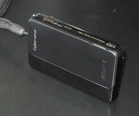
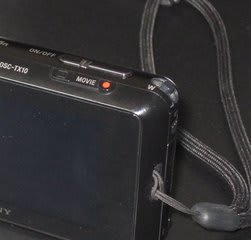

# スキーヤ-用デジカメ？Cybershot　TX10インプレッションその１

📅 投稿日時: 2011-05-27 00:57:43

🏷️ カテゴリ: [PC,カメラ&小物](c0d8caed13e597efe97b661a8ae56bed0.md)

ということで．

デジカメ＆ビデオカメラを兼用するカメラということで，

[新たに購入したTX10](edc461a9f1ae90e7a790c71fb3597b618.md)ですが．

一ヶ月使ったので，使ってみたインプレッションをば．

まず，気になる動画撮影能力ですが．

1920x1080，60iのフルハイビジョン撮影ができて，

AVCHDとMP4の，二つの記録形式が選べます．

PCにコピーして見るときには，MP4形式が便利ですね～．

あ，MP4だと，60iではなく，30fpsになります．

んで．

光学4倍ズーム．

これは速い．

ビデオカメラと遜色ない速さ．

デジカメの動画撮影時の光学ズームとしては，

驚きの速さではないでしょうか…

ズームがボタンではなく，カメラの角にあるレバー式ってのが

さらにGood.

この角っこにあるのが，ズームレバーなんですが…

小さくて一見操作しにくそうに見えますが，こいつは

スキーのグローブをしたままでも操作できます．

普通のデジカメの小さなシーソーボタンだと，グローブ

したままの操作は不可能ですから，このレバー，意外と

使い良いです…

さらに．

デジタルで16倍ズームまで行きます．

前にも書いたように，画質劣化するだろうなぁ，

と思っていたら，スキーの動き解析をするには

十分な画質です．

普通のSD画質よりはずっといい感じに写るので，

十分実用に耐えます．

かなり遠くから撮っても，豆粒にならずにスキーヤーを

写せますね～．

で．さらに．

ピント合わせが驚速．

ビデオカメラでもピント合わせに悩むような

真っ白な雪が背景の場合でも，ピントに

悩んだことが無いですね～．

前に持っていたDVテープのビデオカメラより

オートフォーカス強いなぁ…

で．さらにさらに．

もうひとつの驚きが．

動画撮影時の手ブレ補正もすごい強い．

デジタルズームで最大望遠にした場合，

ブレブレな動画になるかと思ったら．

手ブレがしっかり抑えられて，見れる画像に

なってたのにはびっくり．

んで．

液晶がかなり高精細なきれいなので，撮った後に

滑りを確認する場合も，遠くでちいさく写っている画像

でも，ちゃんと動きがわかるという…

って感じで．

もしかすると，普通のビデオカメラよりいいかも？？？

まぁ，欠点もいくつかありますが．

静止画のレビューと，欠点についてはまた後日…
