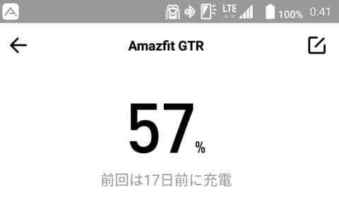
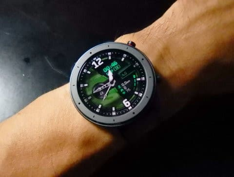
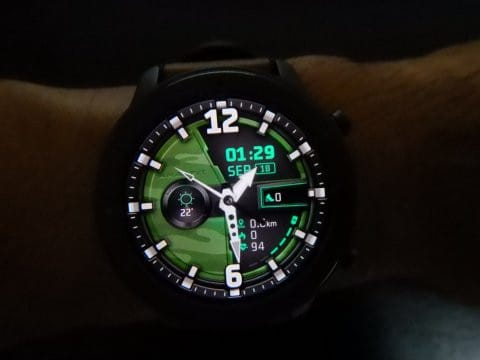
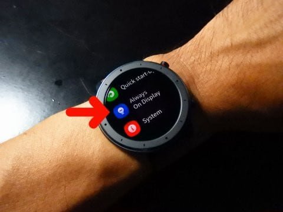
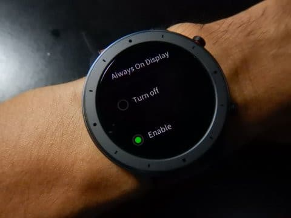
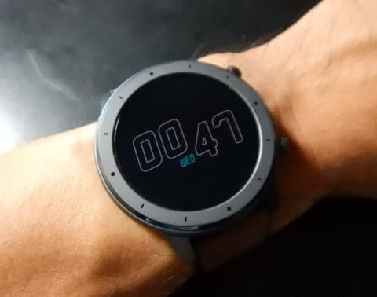
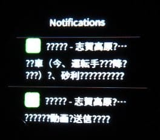

# Amazfit GTRスマートウォッチ，さりげなく常時点灯機能が追加されてたよ！

📅 投稿日時: 2019-09-19 00:33:06

🏷️ カテゴリ: [PC,カメラ&小物](c0d8caed13e597efe97b661a8ae56bed0.md)

ということで．

8月に購入した，Amazefit GTR．

これまで，

その1．[購入レポート，](e07b216ec3b426f7a5a1462a3b6fd1c02.md)

その2．[開封＆試してみた感じ，](edd1205f6bd9cd6dadb50e4fc6316b747.md)

その3．[アクティビティーログ](ecd7317c7980728b41dae1a21fe835803.md)

その4．[スマホアプリのインストール＆設定](eb88e9293dae421d12f27fe8b5b363344.md)

その5．[スマホアプリを使ってみた感じ](ecf2d1a51d5012b9edf9fbf5307e586db.md)

とレポートを書いてきましたが．

そろそろ使って1か月以上たちますが．

買ってから今までに．

購入直後に充電した以外は，

9月に入って1回充電したっきり

です…！

購入直後は，初期設定だとか，

いろいろ試してみたりしたので

電池を激しく使ったはずなのに，

電池は21日ほどもち．

…そして，9月に入って一度充電した後，

17日経つのに…

まだ電池が57％，半分以上残ってます！！

うーむ．

これは，普通に使えば電池は1か月

以上もつということですね…

ちなみに，心拍計測は

定期測定＆睡眠計測をOnに

してますし．

そこそこ頻繁に，着信通知が鳴りますが．

ワークアウト計測をしておらず，

ほとんどGPSもOnにしないため，

長持ちしているんでしょうね…

それにしても．

カタログ値で電池もち24日．

実際はもう少し短いだろうなぁ…

と思っていたのに．

一か月充電しなくていいとは，

嬉しい予想外！

そして．

8月末に，スマホアプリのファームアップが

あったのですが．

「何が一体アップデートされたんだろう…？」

と思っていたら．

文字盤がいくつか追加されたのに

気づき．

その中に，気に入ったのがあったので，

さっそくスマホから本体に

ダウンロードして，

ウオッチフェースを変更してみました…！

左側に本日の天気と気温，

右側に歩数，

右下に歩行距離，消費カロリー，

現在の心拍数が表示されて，

結構便利です…

そして．

9月7日に，本体のファームアップデートが

かかったのですが．

このファームアップ．

「どんな機能が追加されたのか」の

案内が全くないまま，

自動的にアップデートされており．

「何が変わったんだろう…？」

と，しばらく気づきませんでしたが．

なんと．

常時点灯モードが追加されました！！

ファームアップされてから

一週間ほど，この機能追加に

気づかなかった…

ってな感じで．

知らぬ間に追加されていた，

この

「Always on display」

こいつをEnableにすると…

普通なら，画面が消灯している時に．

最低限の時間が確認できる，

こういう表示に切り替わります…

…うーむ．

全く知らぬ間にこんな機能が

追加されていたとは…

ただ．

なるべく画面の点灯部分を減らして，

電池消費を抑えたデザインにして

いるとは言え．

これをOnにする時に，

「かなり電池消耗するよ！」

という警告が出るので．

…おそらく，常時点灯させると

かなり電池もちは悪くなるんだと

思います…

とはいえ．

ファームアップで，こういう風に

ちゃんと機能追加をしていって

くれるところは嬉しいですね．

…これで，あとはメッセージ通知の

日本語対応さえしてくれれば，

完璧なんだけど…

早く日本語対応ファームに

アップデートされないかな…
