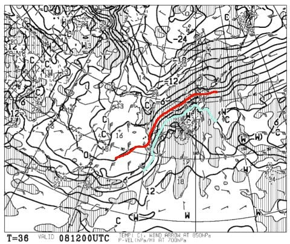
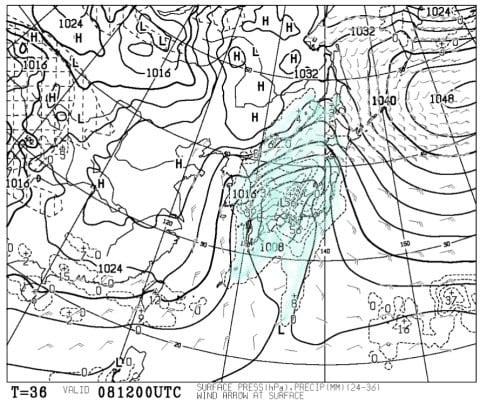
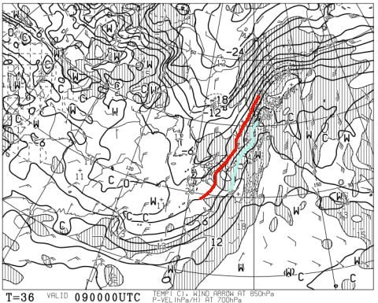
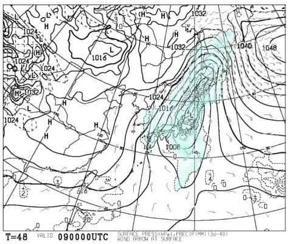
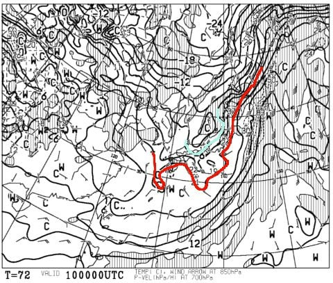
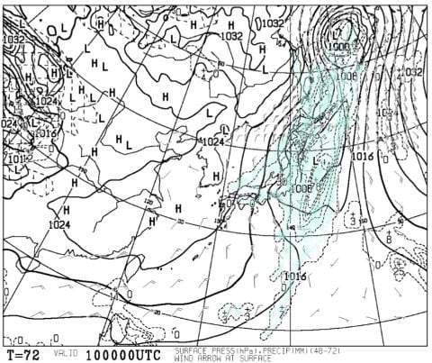
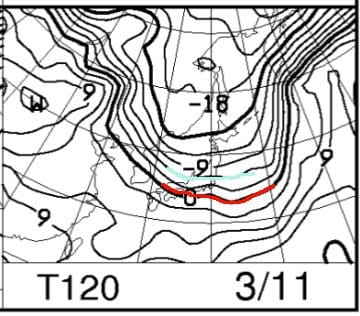
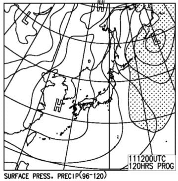

# 3月10，11日の週末の志賀高原スキー場の天気は…土曜は雪？日曜は冷え冷えの晴れ．下地は固いかもしれないけど，意外と良さそう…

📅 投稿日時: 2018-03-08 01:45:03

えー．

本日水曜．

結構気温が冷え，志賀高原は

朝は-10℃近くまで下がったようですが．

志賀高原は相変わらず，なぜか冷えた日には

降ってくれず．

積雪が全く増えてませんね…（涙）．

そして．

明日8日木曜．

850hpa気温を見てみると…

うぎゃーーーーっ！！！

赤く印した0℃線は，津軽海峡付近まで北上し，

水色の+6℃線が志賀より北まで上がって

るんですけどっ！？？

これは，8日の志賀高原は，昼ごろにプラス気温を超え．

夜でもプラスの気温になりそうなんですけどっ！！！

そして，8日の地上天気図は…

ががががーーーん！！

降水域が，日本をすっぽり覆っていて．

志賀高原でも，昼過ぎから液体が降り始めて，

夜の間も，ずっと液体のまま降り続けそう…（激涙）

…また，液体か…っ！！

で．

9日，金曜は…

うがぁぁぁっ！！

志賀高原に，まだ水色の+6℃線がっ！！

志賀高原でも，朝からプラス気温だよ…（涙）．

9日の地上天気図を見ると…

ダメだ…

この日もすっぽり降水域に覆われてる…（泣）．

だもんで．

8日夜から9日朝まで．

志賀高原でも気温はプラスのままで．

木曜夜から金曜朝まで，一晩中液体が降り続けますね…（激涙）．

そして，8日午後から9日朝にかけては．

強い南風が吹き，奥志賀ゴンドラや焼額第2ゴンドラは

営業がヤバそうな感じ…

ただ，9日昼ごろに前線が通過しそうで．

昼からは気温がぐんぐん下がって．

昼ごろには，雪になりそうです！！

で．

肝心の週末．

土曜10日の朝9時の850hpa予想気温をみると．

…赤い0℃線は太平洋まで下がり，

志賀には水色の-6℃線が掛かってますよ！！

これは，土曜はちゃんと冷えてくれそうですね～！

そして，土曜の地上天気図は…

ををを！

縦縞の西高東低天気図っ！！

…うむ．

金曜午後から土曜朝まで，10～20cm積もってくれそうかな！！

木曜夜から金曜にかけての雨で凍った下地は，

新雪で隠れてくれそうな予感…っ！

続いて，日曜11日の850hpa気温予想を見ると．

この日も水色の-6℃線が志賀に掛かっているので．

ちゃんと冷えてくれそうですよ！

朝は-8～9℃くらいかな？？

そして，日曜の地上天気図は…

うむ．高気圧に覆われて，晴れそうな予感…っ！

このままの天気図だと…日曜は意外とマシかも…？？

ってな感じで．まとめると．

木曜8日：昼ごろから風が強まり，気温がぐんぐん上がって…

　空から液体が降り始める（涙）．南風で奥志賀，焼額第1ゴンドラ営業は

　ヤバい感じ．南風に強い1ゴンは動くだろうけど…

　この日の午後は高温＆強風＆雨の3重苦（涙）．

　でも，雨はそれほど強く降らないか…

金曜9日：前日の夜からひたすら強風で雨が降り続ける朝（泣）．

　朝の気温はプラスで，雨がしばらく降り続けるが，

　午前中に雨が雪に変わり．そのあとは気温がぐっと冷えて，

　雪が降り続ける．

　それほど激しい雪ではなさそう…

土曜10日：朝は-7～8℃くらいまで冷え込み，雪降り！！

　昨日から降り続けた雪は，朝には10cm～20cm積もり，

　雨で凍ったゲレンデは雪で隠れてくれそう！

　朝は柔らかい圧雪．終日気温は低く，昼間も-3℃程度

　までしかあがらない．

　昼ごろには雪がやむかな？

　午後は柔らかい雪が蹴散らされた荒れ気味斜面．

　急斜面は下地の固いのが出てきそう…

日曜11日：朝は土曜と同じ程度，-7～8℃程度．

　朝から晴れそう！昨晩からの積雪はないけど，

　締まった冷え冷えのいい圧雪が楽しめそう！

　ただ，斜度のきつい部分はじきに下地の固いのが

　出てくるかも…

　晴れても昼間の気温はそれほど上がらず，土曜と

　同じく最高気温は-3度程度かな？

　午後はところどころ固い雪が出てきそうだけど，

　晴れて冷え冷えなので，結構楽しめるかも…

ってな感じで．

木曜夜から金曜は壊滅的天気ですが．

今の天気図のままなら．

金曜夜から土曜朝の冷え冷えの積雪で

週末のコンディションが改善するという，

奇跡のパターンになりそうです…

　

うむ．

もしホントに，土曜のゲレンデコンディションが激烈に

改善していたとしたら．

それは．

皆さんの熱い思いがこもった冷え冷え降れ降れ踊りが効いた

ということなので．

日本全国のスキーヤーは，激しく情熱的に踊り続けた，

このBlogの読者のみなさんに感謝せねばなるまい…

## 💬 コメント一覧

### 💬 コメント by (yumi)
**タイトル**: 伝言でぇ～す✨
**投稿日**: 2018-03-08 18:44:07

Ｓさぁ～ん🎉

お久しぶりです🎵

今朝はスッゴい風が🍃強く、ゴンドラ全滅でした💧

で、リフトも動く？動かない？滑る？やめる？って感じで平日ミーティング（２ゴン下 券売所あたりで）が始まりました。

で、W70さんから「今年のお宿はネット環境が無いのでＳさんに伝えて」って。

「先日、ゴンドラに乗り合わせた 某、関東の方がＳさんのブログのファンだとか・・・

で、嬉しかったので銀の怪しいお札✨渡したよ。」って。

で、すったもんだして、３高が動くと言う言葉に踊らされ、ブーツに履き替え階段を昇ろうとしたその時⁉️

「３高、止まりました。」

え、えぇｪｪｪｪｪ・・・

「２高、４ロマ動いてます。」

結局、吹雪の中を泣きながら💧💧💧滑りました⛷️💨

### 💬 コメント by (Skier_S)
**タイトル**: yumiさま
**投稿日**: 2018-03-09 04:07:17

木曜は悲惨だったみたいですね～．

動いていた2高，4ロマも午後は全滅したみたいですね．

朝は雨じゃなかったんですか…

吹雪だったんですね．

その中滑るとは，お疲れ様でした．

で．

W70さんからの伝言ありがとうございます～！

最近タイミングが合わないのか，W70さんと

お会いできなくて寂しいのですが．

ファン（？）の方にステッカー渡してくださって

ありがとうございます，とお伝えしておいてください．

では，また今週末にお会いしましょう！

